# Interceptor Write-up

**Platform**: TryHackMe <br>
**Room**: Interceptor (https://tryhackme.com/room/interceptor) <br>
**Category**: Web Application <br>
**Target**: Linux <br>
**Techniques**: Directory Enumeration, Information Disclosure, Mass Assignment, SSRF, Filter Bypass <br>
**Final Goal**: Remote Code Execution

## Executive Summary

This assessment evaluated the security of the **Interceptor** web application, a MediaHub portal used by journalists to manage and access internal content. The objective was to determine whether an attacker could identify vulnerabilities in the application's authentication, verification, and backend request handling mechanisms that would lead to unauthorised access and remote code execution.

The assessment identified several vulnerabilities, including sensitive information disclosure through an exposed backup file, weak password controls, and insecure server-side request handling. These weaknesses could be combined to obtain administrative access, bypass the application's OTP verification mechanism through mass assignment, and abuse a server-side request functionality to access internal resources and ultimately retrieve the final flag.

The assessment highlights the importance of protecting backup files and sensitive configuration information, enforcing secure authentication and verification mechanisms, and validating server-side requests against robust allow-lists. Backend functionality that processes user-controlled input should not rely solely on client-side or superficial filtering, particularly when it can access internal services or local resources.

## Overview

Interceptor simulates an internal media portal where a journalist management application exposes authentication, verification, and backend functionality through web requests.

The objective is to gain administrative access to the MediaHub portal, bypass the OTP verification mechanism, identify weaknesses in the application's backend functionality, and ultimately obtain the final flag through remote code execution.

The room demonstrates an attack chain involving:

- Service and web application enumeration
- Directory enumeration
- Backup file disclosure
- Information disclosure
- Password policy analysis
- Authentication
- Burp Suite request interception
- Mass Assignment
- Authentication bypass
- Server-Side Request Forgery (SSRF)
- SSRF filter bypass
- Command Injection
- Local file retrieval
- Remote Code Execution

## Attack Chain

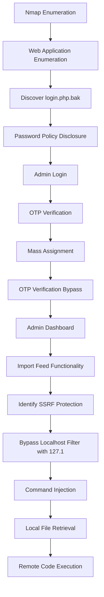

---

## Initial Enumeration

The assessment began with an Nmap scan to identify the services exposed by the target:

```bash
nmap -sV -sC -p- 10.112.175.119
```

The `-sV` option enabled service and version detection, while `-sC` ran Nmap's default NSE scripts. The `-p-` option scanned all TCP ports rather than only the most common ports.

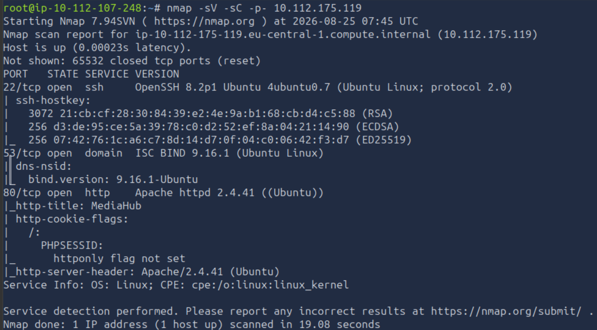

The scan identified three open ports:

| Port | Service | Observation |
|------|---------|-------------|
| 22 | SSH | Potential management interface that may become useful if valid credentials are obtained. |
| 53 | DNS | Indicates the host provides DNS services, although no immediate attack vector is identified. |
| 80 | HTTP | Public-facing recruitment portal and primary attack surface. |

Since a web application named **MediaHub** was exposed on port `80`, further enumeration focused on the HTTP service.

## Directory Enumeration

Gobuster was used to identify accessible directories and files:

```bash
gobuster dir -u "http://10.112.175.119" -w /usr/share/wordlists/dirbuster/directory-list-2.3-medium.txt -r -x .php,.js,.html,.py,php.bak,.git,.env,.txt --exclude-length 1491
```

The `dir` mode performed directory and file enumeration against the web server. The `-x` option added the specified extensions to each wordlist entry, allowing files such as PHP scripts, JavaScript files, backups, and environment files to be identified.

> **Note**: The `--exclude-length 1491` option was added because the server returned a wildcard response with a `200 OK` status code even when a requested resource did not exist. 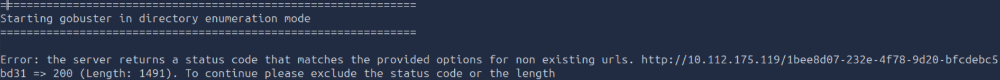 Responses with a length of 1491 bytes were therefore excluded from the results to reduce false positives.

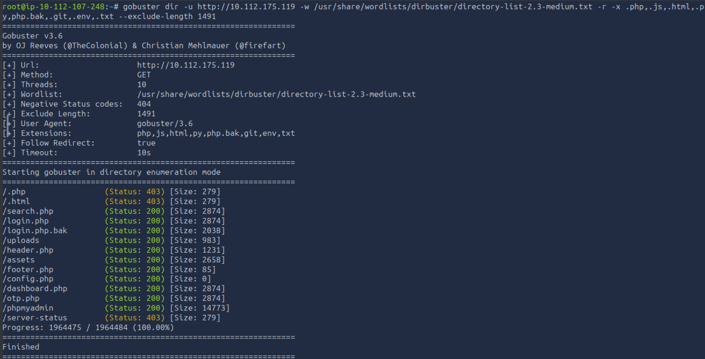

The scan identified several interesting endpoints, including:

- `/login.php.bak`
- `/login.php`
- `/uploads`
- `/assets`
- `/config.php`
- `/dashboard`
- `/otp.php`

## Backup File Disclosure

Before interacting further with the authentication functionality, the discovered login.php.bak file was inspected at:

```text
http://10.112.175.119/login.php.bak
```

The backup file was automatically downloaded to the AttackBox and could be opened with a text editor.

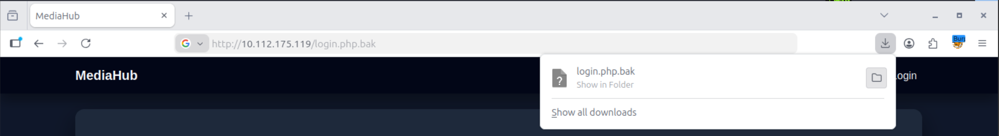

The file contained both the contents of `login.php` and a temporary developer note. The note disclosed the email address of an administrative test account and provided information about the password format:

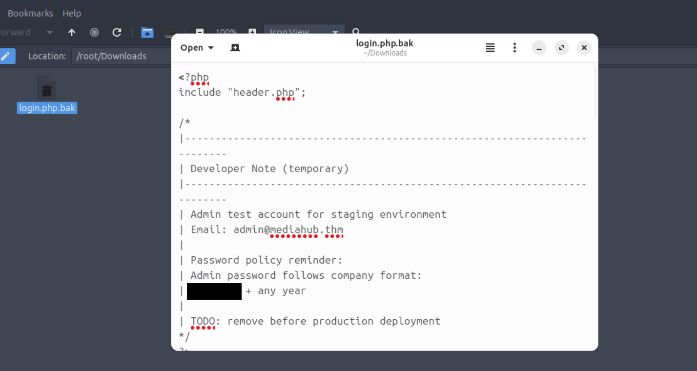

```php
<?php
include "header.php";

/*
|--------------------------------------------------------------------------
| Developer Note (temporary)
|--------------------------------------------------------------------------
| Admin test account for staging environment
| Email: admin@mediahub.thm
|
| Password policy reminder:
| Admin password follows company format:
| <REDACTED> + any year
|
| TODO: remove before production deployment
*/
?>

<div class="row justify-content-center">
  <div class="col-md-5">
    <div class="card p-4">

      <h4 class="mb-3">Login</h4>

      <form id="loginForm">
        <input class="form-control mb-3" name="email" placeholder="Email" required>

        <input class="form-control mb-3" name="password" type="password" placeholder="Password" required>

        <button id="btnLogin" class="btn btn-primary w-100" type="submit">
          Login
        </button>
      </form>

      <div id="msg" class="mt-3"></div>

    </div>
  </div>
</div>

<script>
const form = document.getElementById("loginForm");
const msg  = document.getElementById("msg");
const btn  = document.getElementById("btnLogin");

form.addEventListener("submit", async (e) => {
  e.preventDefault();

  msg.innerHTML = `<div class="text-muted">Signing in...</div>`;
  btn.disabled = true;

  const payload = new FormData(form);

  try {
    const res = await fetch("api_login.php", {
      method: "POST",
      body: payload
    });

    const data = await res.json();

    if (!data.ok) {
      msg.innerHTML = `<div class="alert alert-danger py-2 mb-0">${data.error}</div>`;
      btn.disabled = false;
      return;
    }

    msg.innerHTML = `<div class="alert alert-success py-2 mb-0">${data.message}</div>`;
    setTimeout(() => window.location = data.redirect, 400);

  } catch (err) {
    msg.innerHTML = `<div class="alert alert-danger py-2 mb-0">Something went wrong.</div>`;
    btn.disabled = false;
  }
});
</script>

<?php include "footer.php"; ?>
```

This represented an **information disclosure** vulnerability, where sensitive application information was unintentionally exposed through a publicly accessible backup file. In this case, the disclosure provided enough information to significantly reduce the password search space for the administrative account.

The backup also revealed that the login form submitted credentials to `api_login.php` using a `POST` request.

The password policy could therefore be used to construct likely credentials for the disclosed administrative account.

## Administrative Authentication

First, the browser needed to have the FoxyProxy with a profile set up for Burp with `Hostname` as `127.0.0.1` and `Port` as `8080`. 

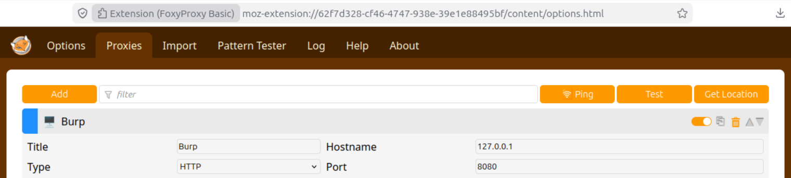

Next, the MediaHub login page was accessed at:

```text
http://10.112.175.119/login.php
```

Based on the information disclosed in the backup file, several recent years from the 21st century were tested against the provided password format.

A valid password was eventually identified, resulting in successful authentication and redirection to the OTP verification page at `/opt.php`.

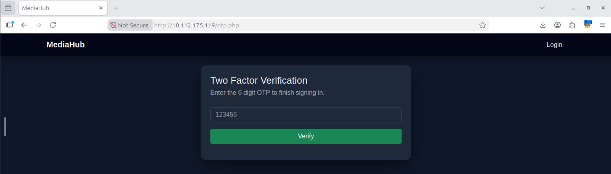

The application required a six-digit OTP to complete the login process. A random value was initially submitted, `123456`.

As expected, the application rejected the value as an invalid OTP.

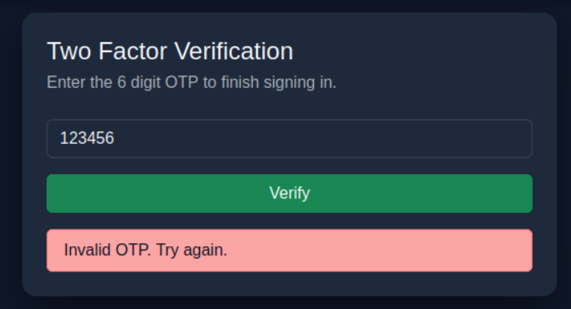

The next step was therefore to inspect how the OTP verification request was processed.

## OTP Verification Request Analysis

Burp Suite was used to inspect the application's HTTP traffic. In Proxy → HTTP history, the POST request to `/verify_otp.php` was located and sent to the `Repeater` tab.

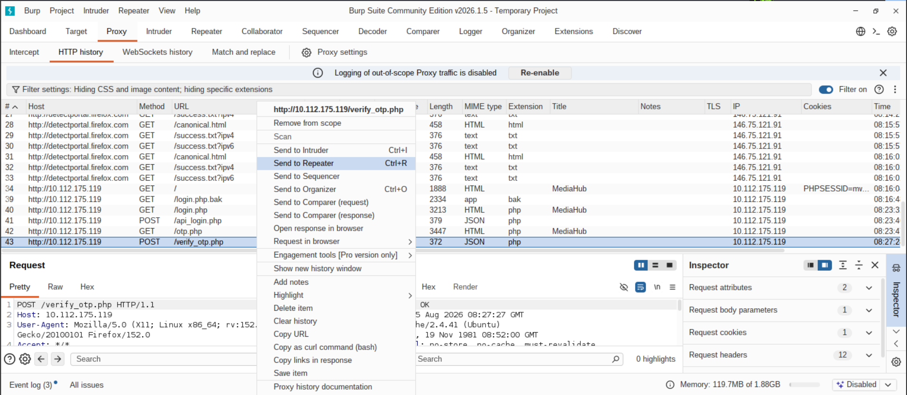

Repeating the request returned the following JSON response:

```json
{
  "ok":false,
  "error":"Invalid OTP. Try again.",
  "is_verified":false
}
```

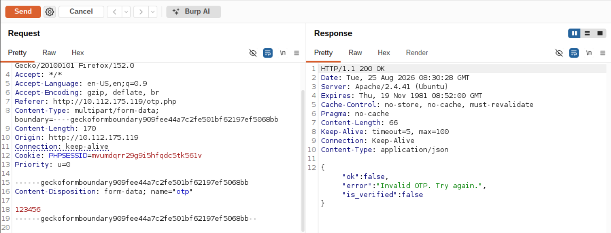

The request contained the supplied OTP as the `otp` parameter:

```text
Content-Disposition: form-data; name="otp"

123456
```

The response also revealed an `is_verified` value, which suggested that the application's verification state was being handled through a parameter that could potentially be manipulated.

## Mass Assignment

**Mass Assignment** is a vulnerability that occurs when an application automatically maps user-controlled request parameters to internal object or model properties without sufficiently restricting which properties can be modified. This can allow an attacker to alter values that should only be controlled by the application itself.

The OTP request was modified to include an additional `is_verified` parameter set to `true`:

```text
Content-Disposition: form-data; name="is_verified"

true
```

The modified request was then sent through Burp Suite Repeater.

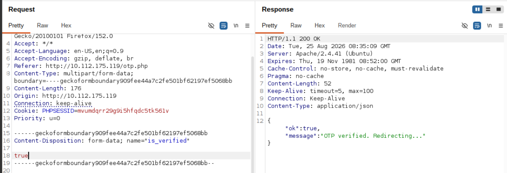

The response changed to:

```json
{
  "ok":true,
  "message":"OTP verified. Redirecting..."
}
```

This indicated that the verification state had been modified successfully without providing the correct OTP. The OTP verification mechanism had therefore been bypassed through mass assignment.

## Administrative Dashboard

The first flag was displayed at the top of the page:

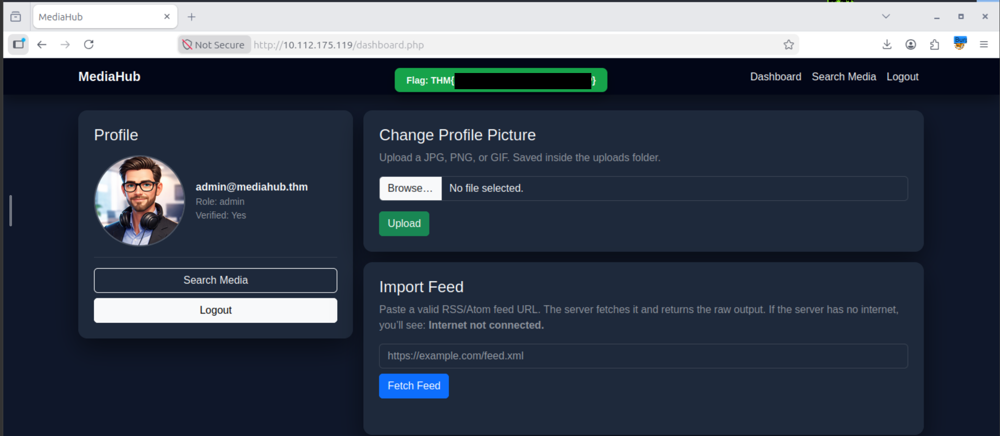

The dashboard confirmed that the authenticated account was `admin@mediahub.thm`. Administrative access had therefore been obtained.

The remaining objective was to achieve remote code execution and retrieve the final flag located at:

```bash
/var/www/user.txt
```

## Import Feed Functionality

The dashboard provided a **Change Profile Picture** functionality. Attempts were made to upload a shell payload, modify the file extension in the request, and change the payload's magic numbers. These attempts were unsuccessful and therefore did not provide an exploitation path.

The dashboard also contained an **Import Feed** functionality with the following description:

```text
Paste a valid RSS/Atom feed URL. The server fetches it and returns the raw output. If the server has no internet, you’ll see: Internet not connected.
```

This functionality was potentially interesting because it required the server to retrieve a user-supplied URL.

A request to the local host was initially tested:

```text
http://127.0.0.1
```

The application returned a message indicating that private network access was blocked.

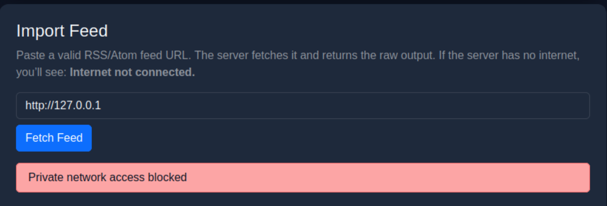

This behaviour suggested that the application implemented a filter intended to prevent requests to internal or private network addresses.

The corresponding request was located in Burp Suite's HTTP History and sent to `Repeater` for further analysis.

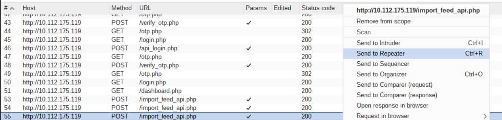

Repeating the request produced the expected JSON response.

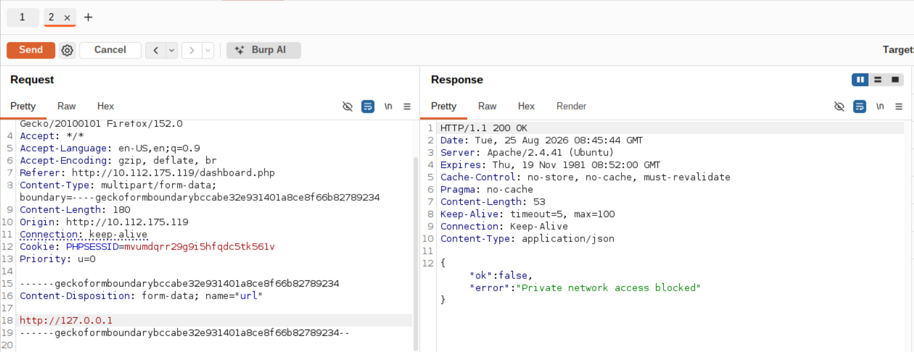

## SSRF Filter Bypass

The functionality was consistent with **Server-Side Request Forgery (SSRF)**, a vulnerability where an attacker can cause a server to make requests to a destination controlled or influenced by the attacker. SSRF can potentially provide access to internal services that are not directly reachable from the attacker's machine.

The application attempted to prevent access to localhost by filtering the submitted URL. However, IP addresses can have multiple valid representations.

Instead of using `127.0.0.1` the shorter loopback representations were tested, `127.0.1` or `127.1`. 

The `url` parameter in Burp Suite Repeater was modified accordingly:

```url
http://127.1
```

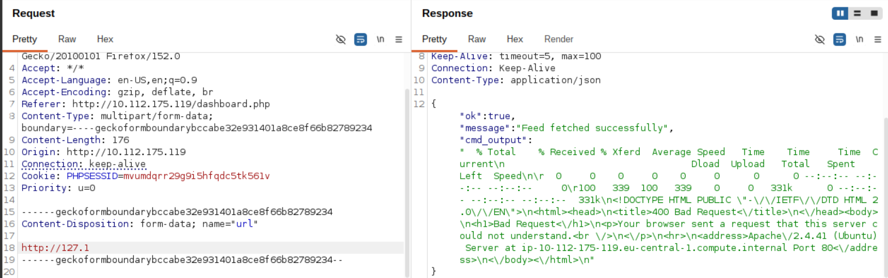

The request was accepted and returned a successful response `message`:

```text
Feed fetched successfully
```

The response also contained a `cmd_output` parameter. Its contents included `curl` response metrics and an HTML error page generated by an Apache 2.4.41 server running on Ubuntu:

```html
<!DOCTYPE HTML PUBLIC "-//IETF//DTD HTML 2.0//EN">
<html><head>
<title>400 Bad Request</title>
</head><body>
<h1>Bad Request</h1>
<p>Your browser sent a request that this server could not understand.<br />
</p>
<hr>
<address>Apache/2.4.41 (Ubuntu) Server at ip-10-112-175-119.eu-central-1.compute.internal Port 80</address>
</body></html>
```

The successful request demonstrated that the localhost restriction could be bypassed using an alternative representation of the loopback address.

## Command Injection and Local File Retrieval

The response behaviour indicated that the supplied URL was ultimately processed by `curl`. This provided an opportunity to influence the command being executed by injecting additional arguments.

The `file://` URI scheme can be used by `curl` to access local files. To terminate the original URL argument and append a second `file://` target, the following value was constructed:

```url
http://127.1; file:///var/www/user.txt
```

The semicolon `;` separated the original localhost request from the additional `file://` argument. The resulting value was supplied through the `url` parameter.

The request returned the contents of the final flag in the response.

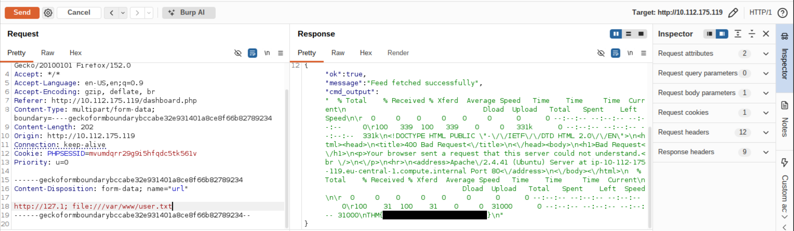

This resulted in the final objective being achieved through command injection and local file retrieval.

# Conclusion

The assessment demonstrated that multiple vulnerabilities within the MediaHub application could be chained to progress from unauthorised access to retrieval of the final flag. An exposed backup file disclosed sensitive information about the administrative account and password policy, allowing administrative access to be obtained. The OTP verification mechanism could then be bypassed by modifying server-side parameters through a mass assignment vulnerability.

Following administrative access, the application's feed import functionality was found to perform server-side requests based on user-controlled input. The filtering could be bypassed by using an alternative representation of the loopback address, allowing requests to be directed to the local system. The same functionality could subsequently be abused to access a local file and retrieve the final flag.

Overall, the assessment demonstrated how information disclosure, insufficient authentication controls, insecure parameter handling, and inadequate server-side input validation could be combined to bypass intended security boundaries and access sensitive resources.

---

# Remediation Recommendations

The following recommendations should be implemented to address the identified weaknesses and reduce the likelihood of similar attack chains:

| Finding | Recommendation |
| ------- | -------------- |
| **Exposed backup file** | Remove backup and temporary files from production web directories. Prevent sensitive source code, configuration files, and developer notes from being directly accessible through the web server. |
| **Weak password policy** | Enforce strong, unpredictable passwords for administrative accounts and avoid password formats that can be derived from publicly accessible or predictable information. |
| **OTP verification bypass** | Ensure verification state is determined exclusively by trusted server-side logic. Do not accept security-sensitive fields such as `is_verified` directly from client-controlled requests. |
| **Mass assignment** | Explicitly define which request parameters may be modified by users instead of automatically binding arbitrary request parameters to application objects or security-sensitive state. |
| **SSRF in feed import functionality** | Restrict outbound requests using a strict allow-list of permitted destinations and validate the resolved destination rather than relying solely on user-supplied hostname strings. |
| **Loopback filter bypass** | Validate and normalise IP addresses before applying access controls, and block all representations of loopback, private, link-local, and other restricted address ranges. |
| **Local file access through URL handling** | Disable unsupported URL schemes such as `file://` and permit only the protocols required by the application, such as `http` and `https`. |
| **Command injection through URL processing** | Avoid constructing shell commands from user-controlled input. Where command-line utilities are required, use safe process APIs with arguments passed separately and strictly validated. |
| **Excessive backend access** | Run URL-fetching functionality with the minimum privileges and network access required. Network segmentation and egress filtering should prevent access to sensitive internal resources. |
| **Sensitive information disclosure** | Remove credentials, administrative information, and development notes from application source code and backup files. Secrets should be stored securely and rotated if exposed. |

Implementing these recommendations would significantly reduce the likelihood of an attacker progressing from a publicly accessible web application to remote code execution.