# Support Write-up

**Platform**: TryHackMe <br>
**Room**: Support (https://tryhackme.com/room/support) <br>
**Category**: Web Application <br>
**Target**: Linux <br>
**Techniques**: Information Disclosure, Credential Brute-Forcing, Cookie Manipulation, IDOR, Local File Inclusion, Command Injection <br>
**Final Goal**: Remote Code Execution

# Executive Summary

This assessment evaluated the security of the **Support** web application, a support operations portal used to manage user information and administrative functionality. The objective was to determine whether an unauthenticated attacker could identify weaknesses that would lead from unauthorised access to privileged functionality.

The engagement identified several vulnerabilities, including information disclosure, weak authentication controls, insecure client-side authorisation, and insecure direct object references. These weaknesses could be chained together to obtain valid user credentials, access the Support Operations Panel, identify and target an administrative account, and ultimately achieve Remote Code Execution on the target.

The evaluation highlights how weaknesses across different security controls can combine to form a complete attack path. It also demonstrates the importance of treating client-side controls, access restrictions, file inclusion mechanisms, and system command execution as security boundaries rather than relying on them as trusted inputs.

## Overview

Support simulates an internal Support Operations Platform used by IT and helpdesk teams to manage users and perform administrative operations. The objective is to assess the web application, identify weaknesses in its authentication and access controls, and ultimately achieve remote code execution on the underlying server.

The room demonstrates a realistic web application attack chain involving:

- Service and web application enumeration
- Credential brute-forcing
- Cookie manipulation
- IDOR
- Local File Inclusion
- Credential disclosure
- Command Injection
- Remote Code Execution

### Attack Chain

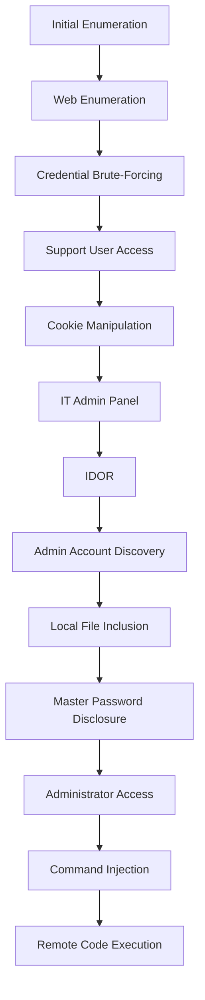

---

## Initial Enumeration

The assessment begins by identifying the services exposed by the target host.

```bash
nmap -sV -sC -p- 10.113.187.204
```

Where:

- `-sV` performs service version detection.
- `-sC` executes Nmap's default NSE scripts.
- `-p-` scans all TCP ports rather than the default top 1,000.

The scan reveals two externally accessible services.

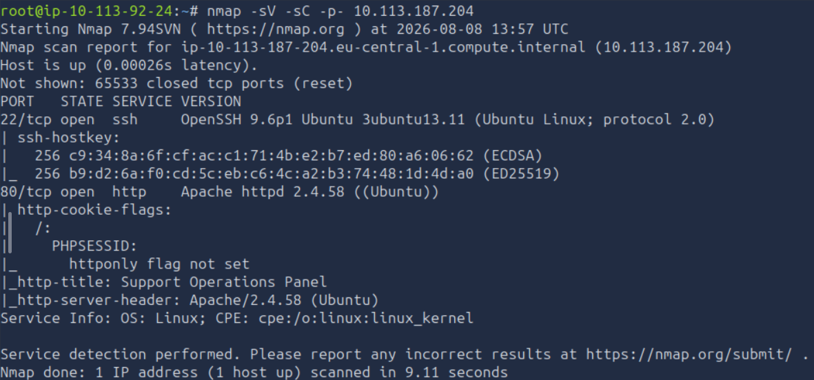

| Port | Service | Observation |
|------|---------|-------------|
| 22 | SSH | Potential management interface that may become useful if valid credentials are obtained. |
| 80 | HTTP | Public-facing Support Operations Panel and primary attack surface. |

Since the HTTP service presents the largest attack surface, the assessment continues with web application enumeration.

## Web Application Enumeration

With the attack surface narrowed to the web application, the next objective is to identify hidden resources that may not be linked from the application's interface.

Directory enumeration is performed using Gobuster:

```bash
gobuster dir -u "http://10.113.187.204" \
-w /usr/share/wordlists/dirbuster/directory-list-2.3-medium.txt \
-r \
-x .php,.js,.html,.py,php.bak,.git,.env
```

The scan identifies several interesting endpoints, including:

- `/info.php`
- `/skins`
- `/includes`
- `/api.php`
- `/config.php`
- `/dashboard.php`

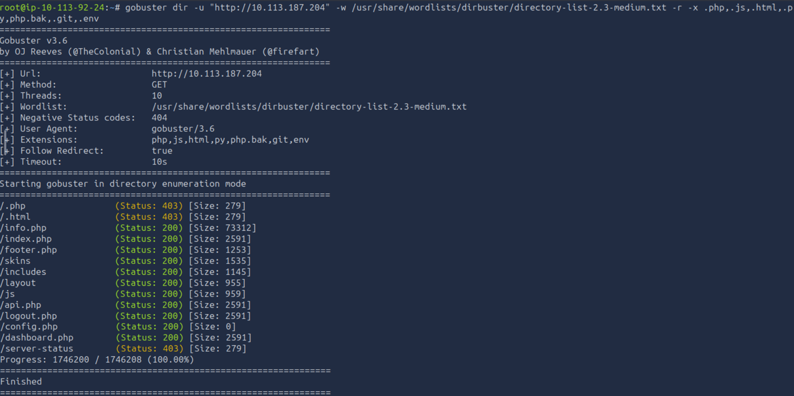

Attempting to access these resources does not immediately reveal useful information. In most cases, either a blank page is returned or the request is redirected to the login page.

The login page identifies the application as the **Support Operations Panel** and provides a potentially valid username, `help@support.thm`. The address is displayed twice, first as a greyed-out value in the **Corporate Email** field and again in the message `Problems signing in? Contact IT Operations @ help@support.thm`.

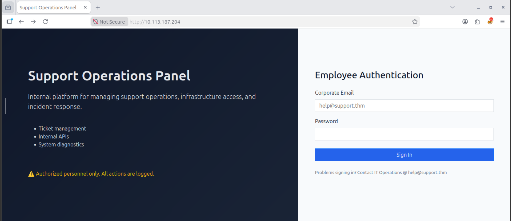

The presence of a known username makes password enumeration a logical next step.

---

## Credential Brute-Forcing

Before attempting to brute-force the password, the login request needs to be examined to identify the parameters used by the application.

Right-click the webpage and select **Inspect**. Navigate to the **Network** tab, enter the known email address together with a random password, and select **Sign In**.

The resulting POST request contains the following form parameters:

- `email`
- `password`

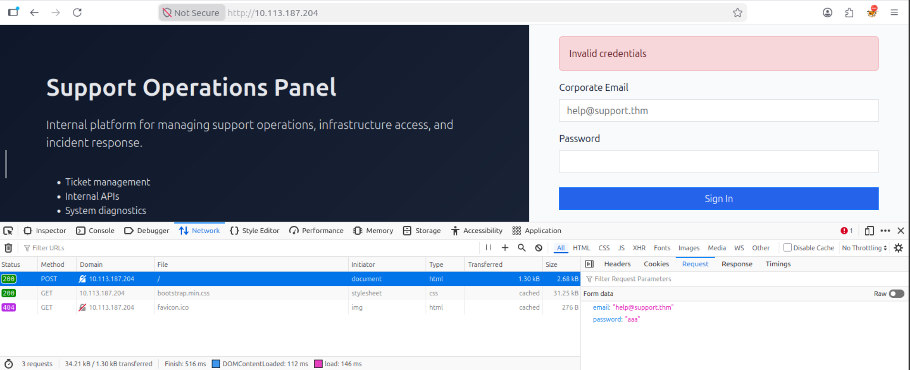

With the request structure identified, **Ffuf** can be used to test passwords from the rockyou.txt wordlist.

```bash
ffuf -w /usr/share/wordlists/rockyou.txt \
-X POST \
-d "email=help@support.thm&password=FUZZ" \
-H "Content-Type: application/x-www-form-urlencoded" \
-u http://10.113.187.204 \
-fc 200
```

The relevant options are:

- `-w` specifies the wordlist.
- `-X POST` sets the HTTP request method.
- `-d` defines the POST data and places the FUZZ keyword at the password parameter.
- `-H "Content-Type: application/x-www-form-urlencoded"` specifies the format of the submitted form data.
- `-fc 200` filters out responses returning HTTP status code 200. Failed login attempts return a normal 200 OK response, while a successful login returns a redirect.

Ffuf identifies the valid password.

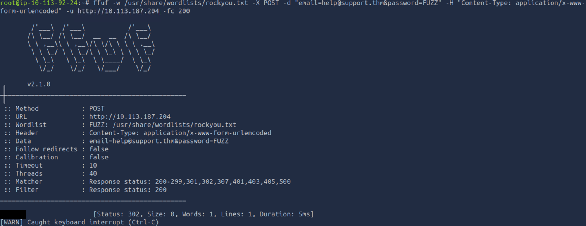

The recovered credentials can now be used to authenticate to the application.

## Initial Access

Enter the recovered credentials into the login page. Successful authentication redirects to `/dashboard.php`.

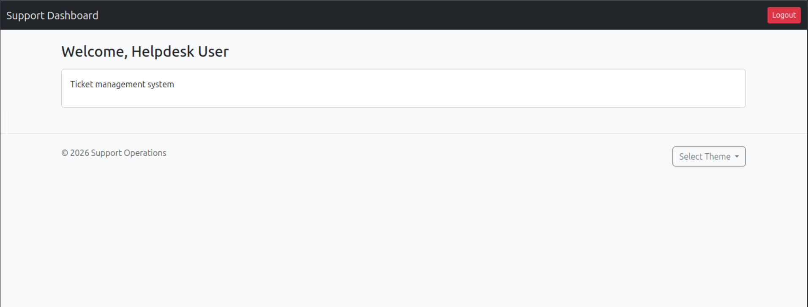

The dashboard provides limited functionality. A **Select Theme** button allows the colour of the area containing the welcome message to be changed, while a **Logout** option is also available.

Since the application exposes limited functionality through the interface, the client-side data is inspected for additional information.

Right-click the page and select **Inspect**, then navigate to **Storage** → **Cookies**.

An `isITUser` cookie is present with a value that appears to be a hash.

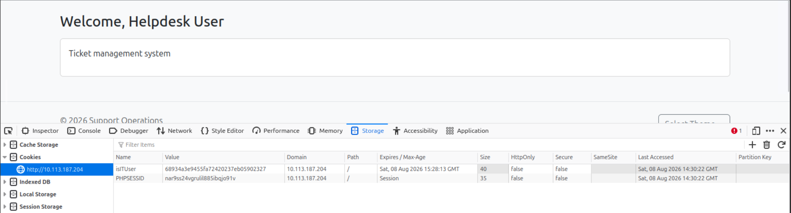

The value can be submitted to **CrackStation** (https://crackstation.net/) to identify the hashing algorithm and recover its underlying value. The website identifies the value as an MD5 hash representing a well-known boolean value.

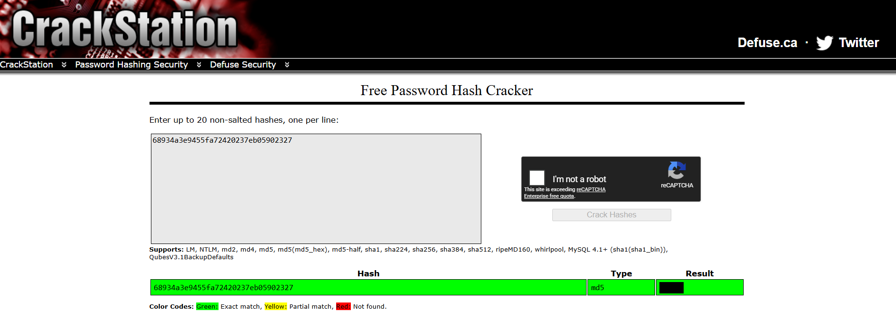

Since the cookie appears to control whether the current user is considered an IT user, changing its value to the MD5 representation of the opposite boolean value may expose additional functionality. **CyberChef** (https://gchq.github.io/CyberChef/) can be used to generate the required MD5 hash using the MD5 recipe.

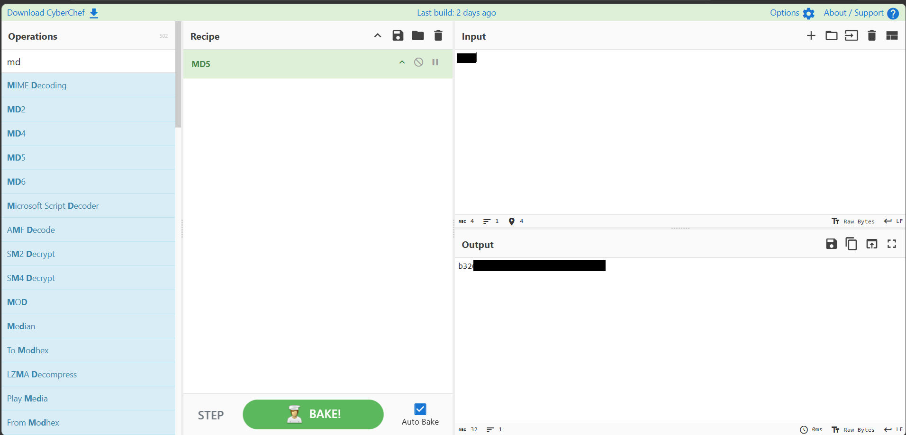

Replace the existing `isITUser` cookie value with the generated hash and reload the page. A new button appears, providing access to the **IT Admin Panel API**.

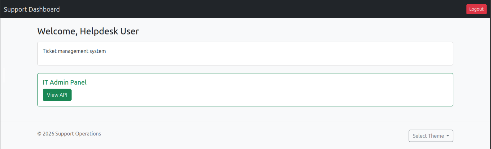

The new functionality redirects to the previously discovered `/api.php`. The API page contains instructions for querying user information.

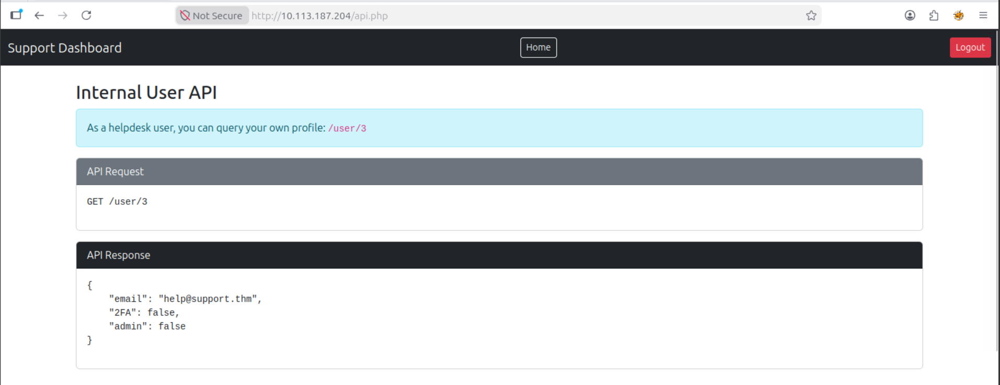

---

## IDOR

The API documentation provides an endpoint for retrieving user information. The current user's profile can be accessed using `http://10.113.187.204/user/3`. The response contains information about the account, including the fact that it is not an administrator account.

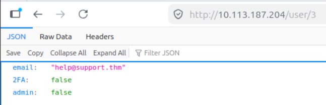

Since the endpoint accepts a user ID directly in the URL, it is worth testing whether access controls are enforced when another user's ID is supplied.

Changing the ID to `1`: `http://10.113.187.204/user/1` reveals another account, `specialadmin@support.thm`. The response identifies the account as having administrative privileges.

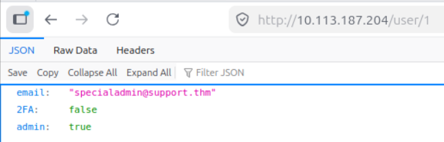

The administrative account has now been identified, but its password is still unknown. The next objective is therefore to investigate the application's theme functionality and the `/skins` directory discovered during the initial enumeration.

---

## Local File Inclusion

Returning to the dashboard reveals the theme selection functionality previously observed. During the Gobuster scan, the `/skins` directory was identified. Navigating to this directory reveals several PHP files corresponding to the available colours.

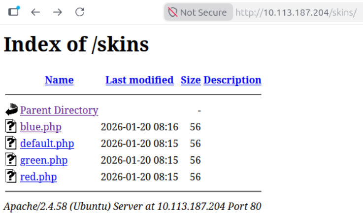

Changing the selected colour modifies the URL. For example, selecting the red theme results in `http://10.113.187.204/dashboard.php?skin=red`. Although the `.php` extension is not present in the URL, the `red.php` script appears to be loaded by the application. This behaviour suggests that the `skin` parameter may control which PHP file is loaded. The application is therefore tested by attempting to load the previously discovered `config.php` file with `http://10.113.187.204/dashboard.php?skin=config`. The page does not visibly change.

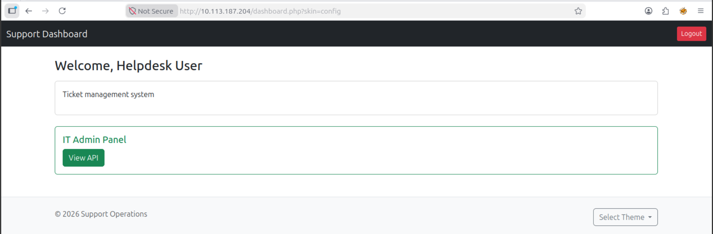

Since the configuration file is located one directory above the skins directory, a path traversal sequence can be tested with `http://10.113.187.204/dashboard.php?skin=../config`. The interface changes, suggesting that a different file has been loaded. However, the contents of the file are not displayed directly on the page.

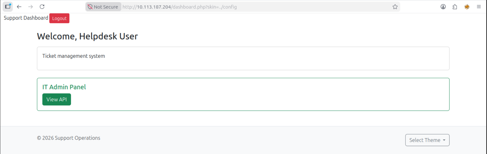

The page source can provide additional information. Right-click the page and select `View page source`. The source contains content from the loaded PHP file and reveals a variable named `MASTER_PASSWORD`.

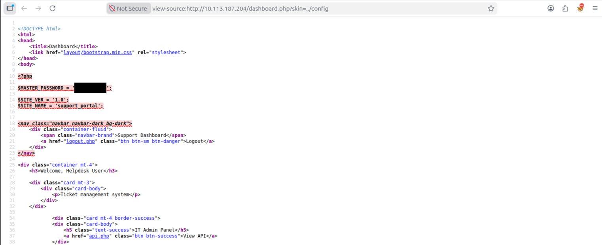

The disclosed value appears to be intended for administrative authentication.

---

## Administrator Access

The recovered password is tested against the previously identified `specialadmin@support.thm` account. The password does not initially authenticate successfully. A small variation is then tested by removing the special character from the recovered value. This variation successfully authenticates to the administrative account. 

The administrator dashboard reveals the **admin flag**.

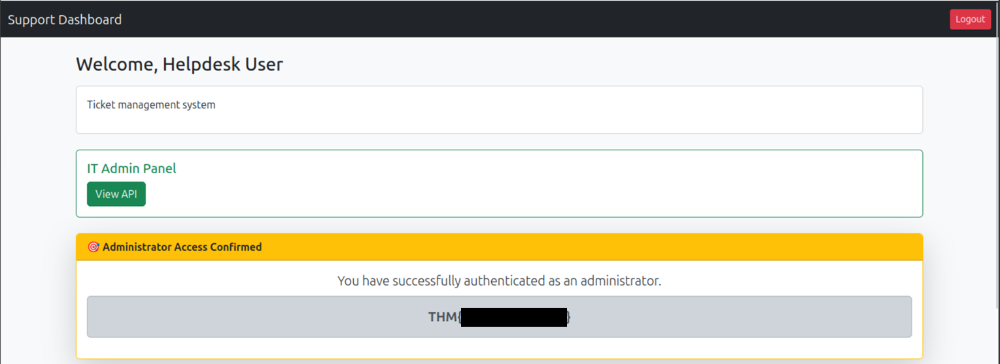

With administrative access established, the next objective is to determine whether the additional functionality available to the administrator can be abused to execute commands on the underlying server.

---

## Command Injection

The administrator dashboard introduces an additional control next to the **Select Theme** button. This functionality allows the displayed value to be changed between the current **Date** and **Time**.

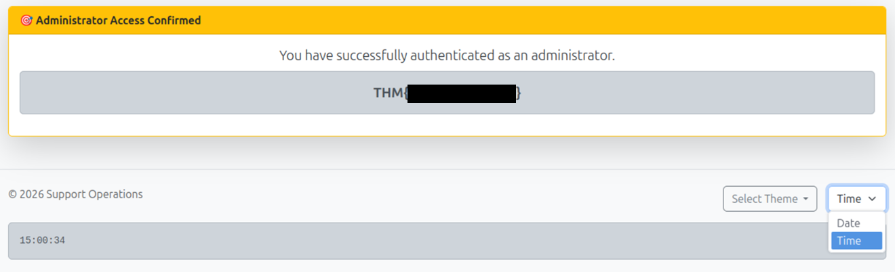

Inspecting the new dropdown reveals that the **Time** option uses the following value: `date +"%H:%M:%S"`. 

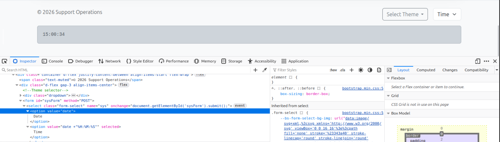

The value resembles the Linux `date` command. Selecting the **Date** option displays output matching the format produced by the Linux `date` command.

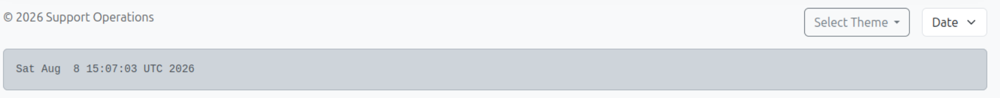

For comparison, executing `date` on the AttackBox produces a similar output structure.

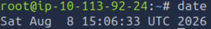

This suggests that the application may be passing the selected value to a system command. A basic command injection test is performed by changing the value of the **Date** option to `date; id`.

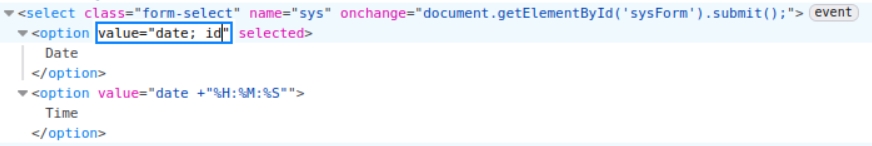

Selecting the **Date** option causes the application to display the output of both commands.

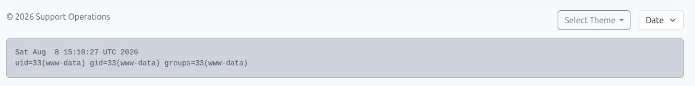

The output of `id` confirms that arbitrary system commands can be executed through the parameter, demonstrating **Remote Code Execution** on the underlying Linux server.

The final objective is to use this command execution to retrieve the user flag.

---

## Retrieving the User Flag

The **Time** value is modified to execute the cat command after the original date command `date +"%H:%M:%S"; cat /home/ubuntu/user.txt`. 

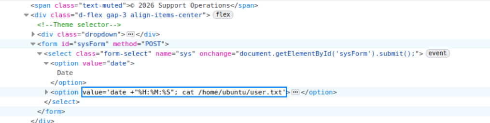

Selecting the **Time** option executes the modified command and displays the contents of the **user flag**.

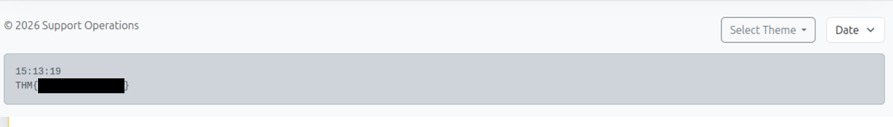

The **user flag** is successfully retrieved, confirming remote code execution on the target server.

## Conclusion

The assessment demonstrated how several weaknesses in the Support Operations Platform could be chained together to achieve remote code execution.

The attack began with web application enumeration, which revealed a valid username and several potentially interesting endpoints. Password brute-forcing provided initial access, after which manipulation of the `isITUser` cookie exposed additional administrative functionality. An IDOR vulnerability then allowed an administrative account to be identified, while Local File Inclusion resulted in the disclosure of a master password.

Finally, command injection in the administrator's date and time functionality enabled arbitrary commands to be executed on the underlying Linux server, allowing the user flag to be retrieved.

The room highlights the importance of treating client-side values and user-controlled parameters as untrusted input. Weak authentication controls, insecure access restrictions, file inclusion vulnerabilities, and command injection can become significantly more impactful when combined into a single attack path.

---

## Remediation Recommendations

The compromise of the Support Operations Platform was achieved by chaining together several independent weaknesses. Addressing the following issues would significantly reduce the application's attack surface.

| Finding | Recommendation |
|---------|----------------|
| **Credential Brute-Forcing** | Implement rate limiting and account lockout controls to restrict repeated authentication attempts. Monitor failed login attempts and consider multi-factor authentication for privileged accounts. |
| **Client-Side Privilege Control** | Do not rely on client-controlled cookies to determine user privileges. Authorisation decisions should be enforced server-side based on the authenticated user's account and permissions. |
| **IDOR** | Enforce authorisation checks for every requested resource. Users should only be able to access objects they are explicitly authorised to view, regardless of the identifier supplied in the request. |
| **Local File Inclusion** | Validate and restrict file paths using an allowlist and prevent user-controlled parameters from accessing arbitrary files. Path traversal sequences such as `../` should be rejected. |
| **Sensitive Information Disclosure** | Do not expose configuration files or sensitive application variables through web-accessible functionality. Secrets such as master passwords should be stored securely and should not be embedded in application files that can be disclosed. |
| **Command Injection** | Avoid passing user-controlled input directly to operating system commands. Where system commands are required, use safe APIs and strict allowlists for permitted values. |
| **Authentication** | Store credentials securely and avoid relying on predictable or easily discoverable passwords. Administrative accounts should use strong, unique credentials and additional authentication controls where appropriate. |

Implementing these recommendations would significantly reduce the likelihood of an attacker progressing from a publicly accessible web application to remote code execution on the underlying server.
